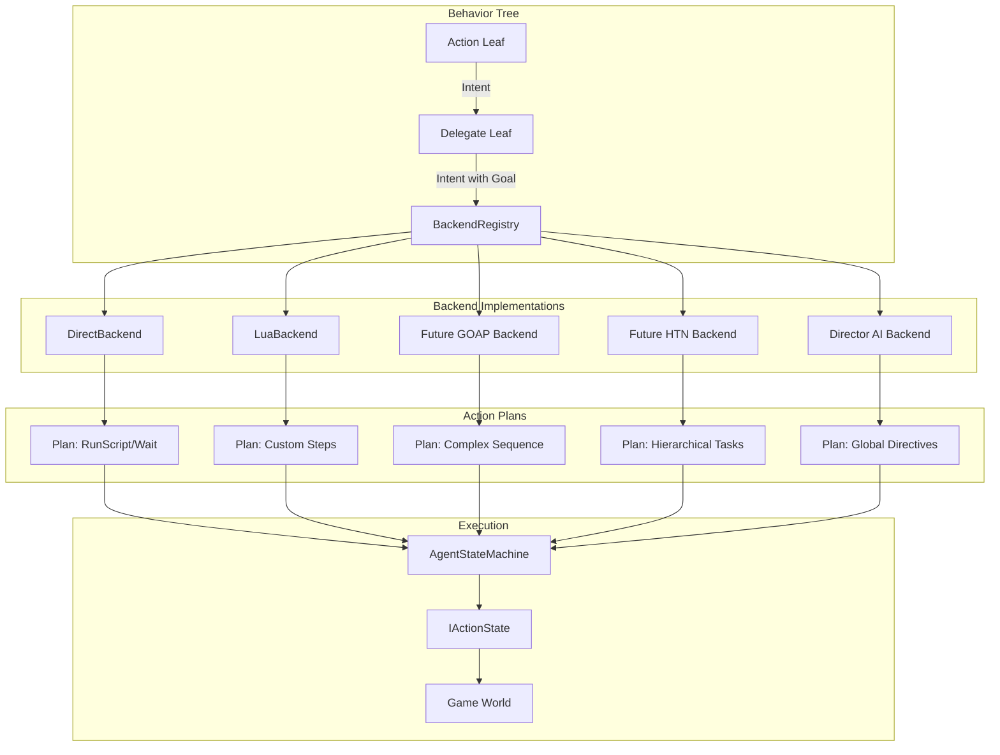
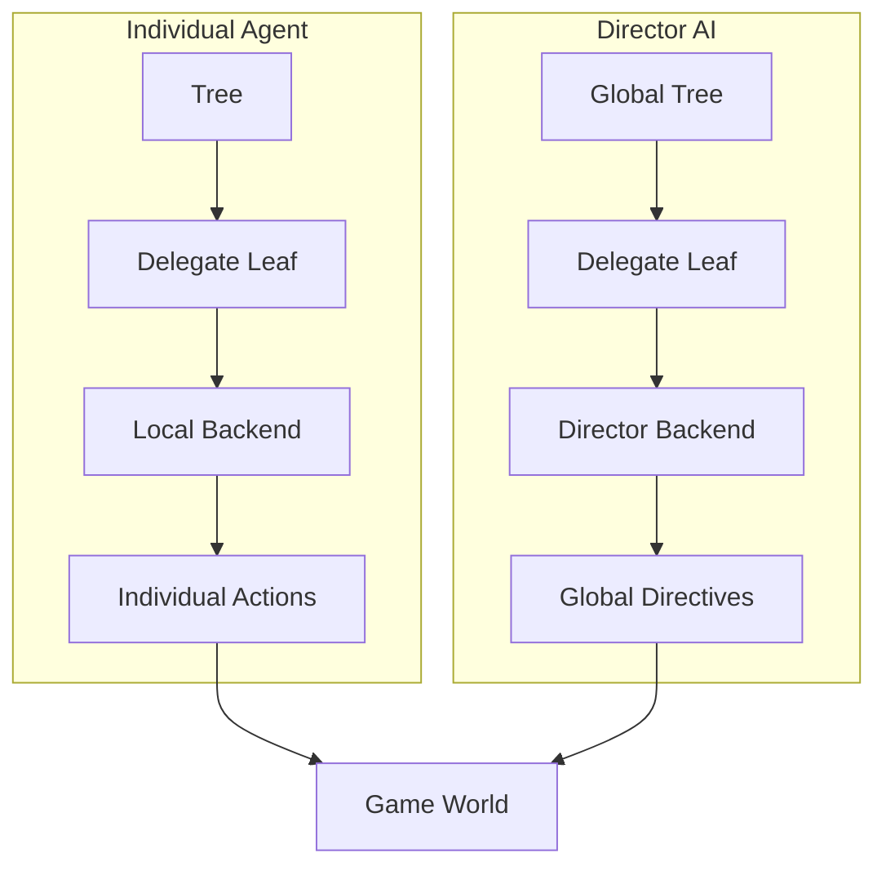

# Backend Abstraction Theory

> **Category:** Architectural Pattern  
> **Status:** Implemented  
> **Core Files:** `Code/Include/GOAT/Interfaces/IBackend.h`, `Code/Source/Core/Frontend/DirectBackend.cpp`, `Code/Source/Core/Scripting/LuaBackend.cpp`, `Code/Source/Core/Application/BackendRegistry.cpp`

---

## 💡 Core Concept

The **Backend Abstraction** is the single most important architectural pattern in G.O.A.T. It treats all AI decision-making as a **planning problem**. Instead of hardcoding Behavior Trees, HTN, GOAP, or Utility AI as separate systems, G.O.A.T. routes every decision through a unified interface:

```cpp
// Code/Include/GOAT/Interfaces/IBackend.h
class IBackend
{
public:
    AZ_RTTI(IBackend, IBackendTypeId);

    virtual ~IBackend() = default;

    // Name this backend is registered under and referenced by from Lua.
    virtual AZ::Name GetName() const = 0;

    // Produces a plan for one intent. Returns false when this backend cannot satisfy it.
    virtual bool Plan(const PlanContext& context, const Intent& intent, ActionPlan& outPlan) = 0;

    // Reports the conditions that invalidate the plan while it runs.
    virtual void CollectGuards(
        [[maybe_unused]] const PlanContext& context,
        [[maybe_unused]] const ActionPlan& plan,
        [[maybe_unused]] GuardList& outGuards) const { }

    // Releases any per agent state held for this agent.
    virtual void Release([[maybe_unused]] const PlanContext& context) { }
};
```

Any leaf node in a tree can emit an `Intent`, and any backend can turn that `Intent` into an `ActionPlan`. This unifies all AI paradigms under one contract.

---

## 🗺️ Visual Overview



---

## 🤔 Why This Matters

### The Problem with Traditional AI Frameworks

In most game AI systems, you have to pick a paradigm upfront:

- **Behavior Trees:** Great for reactive, hierarchical logic, but poor for complex planning.
- **GOAP:** Great for goal-driven planning, but verbose and hard to author for simple behaviors.
- **HTN:** Great for structured tasks, but rigid and requires significant setup.
- **Utility AI:** Great for scoring-based decisions, but lacks deep hierarchy.

If you want a game with a mix of NPC types (some using BT, some using GOAP, some using HTN), you typically have to build separate systems or hack around the limitations.

### The G.O.A.T. Solution

G.O.A.T. makes **all of these paradigms interchangeable** through `IBackend`. A tree can use a simple `script` leaf (handled by `DirectBackend`), or it can `delegate` to a complex GOAP planner. The tree structure doesn't change – only the backend does.

This gives you:

- **Flexibility:** Use the right tool for the right job.
- **Modularity:** Add new backends without touching the core engine.
- **Runtime Swapping:** Change an NPC's planning strategy at runtime by swapping backends.

---

## 🧩 How It Works in the Code

### The Intent

An `Intent` is the message a tree leaf sends to a backend. It contains either:

- A direct action (from `raw` or `script` leaves), or
- A backend name + goal (from `delegate` leaves).

```cpp
// Code/Include/GOAT/Domain/Intent.h
struct Intent
{
    AZ::Name m_backend;
    AZ::Name m_goal;
    ActionRequest m_direct;
    NodeIndex m_node = InvalidNodeIndex;
};
```

### The PlanContext

When a backend plans, it receives a `PlanContext` that gives it access to everything it needs:

```cpp
// Code/Include/GOAT/Interfaces/IBackend.h
struct PlanContext
{
    AgentId m_agent;
    AZ::EntityId m_entity;
    IBlackboardSystem* m_blackboard = nullptr;
    INodeScripting* m_scripting = nullptr;
};
```

- **AgentId:** Identifies which agent is planning.
- **EntityId:** The entity the agent drives.
- **Blackboard:** Shared data, allowing the backend to read/write variables.
- **Scripting:** Allows access to custom Lua control flow (if needed).

### The BackendRegistry

Backends are registered by name and looked up when a `delegate` node is encountered:

```cpp
// Code/Source/Core/Application/BackendRegistry.cpp
class BackendRegistry final
{
public:
    bool Register(AZStd::unique_ptr<IBackend> backend);
    void Unregister(const AZ::Name& name);
    IBackend* Find(const AZ::Name& name) const;
    AZStd::vector<AZ::Name> GetNames() const;
    void Clear();
};
```

When the `TreeWalker` hits a `delegate` node, it:

1. Extracts the backend name from the intent.
2. Looks it up in the `BackendRegistry`.
3. Calls `IBackend::Plan()` with the intent and context.
4. Receives an `ActionPlan` or failure.

---

## ⚖️ Concrete Examples

### DirectBackend

The simplest backend. It handles `raw` and `script` leaves by producing a one-step plan.

```cpp
// Code/Source/Core/Frontend/DirectBackend.cpp
bool DirectBackend::Plan(
    [[maybe_unused]] const PlanContext& context, const Intent& intent, ActionPlan& outPlan)
{
    if (intent.m_direct.m_action == CoreActions::Invalid)
    {
        return false;
    }

    outPlan.m_steps.clear();
    outPlan.m_steps.push_back(intent.m_direct);
    return true;
}
```

**When is this used?** Whenever you write a simple tree like:

```lua
script "Patrol",
wait(0.5)
```

---

### LuaBackend

A backend defined entirely in Lua. Used when you want to write planning logic in scripting.

```lua
-- Example from ExampleAdvanced.lua
backend "Errand" {
    plan = function(me, ctx, goal)
        if goal == "Rest" then
            return { { action = "wait", seconds = 2.0 } }
        end
        return {
            { action = "script", behavior = "Announce" },
            { action = "wait", seconds = 0.5 },
        }
    end,
}
```

The C++ side wraps this in a `LuaBackend`:

```cpp
// Code/Source/Core/Scripting/LuaBackend.cpp
bool LuaBackend::Plan(const PlanContext& context, const Intent& intent, ActionPlan& outPlan)
{
    m_scriptContext.Bind(context.m_agent, context.m_entity, context.m_blackboard);
    const ActionPlan* planned = m_dispatch.CallBackendPlan(m_name, intent.m_goal, context.m_agent, m_scriptContext);
    m_scriptContext.Unbind();

    if (planned == nullptr || planned->IsEmpty())
    {
        return false;
    }

    outPlan = *planned;
    return true;
}
```

### Future Backends

Imagine you want to add full GOAP. You would:

1. Create a new C++ class implementing `IBackend`.
2. Register it in `GOATSystemComponent` or a module.
3. Use it in a tree like this:

```lua
delegate "MyGoap" { goal = "DefeatEnemy" }
```

No changes to the core engine required.

---

## 🗺️ Impact on Modules

This abstraction is what makes **Director AI** possible. A Director is simply a backend running at the **Global** or **Squad** blackboard scope.



The Director can:

- Read player progress from the Global Blackboard.
- Spawn enemies (via actions).
- Write to Squad Blackboards to coordinate groups.
- Change difficulty by modifying shared variables.

---

## 🔗 Related Concepts

- [[Design Principles]]
- [[Performance Model]]
- [[Extensibility Model]]
- [[Director AI]]

---

*Last updated: 2026-08-26*