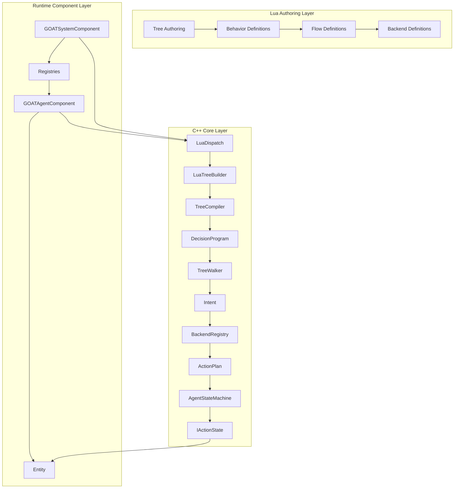

# Design Principles

> **Category:** Design Principles  
> **Status:** Implemented  
> **Core Files:** `Code/Source/Backends/BehaviorTree/Code/Source/TreeCompiler.cpp`, `Code/Source/Backends/BehaviorTree/Code/Source/TreeWalker.cpp`, `Code/Source/Core/Scripting/LuaDispatch.cpp`, `Code/Include/GOAT/Interfaces/IBackend.h`

---

## 💡 Core Concept

G.O.A.T. is not just a Behavior Tree library. It is a **unified decision-making framework** built on six core pillars that shape every architectural decision. These principles ensure the framework remains fast, flexible, and easy to extend without sacrificing performance.

The design philosophy can be summarized as:

> **"Separate what you decide (Lua) from how you execute (C++), and route all decision-making through a single pluggable interface (IBackend)."**

---

## 🤔 Why This Matters

Without these principles, AI frameworks often devolve into rigid, component-heavy monoliths. For example:

- **Typical BT frameworks** hardcode the tree traversal logic and provide no way to integrate GOAP or HTN alongside BT.
- **Typical HTN frameworks** lack the flexibility of a scripting language and require C++ changes for every new behavior.
- **Typical monolithic AI systems** force all agents to use the same paradigm, making it difficult to have varied NPC behaviors.

G.O.A.T. avoids all of this by enforcing a strict separation between **authoring** (Lua), **compilation** (C++), and **execution** (C++), all tied together by a single `IBackend` abstraction.

---

## 🗺️ Visual Overview



---

## ⚖️ The Six Pillars (Updated)

### 1. Backend as a Planning Abstraction

**Description:**  
All decision-making (Behavior Trees, HTN, GOAP, Utility AI, Director AI) goes through `IBackend`. A tree leaf (`delegate` node) emits an `Intent`, and the backend is responsible for turning that `Intent` into an `ActionPlan`.

**How it works in the code:**

```cpp
// Code/Include/GOAT/Interfaces/IBackend.h
class IBackend
{
public:
    AZ_RTTI(IBackend, IBackendTypeId);

    virtual ~IBackend() = default;

    // Name this backend is registered under and referenced by from Lua.
    virtual AZ::Name GetName() const = 0;

    // Produces a plan for one intent. Returns false when this backend cannot satisfy it.
    virtual bool Plan(const PlanContext& context, const Intent& intent, ActionPlan& outPlan) = 0;

    // Reports the conditions that invalidate the plan while it runs.
    virtual void CollectGuards(
        [[maybe_unused]] const PlanContext& context,
        [[maybe_unused]] const ActionPlan& plan,
        [[maybe_unused]] GuardList& outGuards) const { }

    // Releases any per agent state held for this agent.
    virtual void Release([[maybe_unused]] const PlanContext& context) { }
};
```

**Concrete examples:**

| Backend | Type | Usage |
| :--- | :--- | :--- |
| *(inline)* | C++ | `raw` and `script` leaves need no backend: the leaf's own request becomes a one-step plan. |
| `LuaBackend` | Lua | User-defined planning in Lua via `backend "MyGoap" { plan = ... }`. |
| `FutureGoapBackend` | Planned | Could implement full GOAP planning, reusable across all trees. |

**Why this matters:**
- **Flexibility:** A tree can switch from a simple "do this action" to a complex HTN planner without changing the tree structure.
- **Extensibility:** New AI paradigms can be added by modules without modifying the core engine.
- **Runtime swapping:** The `BackendRegistry` allows backends to be registered/unregistered at runtime.

---

### 2. Lua-First Authoring

**Description:**  
The entire behavior tree DSL is defined in Lua (`GOAT.lua`). Trees, behaviors, flows, and backends are all written in Lua. C++ only compiles and executes the resulting flat structure.

**How it works in the code:**

- `GOAT.lua` defines global functions: `tree`, `behavior`, `flow`, `backend`, and node constructors (`selector`, `sequence`, `wait`, `script`, etc.).
- The `tree` function calls `GOAT.Compile(name, root)` which flattens the node graph into a pre-order record list.
- `LuaDispatch::EmitTree` calls `GOAT_EmitTree`, which pushes node data into a `LuaTreeBuilder`.
- `LuaTreeBuilder` reconstructs a `AuthoredNode` hierarchy.
- `TreeCompiler` compiles that hierarchy into a `DecisionProgram`.

**Concrete example (from `ExampleAgent.lua`):**

```lua
-- Author a tree entirely in Lua
behavior "Patrol" {
    tick = function(me, ctx)
        ctx:SetInt("patrol_stop", me.stop)
        return SUCCESS
    end,
}

return tree "ExampleAgent" {
    selector {
        sequence {
            condition "target_seen" { abort = "lower_priority" },
            script "Alert",
            wait(1.0),
        },
        sequence {
            script "Patrol",
            wait(0.5),
        },
    },
}
```

**Why this matters:**
- **Rapid iteration:** Designers can hot-reload scripts without recompiling C++.
- **Full programming power:** Variables, loops, and custom logic can be embedded in behaviors.
- **Extensibility:** New node types, flows, and backends can be defined purely in Lua.
- **Separation of concerns:** C++ handles execution; Lua handles expression.

---

### 3. Schema-Driven Blackboard

**Description:**  
Blackboard variables are declared in `.bbx` assets, merged into a global `BlackboardSchema`, and resolved into typed indices at compile time. No string lookups at runtime.

**How it works in the code:**

- `BlackboardAsset` (.bbx) declares variables with `name`, `type`, `scope`, and `default`.
- `BlackboardSchema::Declare` assigns each variable a typed `BlackboardKey`.
- `TreeCompiler` resolves property names to `BlackboardKey`s at compile time.
- `BlackboardStorage` stores values in typed, contiguous arrays indexed by `BlackboardKey`.

**Concrete example (from `BlackboardSchema.h`):**

```cpp
class BlackboardSchema final
{
public:
    AZ::Outcome<BlackboardKey, AZStd::string> Declare(
        const AZ::Name& name, BlackboardScope scope, BlackboardType type, AZStd::any defaultValue = {});

    BlackboardKey Find(const AZ::Name& name) const;
};
```

**Supported types (from `BlackboardTypes.h`):**

| Type | C++ Type | Lua Type |
| :--- | :--- | :--- |
| Bool | `bool` | `boolean` |
| Int | `AZ::s64` | `number` |
| Float | `float` | `number` |
| Vector3 | `AZ::Vector3` | `Vector3` |
| EntityId | `AZ::EntityId` | `EntityId` |
| Name | `AZ::Name` | `string` |
| Quaternion | `AZ::Quaternion` | `Quaternion` |
| Transform | `AZ::Transform` | `Transform` |
| EntityIdList | `AZStd::vector<AZ::EntityId>` | `table` |

**Why this matters:**
- **No string lookups at runtime** – O(1) array indexing.
- **Type safety** – Compile-time validation catches typos and type mismatches.
- **Cross-scope sharing** – Global, Agent, and Squad scopes allow data to be shared efficiently.
- **Memory efficiency** – Only declared variables are allocated.

---

### 4. Server Authority

**Description:**  
All AI decisions run on the server. Clients only receive replicated blackboard state.

**How it works in the code:**

- `GOATAgentComponent` is only active on the server (`Authority` role).
- `GOATSystemComponent` registers services only on the server.
- Blackboard keys marked as `replicated` are synced to clients via O3DE's replication system.

**Why this matters:**
- **Deterministic behavior** – All AI decisions are consistent across clients.
- **Prevents cheating** – Clients cannot influence AI decisions.
- **Simplifies network code** – Only replicated state needs synchronization.

---

### 5. Performance-Aware Execution

**Description:**  
The framework uses multiple mechanisms to ensure agents run efficiently without wasting CPU or memory.

**Mechanisms:**

| Mechanism | Description |
| :--- | :--- |
| **Tick Bands** | Agents run at different frequencies via `AgentRegistry::BandCount` (0 = most frequent, 3 = least). |
| **Interval Services** | Services attached to composites run at fixed intervals, tracked by `ServiceTracker`. |
| **Flat Programs** | Trees compile into contiguous `DecisionNode` arrays with precomputed indices. |
| **Iterative Traversal** | `TreeWalker` uses a loop instead of recursion, avoiding stack overflow on deep trees. |
| **Shared Programs** | Multiple agents running the same tree share an immutable `DecisionProgram`. |
| **Blackboard Indexing** | Values are stored in typed arrays, accessed by index, not string. |
| **Event-Driven Guards** | `GuardWatch` watches only the blackboard slots a tree guards on, waking the agent only when a relevant key changes. |
| **AgentStore** | Dense storage with generation-checked handles prevents stale pointers and keeps memory contiguous. |

**Concrete example (from `AgentRuntime.cpp`):**

```cpp
void AgentRuntime::Tick(AgentRecord& agent, float deltaTime)
{
    agent.m_cursor.AdvanceClock(deltaTime);
    const PlanContext planContext = MakePlanContext(agent);

    WalkStep step;
    bool haveStep = false;
    ApplyGuards(agent, planContext, step, haveStep);

    TickServices(agent, deltaTime);

    if (!haveStep)
    {
        if (agent.m_machine.HasPlan())
        {
            ActionContext actionContext = MakeActionContext(agent);
            const ActionResult result = agent.m_machine.Step(m_actions, actionContext, deltaTime);
            if (result == ActionResult::Running) { return; }
            step = m_walker.Advance(*agent.m_program, agent.m_cursor, planContext, result);
        }
        else
        {
            step = m_walker.Begin(*agent.m_program, agent.m_cursor, planContext);
        }
        haveStep = true;
    }
}
```

**Why this matters:**
- **Scalability** – Supports thousands of agents without frame spikes.
- **Cache locality** – Flat arrays are cache-friendly.
- **Predictable performance** – No hidden allocations or recursion.

---

### 6. Behavior-Driven Data

**Description:**  
Behaviors declare which blackboard keys they need. The system dynamically provisions only those keys, saving memory and enforcing correctness.

**How it works in the code:**

- `TreeCompiler` collects `observedKeys` for conditions with `abort` modes.
- `BlackboardStorage::EnsureCapacity` resizes arrays only when new keys are added.
- `LuaPlanBuilder` validates that steps reference existing blackboard keys.
- `GuardWatch` connects only to the storages that hold observed keys.

**Why this matters:**
- **Memory efficiency** – No wasted storage for unused variables.
- **Correctness** – Referencing an undeclared variable is caught at compile time, not runtime.
- **Designer-friendly** – Clear error messages help designers find issues.

---

## 🧩 Impact on the Codebase

### Lua Layer

- `GOAT.lua` defines the entire vocabulary (`tree`, `behavior`, `flow`, `backend`).
- Users write trees in pure Lua, customizing control flow (`flow`) and planning (`backend`) without touching C++.
- The `ctx` object passed to behaviors gives type-safe blackboard access (`SetBool`, `GetInt`, `GetNumber`, `SetEntity`, etc.).

### C++ Core

- `TreeCompiler` validates authored trees and flattens them into `DecisionProgram`s.
- `TreeWalker` executes these flat programs iteratively, emitting `Intent`s.
- An `Intent` with no backend named becomes a one-step plan inline; one that names a backend goes through `BackendRegistry`.
- `AgentStateMachine` executes `ActionPlan`s, calling `IActionState::Begin`, `Step`, `End`.
- `GuardEvaluator` re-checks guards when observed keys change.
- `ServiceTracker` determines which services are due to run.

### Extensibility

- Modules register new `IActionState`s (e.g., `MoveTo`, `Attack`) via `IAgentSystem::RegisterAction`.
- New planning algorithms (HTN, GOAP) are added by implementing `IBackend` and registering it via `IAgentSystem::RegisterBackend`.
- New node types are added via `NodeTypeRegistry`.
- New tree slots can be rebound at runtime via `TreeLibrary::Bind`.

---

## 🗺️ Future Evolution

These principles are designed to accommodate planned modules like [[Navigation Library]] and [[Perception Module]].

### Navigation Library

- **How it fits:** Will be implemented as a library of `IActionState`s (e.g., `MoveTo`, `Wander`), not a component.
- **Registration:** Each navigation action will be registered via `IAgentSystem::RegisterAction`.
- **Blackboard Integration:** Target positions will be stored in `Vector3` blackboard keys.
- **Why not a component?** Navigation is a service, not a state. Components bring replication and lifecycle overhead; a library keeps it lightweight and reusable.

### Perception Module

- **How it fits:** Will likely be implemented as Lua `service` nodes that poll world state and write to the blackboard.
- **Example service:**
  ```lua
  behavior "Sense" {
      tick = function(me, ctx)
          ctx:SetBool("target_seen", ctx:GetInt("patrol_stop") % 4 == 0)
      end,
  }
  ```
- **Why a service?** Services run at fixed intervals, reducing CPU cost compared to per-frame checks. They respect the "Performance-Aware Execution" and "Behavior-Driven Data" principles.

---

## 🔗 Related Concepts

- [[Backend Abstraction Theory]]
- [[Performance Model]]
- [[Extensibility Model]]
- [[Blackboard System]]

---

*Last updated: 2026-08-26*