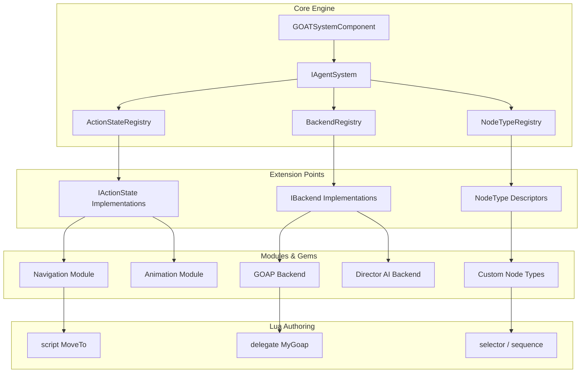
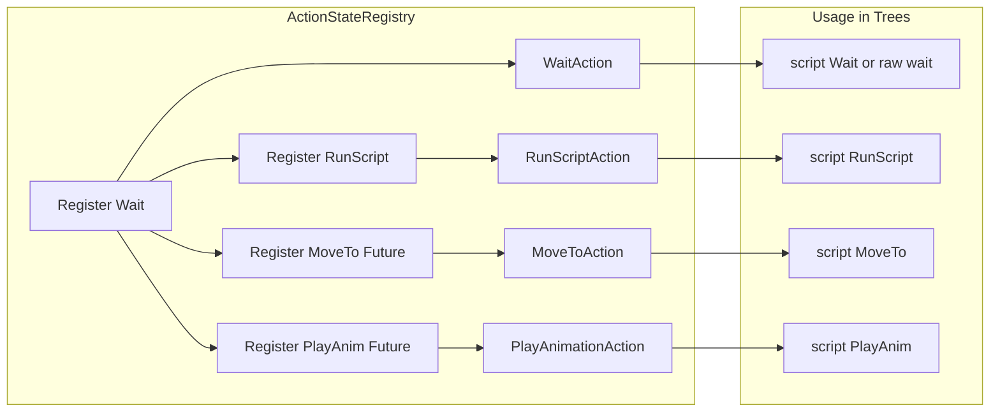
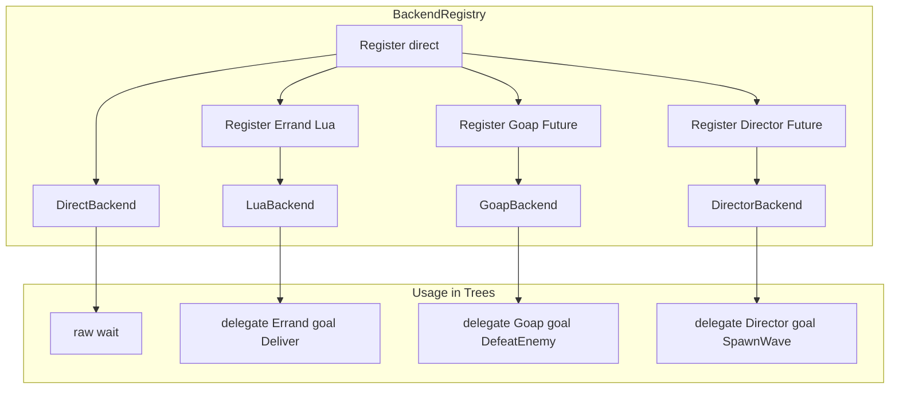
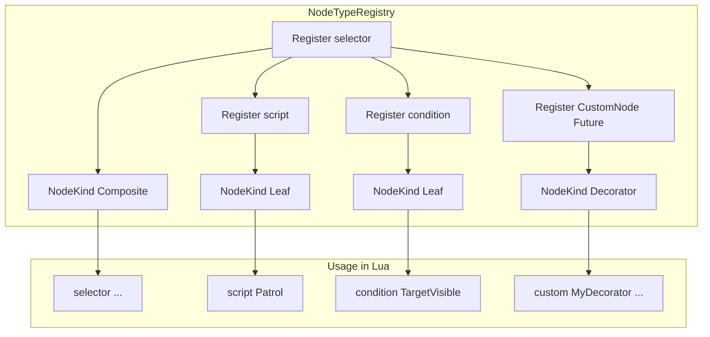

# Extensibility Model

> **Category:** Architectural Pattern  
> **Status:** Implemented  
> **Core Files:** `Code/Source/Clients/GOATAgentComponent.cpp`, `Code/Source/Core/Application/ActionStateRegistry.cpp`, `Code/Source/Core/Application/BackendRegistry.cpp`, `Code/Source/Core/Application/NodeTypeRegistry.cpp`, `Code/Include/GOAT/Interfaces/IAgentSystem.h`

---

## 💡 Core Concept

G.O.A.T. is designed so that **you never need to modify the core engine** to add new behavior. Instead, you extend it through three primary hook points:

1. **Action States (`IActionState`)** – Add new verbs (e.g., `MoveTo`, `Attack`, `PlayAnimation`).
2. **Backends (`IBackend`)** – Add new planning paradigms (e.g., GOAP, HTN, Director AI).
3. **Node Types (`NodeTypeRegistry`)** – Add new tree node types that the Lua DSL can use.

This is achieved through the `IAgentSystem` interface, which acts as a **registry façade** for the entire framework.

---

## 🗺️ Visual Overview



---

## 🤔 Why This Matters

### The Problem

Most game AI frameworks are **closed** – you have to modify the core source code to add new node types, actions, or planning algorithms. This creates:

- **Fork risk:** Every project modifies core code, making upgrades impossible.
- **Integration pain:** New features require rebuilding the entire engine.
- **Designer frustration:** AI designers are limited to what the core provides.

### The G.O.A.T. Solution

G.O.A.T. treats extensibility as a **first-class concern**. The core engine provides only the **pipeline** (compile, walk, plan, execute). Everything else is pluggable through clean interfaces. This means:

- **Modules add behavior** without touching core.
- **Designers use new verbs** directly in Lua trees.
- **New planning algorithms** are swapped in without changing tree structure.

---

## 🧩 The Three Extension Points

### 1. Action States (`IActionState`)

**Description:**  
Action states are the **atomic operations** an agent can perform. They are registered by name and invoked by `ActionPlan`s.

**Interface:**

```cpp
// Code/Include/GOAT/Interfaces/IActionState.h
class IActionState
{
public:
    AZ_RTTI(IActionState, IActionStateTypeId);

    virtual ~IActionState() = default;

    // Name this action is registered under.
    virtual AZ::Name GetName() const = 0;

    // Called when the action starts.
    virtual ActionResult OnStart(const ActionRequest& request, const PlanContext& context) = 0;

    // Called every tick while the action is running.
    virtual ActionResult OnTick(const ActionRequest& request, const PlanContext& context, float deltaTime) = 0;

    // Called when the action finishes or is interrupted.
    virtual void OnStop(const ActionRequest& request, const PlanContext& context) = 0;
};
```

**How to register:**

```cpp
// Code/Source/Core/Application/GOATSystemComponent.cpp
m_actions->RegisterAt(CoreActions::Wait, AZStd::make_unique<WaitAction>());
m_actions->RegisterAt(CoreActions::RunScript, AZStd::make_unique<RunScriptAction>(*m_dispatch, *m_scriptContext));
```

**Visual Representation:**



**How to create a new one:**

```cpp
class MoveToAction final : public IActionState
{
public:
    AZ_CLASS_ALLOCATOR(MoveToAction, AZ::SystemAllocator);

    AZ::Name GetName() const override { return AZ_NAME_LITERAL("MoveTo"); }

    ActionResult OnStart(const ActionRequest& request, const PlanContext& context) override
    {
        // Start movement logic
        return ActionResult::Running;
    }

    ActionResult OnTick(const ActionRequest& request, const PlanContext& context, float deltaTime) override
    {
        // Update movement
        return ActionResult::Success;
    }

    void OnStop(const ActionRequest& request, const PlanContext& context) override
    {
        // Cancel movement
    }
};
```

---

### 2. Backends (`IBackend`)

**Description:**  
Backends are **planning algorithms** that turn `Intent`s from tree leaves into `ActionPlan`s. This is how you add GOAP, HTN, Utility AI, or Director AI.

**Interface:**

```cpp
// Code/Include/GOAT/Interfaces/IBackend.h
class IBackend
{
public:
    AZ_RTTI(IBackend, IBackendTypeId);

    virtual ~IBackend() = default;

    // Name this backend is registered under and referenced by from Lua.
    virtual AZ::Name GetName() const = 0;

    // Produces a plan for one intent. Returns false when this backend cannot satisfy it.
    virtual bool Plan(const PlanContext& context, const Intent& intent, ActionPlan& outPlan) = 0;
};
```

**How to register:**

```cpp
// Code/Source/Core/Application/GOATSystemComponent.cpp
auto direct = AZStd::make_unique<DirectBackend>();
m_directBackend = AZStd::move(direct);
```

```cpp
// Code/Include/GOAT/Interfaces/IAgentSystem.h
virtual bool RegisterBackend(AZStd::unique_ptr<IBackend> backend) = 0;
```

**Visual Representation:**



**How to create a new one (C++):**

```cpp
class GoapBackend final : public IBackend
{
public:
    AZ_CLASS_ALLOCATOR(GoapBackend, AZ::SystemAllocator);

    AZ::Name GetName() const override { return AZ_NAME_LITERAL("Goap"); }

    bool Plan(const PlanContext& context, const Intent& intent, ActionPlan& outPlan) override
    {
        // Run GOAP algorithm, populate outPlan
        return true;
    }
};
```

**How to create a new one (Lua):**

```lua
-- Example from ExampleAdvanced.lua
backend "Errand" {
    plan = function(me, ctx, goal)
        if goal == "Rest" then
            return { { action = "wait", seconds = 2.0 } }
        end
        return {
            { action = "script", behavior = "Announce" },
            { action = "wait", seconds = 0.5 },
        }
    end,
}
```

---

### 3. Node Types (`NodeTypeRegistry`)

**Description:**  
Node types define the **vocabulary** available in trees. They are registered with a name, an operation (`NodeOp`), and a set of accepted properties.

**Interface:**

```cpp
// Code/Source/Core/Application/NodeTypeRegistry.h
class NodeTypeRegistry
{
public:
    bool Register(const NodeTypeDescriptor& descriptor);
    const NodeTypeDescriptor* Find(const AZ::Name& name) const;
    AZStd::vector<const NodeTypeDescriptor*> GetAll() const;
};
```

**NodeTypeDescriptor:**

```cpp
// Code/Include/GOAT/Domain/NodeType.h
struct NodeTypeDescriptor
{
    AZ::Name m_name;
    NodeKind m_kind;
    NodeOp m_op;
    AZStd::vector<NodeParameter> m_parameters;
    AZStd::string m_category;
    AZStd::string m_description;
};
```

**Visual Representation:**



**How to create a new one (C++):**

```cpp
NodeTypeDescriptor descriptor;
descriptor.m_name = AZ_NAME_LITERAL("MyCustomNode");
descriptor.m_kind = NodeKind::Decorator;
descriptor.m_op = NodeOp::LuaDecorator;
descriptor.m_parameters.push_back({ AZ_NAME_LITERAL("behavior"), true, false, BlackboardType::Name });
m_nodeTypes->Register(descriptor);
```

---

## 🧩 The `IAgentSystem` Façade

All extension points go through `IAgentSystem`, which is registered by `GOATSystemComponent`.

```cpp
// Code/Include/GOAT/Interfaces/IAgentSystem.h
class IAgentSystem
{
public:
    AZ_RTTI(IAgentSystem, IAgentSystemTypeId);

    virtual ~IAgentSystem() = default;

    // Registers an action verb (e.g., MoveTo, Attack, PlayAnimation)
    virtual ActionStateId RegisterAction(AZStd::unique_ptr<IActionState> action) = 0;
    virtual void UnregisterAction(ActionStateId id) = 0;

    // Registers a planning backend (e.g., Goap, Htn, Director)
    virtual bool RegisterBackend(AZStd::unique_ptr<IBackend> backend) = 0;
    virtual void UnregisterBackend(const AZ::Name& name) = 0;

    // Lists available extensions (for console output)
    virtual AZStd::vector<AZ::Name> GetBackendNames() const = 0;
    virtual AZStd::vector<AZ::Name> GetActionNames() const = 0;
};
```

This interface is the **only public API** a module needs to extend G.O.A.T.

---

## ⚖️ Trade-offs

| ✅ Advantage | ⚠️ Disadvantage |
| :--- | :--- |
| No core modification for new features | Requires understanding the interfaces |
| Plug-and-play behavior | More moving parts to debug |
| Designer-friendly vocabulary | More documentation needed |
| Runtime registration/unregistration | Slight overhead for registry lookups |
| Clean separation of concerns | Slight learning curve for new contributors |

---

## 🧩 Impact on the Codebase

### Lua Layer

- Designers use new verbs directly in trees (`script "MoveTo"`).
- Designers define custom backends in Lua (`backend "MyGoap" { ... }`).
- Designers can write custom control flow (`flow "MyComposite" { ... }`).

### C++ Core

- `ActionStateRegistry` stores and dispatches `IActionState`s.
- `BackendRegistry` stores and dispatches `IBackend`s.
- `NodeTypeRegistry` stores descriptors used by `TreeCompiler`.

### Modules

- **Navigation Module:** Registers `MoveTo`, `Wander`, etc. as `IActionState`s.
- **Animation Module:** Registers `PlayAnimation`, `SetAnimationState`, etc.
- **GOAP Backend:** Implements `IBackend` for goal-oriented planning.
- **Director AI Backend:** Implements `IBackend` for global orchestration.

---

## 🗺️ Future Evolution

### Navigation Library

- Will register `MoveTo`, `FollowPath`, `Wander`, `Flee`, etc., as `IActionState`s.
- Will expose them to Lua via `BehaviorContext` so trees can use `script "MoveTo"`.

### Perception Module

- Will likely be implemented as Lua `service` nodes, not C++ components.
- Will write perception results to blackboard keys (e.g., `TargetVisible`, `TargetDistance`).

### Custom Node Types

- Modules can register new node types via `NodeTypeRegistry`.
- Trees can use these node types directly in Lua.

---

## 🔗 Related Concepts

- [[Design Principles]]
- [[Backend Abstraction Theory]]
- [[Performance Model]]
- [[Adding New Actions]]

---

*Last updated: 2026-08-26*