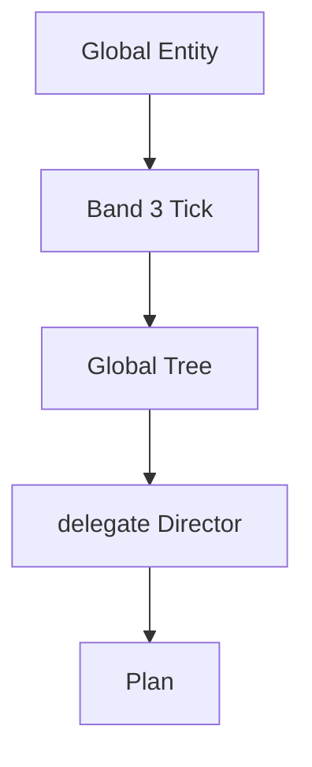

# Orchestration Patterns

> **Category:** Architectural Pattern  
> **Status:** Implemented via `IBackend` and Global Agents  

---

## 💡 Core Concept

**Orchestration Patterns** are architectural approaches for controlling groups of agents from a central authority. In G.O.A.T., this is achieved using the **Backend Abstraction** combined with **Global Blackboard Scopes**. Instead of adding a complex new system, orchestration leverages the existing planning pipeline.

---

## 🤔 Why This Matters

Games often need a "brain" that coordinates many NPCs:

- **Wave-based combat:** The game decides when to spawn enemies and how many.
- **Difficulty scaling:** The game modifies enemy health or speed based on player progress.
- **Environmental events:** The game triggers earthquakes, ambushes, or patrol changes.

Without a clean pattern, this logic often becomes scattered across many components. Orchestration Patterns provide a **single, unified way** to handle global decisions.

---

## ⚖️ The Three Orchestration Styles

### 1. Global Agent (Entity-Based)

The most direct approach. A single entity runs a tree that delegates to a Director backend.



**Pros:** Simple, uses existing components.  
**Cons:** Requires an actual entity in the scene.

---

### 2. Backend-Only (Service-Based)

No dedicated entity. Instead, a **service** runs on a high-priority agent and writes to the Global Blackboard.

```lua
service "Director" { interval = 1.0 }
```

The service polls game state and writes to Global variables.

**Pros:** No extra entity.  
**Cons:** Tied to the life of that specific agent.

---

### 3. Hybrid (Global Agent + Service)

The most flexible. A Global Agent uses a service to monitor state and a `delegate` to execute directives.

```lua
tree "DirectorTree" {
    selector {
        service "CheckProgress" { interval = 1.0 },
        sequence {
            condition "wave_active" { abort = "lower_priority" },
            delegate "Director" { goal = "SpawnWave" },
        },
    }
}
```

**Pros:** Combines reactive monitoring with planning.  
**Cons:** Slightly more complex to author.

---

## 🧩 How Orchestration Fits G.O.A.T.'s Principles

| Principle | How Orchestration Uses It |
| :--- | :--- |
| **Backend Abstraction** | The Director is just a backend (`IBackend`). |
| **Lua-First Authoring** | Global trees, services, and backend plans are all written in Lua. |
| **Schema-Driven Blackboard** | Global and Squad scopes allow cross-agent data sharing. |
| **Performance-Aware** | Band 3 for global agents minimizes CPU cost. |
| **Behavior-Driven Data** | Agents react to Global keys via conditions and aborts. |

---

## 🧩 Example: Wave Spawning

```lua
-- Global tree
return tree "DirectorTree" {
    sequence {
        condition "wave_started" { abort = "lower_priority" },
        delegate "Director" { goal = "SpawnWave" },
        wait(2.0),
    },
}

-- Director backend
backend "Director" {
    plan = function(me, ctx, goal)
        local wave = ctx:GetInt("wave_number") or 1
        return {
            { action = "script", behavior = "SpawnEnemies", tag = "wave_" .. wave },
            { action = "wait", seconds = 10.0 },
        }
    end,
}
```

---

## 🔗 Related Concepts

- [[Director AI]]
- [[Backend Abstraction Theory]]
- [[Design Principles]]
- [[Performance Model]]
- [[Extensibility Model]]

---

*Last updated: 2026-08-26*