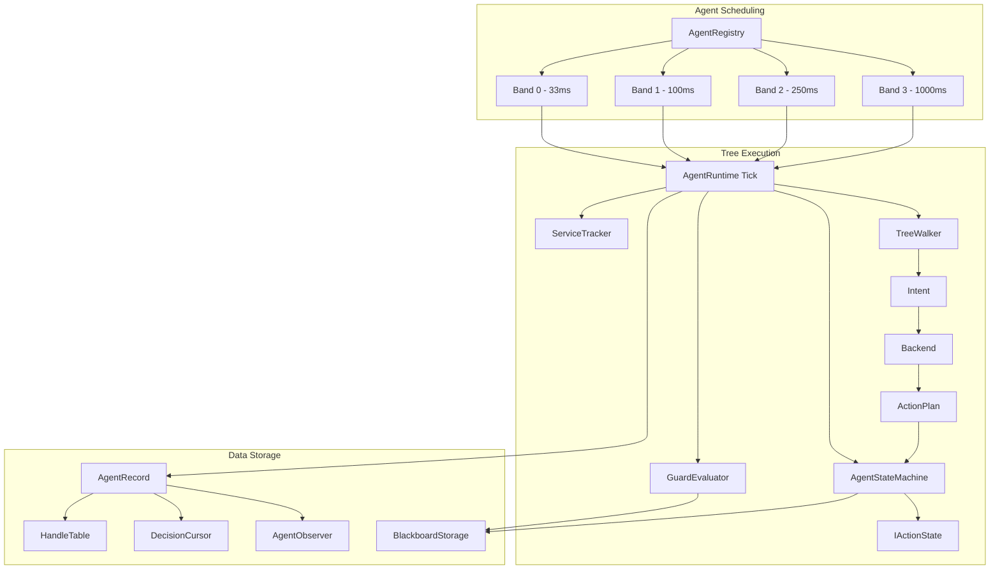
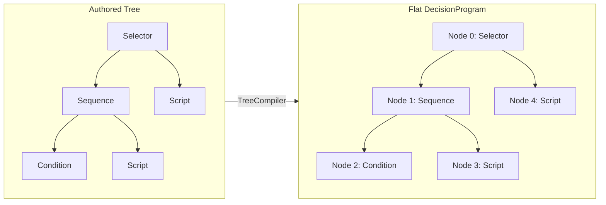
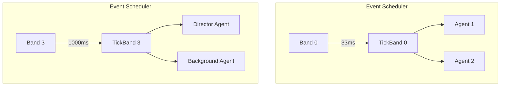
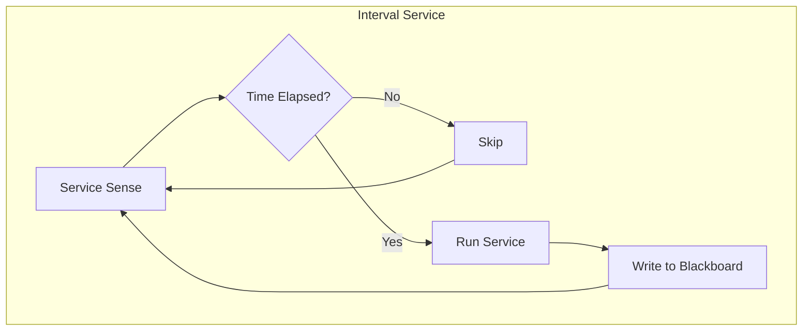

# Performance Model

> **Category:** Performance Model  
> **Status:** Implemented  
> **Core Files:** `Code/Source/Core/Frontend/TreeWalker.cpp`, `Code/Source/Core/Application/AgentRegistry.cpp`, `Code/Source/Core/Application/AgentRuntime.cpp`, `Code/Source/Core/Memory/HandleTable.h`

---

## 💡 Core Concept

G.O.A.T. is designed to support **thousands of agents** without frame spikes. It achieves this through a combination of **structural optimizations** (flat programs, iterative traversal, dense storage) and **scheduling optimizations** (tick bands, interval services, event-driven guards). The goal is to provide **predictable performance** at scale, ensuring that no single agent can cause a significant frame hitch.

---

## 🗺️ Visual Overview



---

## 🤔 Why This Matters

### The Problem

Traditional Behavior Tree implementations suffer from several performance issues:

- **Recursion:** Deep trees cause stack overflow and cache misses.
- **String lookups:** Blackboard variables are looked up by name every tick.
- **Per-frame polling:** Conditions are checked every frame, wasting CPU when nothing changed.
- **Per-agent allocations:** Each agent allocates its own tree nodes, causing fragmentation.
- **No prioritization:** All agents run at the same frequency, wasting CPU on distant or idle NPCs.

### The G.O.A.T. Solution

G.O.A.T. addresses each of these issues with a deliberate architectural choice.

---

## 🧩 Performance Mechanisms

### 1. Flat Programs (Structural Optimization)

**Description:**  
Trees are compiled into a contiguous `AZStd::vector<DecisionNode>` array with precomputed child indices. This eliminates pointer chasing and improves cache locality.

**How it works in the code:**

```cpp
// Code/Source/Core/Frontend/TreeCompiler.cpp
const NodeIndex index = aznumeric_cast<NodeIndex>(program.m_nodes.size());
program.m_nodes.emplace_back();
{
    DecisionNode& node = program.m_nodes[index];
    node.m_op = descriptor->m_op;
    node.m_parent = parent;
    node.m_childCount = aznumeric_cast<AZ::u16>(authored.m_children.size());
}
```

**Visual Representation:**



**Benefits:**
- **Cache-friendly:** Nodes are contiguous in memory.
- **No recursion:** `TreeWalker` uses a loop with explicit parent/child indices.
- **O(1) sibling navigation:** Precomputed `subtreeEnd` indices.

---

### 2. Iterative Traversal (No Stack Overflow)

**Description:**  
The `TreeWalker` executes trees using a loop, not recursion. This avoids stack overflow on deep trees and ensures predictable performance.

**How it works in the code:**

```cpp
// Code/Source/Core/Frontend/TreeWalker.cpp
WalkStep TreeWalker::Run(
    const DecisionProgram& program,
    DecisionCursor& cursor,
    const PlanContext& context,
    NodeIndex node,
    bool bubbling,
    ActionResult result) const
{
    while (node != InvalidNodeIndex)
    {
        if (!bubbling)
        {
            const DecisionNode& current = program.m_nodes[node];
            switch (current.m_op)
            {
            case NodeOp::Selector:
            case NodeOp::Sequence:
                cursor.ChildIndex(node) = 0;
                node = current.m_firstChild;
                continue;
            // ... other nodes ...
            }
        }
        // Bubbling logic
    }
    return Finished(result);
}
```

**Benefits:**
- **No stack overflow:** Handles arbitrarily deep trees.
- **Predictable performance:** Each iteration is O(1).
- **Easy to debug:** Explicit loop with clear state transitions.

---

### 3. Tick Bands (Scheduling Optimization)

**Description:**  
Agents are assigned to "bands" that determine how often they run. `AgentRegistry::BandCount` is 4.

| Band | Interval | Description |
| :--- | :--- | :--- |
| 0 | 33ms | Most frequent (close, high priority agents) |
| 1 | 100ms | Standard AI |
| 2 | 250ms | Distant agents |
| 3 | 1000ms | Least frequent (background, director AI) |

**How it works in the code:**

```cpp
// Code/Source/Core/Application/AgentRegistry.cpp
const AZ::TimeMs defaults[BandCount] = { AZ::TimeMs{ 33 }, AZ::TimeMs{ 100 }, AZ::TimeMs{ 250 }, AZ::TimeMs{ 1000 } };
```

**Visual Representation:**



**Benefits:**
- **CPU savings:** Distant or idle agents run less frequently.
- **Scalability:** Supports thousands of agents with reduced cost.
- **Designer control:** Assign bands in the editor or at runtime.

---

### 4. Interval Services (Reactive Polling)

**Description:**  
Services attached to composites run at fixed intervals, not every frame. This reduces CPU cost for perception and state monitoring.

**How it works in the code:**

```cpp
// Code/Source/Core/Frontend/ServiceTracker.cpp
void ServiceTracker::CollectDue(
    const DecisionProgram& program, DecisionCursor& cursor, AZStd::vector<AZ::u32>& outServices) const
{
    outServices.clear();
    const NodeIndex leaf = cursor.GetActiveLeaf();
    if (leaf == InvalidNodeIndex) { return; }

    const float now = cursor.GetNow();
    for (const NodeIndex nodeIndex : program.m_serviceNodes)
    {
        const DecisionNode& node = program.m_nodes[nodeIndex];
        // In scope means the running leaf is somewhere inside this composite's subtree.
        if (leaf < nodeIndex || leaf >= node.m_subtreeEnd) { continue; }

        for (AZ::u16 offset = 0; offset < node.m_serviceCount; ++offset)
        {
            const AZ::u32 service = node.m_firstService + offset;
            float& due = cursor.ServiceDue(service);
            if (due > now) { continue; }

            due = now + AZStd::max(program.m_services[service].m_interval, 0.0f);
            outServices.push_back(service);
        }
    }
}
```

**Visual Representation:**



**Benefits:**
- **Reduced polling:** Checks happen at defined intervals.
- **Event-driven reactions:** Conditions abort branches when state changes.
- **Lower CPU:** Fewer checks per frame.

---

### 5. Event-Driven Guards (AgentObserver)

**Description:**  
`AgentObserver` watches only the blackboard slots an agent's tree actually guards on. When a watched slot changes, it marks the agent as "dirty" so the `GuardEvaluator` re-checks conditions only when necessary.

**How it works in the code:**

```cpp
// Code/Source/Core/Application/AgentObserver.cpp
void AgentObserver::Connect(const DecisionProgram& program, IBlackboardSystem& blackboard, AgentId agent)
{
    Disconnect();
    m_observed = program.m_observedKeys;
    if (m_observed.empty()) { return; }

    for (AZ::u8 scopeIndex = 0; scopeIndex < static_cast<AZ::u8>(BlackboardScope::Count); ++scopeIndex)
    {
        const auto scope = static_cast<BlackboardScope>(scopeIndex);
        BlackboardStorage* storage = blackboard.FindStorage(scope, agent);
        if (storage == nullptr) { continue; }

        m_handlers[scopeIndex] = BlackboardStorage::ChangedEvent::Handler(
            [this](BlackboardKey key) { OnChanged(key); });
        storage->ConnectChangedHandler(m_handlers[scopeIndex]);
    }
    m_dirty = true;
}
```

**Benefits:**
- **Zero polling:** No conditions evaluated when nothing changes.
- **Targeted wake-ups:** Agents only re-check guards when a watched key changes.
- **Scalable:** Thousands of agents can have active guards without CPU cost.

---

### 6. Shared DecisionPrograms (Memory Optimization)

**Description:**  
Multiple agents running the same tree share an immutable `DecisionProgram`. This eliminates per-agent tree duplication.

**How it works in the code:**

```cpp
// Code/Source/Core/Application/GOATSystemComponent.cpp
m_programs[treeName] =
    AZStd::shared_ptr<const DecisionProgram>(aznew DecisionProgram(AZStd::move(compiled.GetValue())));
```

**Benefits:**
- **Memory savings:** Hundreds of agents can share one tree.
- **Cache efficiency:** Shared program data is hot in CPU cache.
- **No per-agent tree allocation:** Reduces fragmentation.

---

### 7. Blackboard Indexing (Type-Safe, String-Free Access)

**Description:**  
Blackboard variables are resolved to typed indices at compile time, not looked up by string at runtime.

**How it works in the code:**

```cpp
// Code/Source/Core/Domain/BlackboardStorage.cpp
void BlackboardStorage::EnsureCapacity(const BlackboardLayout& layout)
{
    m_bools.resize(count(BlackboardType::Bool), false);
    m_ints.resize(count(BlackboardType::Int), 0);
    m_floats.resize(count(BlackboardType::Float), 0.0f);
    // ... etc
}
```

**Benefits:**
- **No string hashing:** O(1) array access.
- **Type safety:** Compile-time validation prevents type mismatches.
- **Cache locality:** Typed arrays are contiguous in memory.

---

### 8. HandleTable (Dense Storage)

**Description:**  
`HandleTable` uses generation-checked handles (like `AgentId`) to safely manage agents while keeping data contiguous. When a slot is released, the generation is bumped, invalidating stale handles.

**How it works in the code:**

```cpp
// Code/Source/Core/Memory/HandleTable.h
template<typename T, typename Tag>
class HandleTable final
{
public:
    HandleType Acquire(Args&&... args);      // Stores value, returns handle
    bool Release(HandleType handle);         // Destroys value, bumps generation
    T* Find(HandleType handle);              // Returns value, nullptr if stale
    AZStd::vector<T>& GetValues();           // Contiguous iteration
};
```

**Benefits:**
- **Dense iteration:** Values are contiguous for cache-friendly loops.
- **Stale detection:** Generation counters prevent use-after-free.
- **Slot reuse:** Freed slots are recycled without fragmentation.

---

### 9. Bounded Intents Per Tick

**Description:**  
`AgentRuntime` limits the number of intents it satisfies in a single tick to prevent a tree of instantly-completing leaves from spinning the frame.

**How it works in the code:**

```cpp
// Code/Source/Core/Application/AgentRuntime.cpp
constexpr int MaxIntentsPerTick = 8;

for (int attempt = 0; attempt < MaxIntentsPerTick; ++attempt)
{
    if (step.m_outcome == WalkOutcome::Finished) { ... }
    if (StartPlan(agent, planContext, step.m_intent)) { return; }
    step = m_walker.Advance(*agent.m_program, agent.m_cursor, planContext, ActionResult::Failure);
}
```

**Benefits:**
- **Frame budget protection:** No single agent can monopolize a frame.
- **Fair scheduling:** Each agent gets a bounded amount of work per tick.

---

## ⚖️ Trade-offs

| ✅ Advantage | ⚠️ Disadvantage |
| :--- | :--- |
| High performance at scale | Increased compile-time complexity |
| Predictable frame times | Requires careful authoring for bands/intervals |
| Memory efficiency | Fewer per-agent customizations (shared programs) |
| No stack overflow | More complex debugging for deep trees |
| Type-safe blackboard access | Schema must be declared before trees compile |
| Event-driven guards | Requires careful setup of `AgentObserver` |

---

## 🧩 Impact on the Codebase

### Lua Layer

- Designers set `interval` on services to control polling frequency.
- Designers assign `band` to agents via the editor or at runtime.
- Trees are authored once and shared by many agents.

### C++ Core

- `TreeCompiler` flattens trees into contiguous programs.
- `TreeWalker` executes iteratively with no recursion.
- `AgentRegistry` schedules agents into bands.
- `AgentRuntime` bounds work per tick.
- `AgentObserver` enables event-driven guards.
- `HandleTable` provides dense, generation-checked storage.

### Extensibility

- New action states are registered and executed as part of plans.
- New backends (GOAP, HTN) fit into the existing plan execution pipeline.
- New modules (Navigation, Perception) respect the same performance principles.

---

## 🗺️ Future Evolution

### Navigation Library

- Will provide `MoveTo`, `Wander`, etc., as `IActionState`s.
- Will use `Vector3` blackboard keys for target positions.
- Will be registered via `IAgentSystem::RegisterAction`.

### Perception Module

- Will likely be implemented as Lua `service` nodes with intervals.
- Will write to blackboard keys (e.g., `TargetVisible`, `TargetDistance`).
- Will respect the "Behavior-Driven Data" principle.

---

## 🔗 Related Concepts

- [[Design Principles]]
- [[Backend Abstraction Theory]]
- [[Extensibility Model]]
- [[Blackboard System]]

---

*Last updated: 2026-08-26*