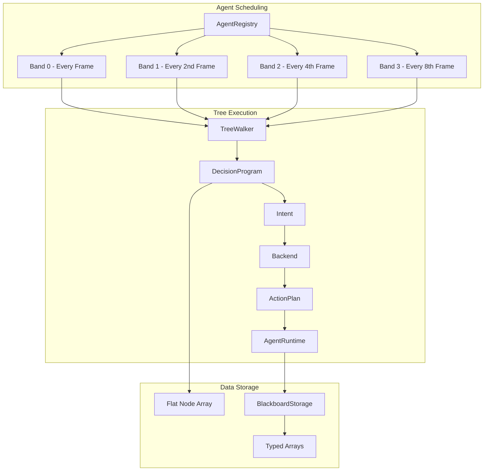
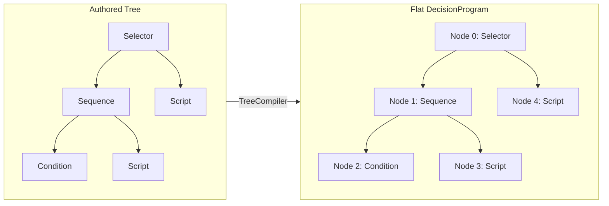
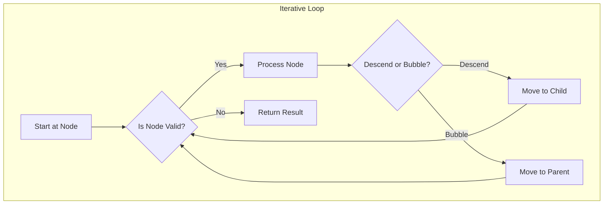
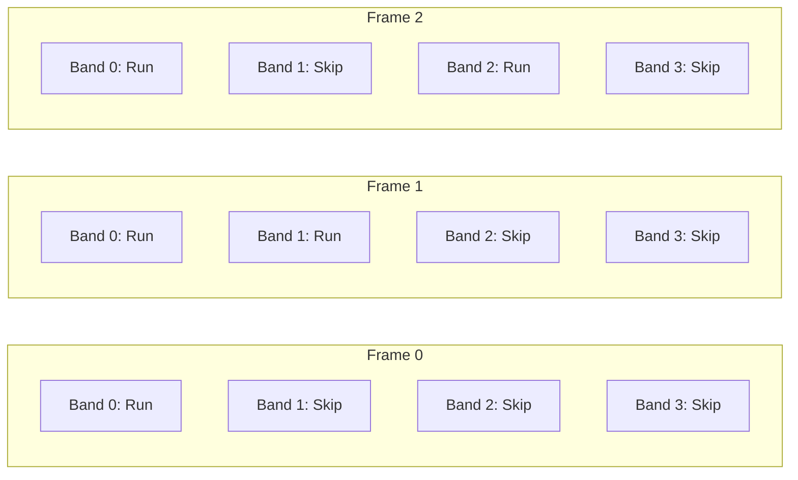

# Performance Model

> **Category:** Performance Model  
> **Status:** Implemented  
> **Core Files:** `Code/Source/Core/Frontend/TreeWalker.cpp`, `Code/Source/Core/Frontend/DecisionCursor.h`, `Code/Source/Core/Application/AgentRuntime.cpp`, `Code/Source/Core/Domain/BlackboardStorage.cpp`

---

## 💡 Core Concept

G.O.A.T. is designed to support **thousands of agents** without frame spikes. It achieves this through a combination of **structural optimizations** (flat programs, iterative traversal) and **scheduling optimizations** (tick bands, interval services). The goal is to provide **predictable performance** at scale, ensuring that no single agent can cause a significant frame hitch.

---

## 🗺️ Visual Overview



---

## 🤔 Why This Matters

### The Problem

Traditional Behavior Tree implementations suffer from several performance issues:

- **Recursion:** Deep trees cause stack overflow and cache misses.
- **String lookups:** Blackboard variables are looked up by name every tick.
- **Per-frame polling:** Conditions are checked every frame, wasting CPU when nothing changed.
- **Per-agent allocations:** Each agent allocates its own tree nodes, causing fragmentation.
- **No prioritization:** All agents run at the same frequency, wasting CPU on distant or idle NPCs.

### The G.O.A.T. Solution

G.O.A.T. addresses each of these issues with a deliberate architectural choice.

---

## 🧩 Performance Mechanisms

### 1. Flat Programs (Structural Optimization)

**Description:**  
Trees are compiled into a contiguous `AZStd::vector<DecisionNode>` array with precomputed child indices. This eliminates pointer chasing and improves cache locality.

**How it works in the code:**

```cpp
// Code/Source/Core/Frontend/TreeCompiler.cpp
const NodeIndex index = aznumeric_cast<NodeIndex>(program.m_nodes.size());
program.m_nodes.emplace_back();
{
    DecisionNode& node = program.m_nodes[index];
    node.m_op = descriptor->m_op;
    node.m_parent = parent;
    node.m_childCount = aznumeric_cast<AZ::u16>(authored.m_children.size());
}
```

**Visual Representation:**



**Benefits:**
- **Cache-friendly:** Nodes are contiguous in memory.
- **No recursion:** `TreeWalker` uses a loop with explicit parent/child indices.
- **O(1) sibling navigation:** Precomputed `subtreeEnd` indices.

---

### 2. Iterative Traversal (No Stack Overflow)

**Description:**  
The `TreeWalker` executes trees using a loop, not recursion. This avoids stack overflow on deep trees and ensures predictable performance.

**How it works in the code:**

```cpp
// Code/Source/Core/Frontend/TreeWalker.cpp
WalkStep TreeWalker::Run(
    const DecisionProgram& program,
    DecisionCursor& cursor,
    const PlanContext& context,
    NodeIndex node,
    bool bubbling,
    ActionResult result) const
{
    while (node != InvalidNodeIndex)
    {
        // ... process node ...
    }
    return Finished(result);
}
```

**Visual Representation:**



**Benefits:**
- **No stack overflow:** Handles arbitrarily deep trees.
- **Predictable performance:** Each iteration is O(1).
- **Easy to debug:** Explicit loop with clear state transitions.

---

### 3. Tick Bands (Scheduling Optimization)

**Description:**  
Agents are assigned to "bands" that determine how often they run. Band 0 runs every frame, Band 1 every other frame, Band 2 every 4th frame, and Band 3 every 8th frame.

**How it works in the code:**

```cpp
// Code/Source/Clients/GOATAgentComponent.h
// The band selects how often it runs, from most frequent at zero.
int m_band = 1;
```

```cpp
// Code/Include/GOAT/Interfaces/IAgentSystem.h
// The band selects how often it runs, from most frequent at zero.
virtual AgentId RegisterAgent(AZ::EntityId entity, const AZ::Name& treeName, size_t band) = 0;
```

**Visual Representation:**



**Benefits:**
- **CPU savings:** Distant or idle agents run less frequently.
- **Scalability:** Supports thousands of agents with reduced cost.
- **Designer control:** Assign bands in the editor or at runtime.

---

### 4. Interval Services (Reactive Polling)

**Description:**  
Services attached to composites run at fixed intervals, not every frame. This reduces CPU cost for perception and state monitoring.

**How it works in the code:**

```lua
-- Example from ExampleAgent.lua
selector {
    service "Sense" { interval = 0.25 },
    sequence {
        condition "target_seen" { abort = "lower_priority" },
        script "Alert",
        wait(1.0),
    },
    sequence {
        script "Patrol",
        wait(0.5),
    },
}
```

```cpp
// Code/Source/Core/Frontend/TreeCompiler.cpp
if (const AZStd::any* interval = FindProperty(authoredService, AZ_NAME_LITERAL("interval")))
{
    double seconds = 0.0;
    if (ReadNumber(*interval, seconds))
    {
        service.m_interval = static_cast<float>(seconds);
    }
}
```

```cpp
// Code/Source/Core/Frontend/DecisionCursor.h
// Absolute time a service is next due to run.
float& ServiceDue(AZ::u32 service) { return m_serviceDue[service]; }
```

**Visual Representation:**

```mermaid
graph TD
    subgraph Service[Interval Service]
        A[Service "Sense"] --> B{Time Elapsed?}
        B -->|No| C[Skip]
        B -->|Yes| D[Run Service]
        D --> E[Write to Blackboard]
        C --> A
        E --> A
    end

    subgraph Tree[Tree Reaction]
        F[Condition "target_seen"] --> G{Abort?}
        G -->|Yes| H[Preempt Lower Priority]
        G -->|No| I[Continue]
    end
```

**Benefits:**
- **Reduced polling:** Checks happen at defined intervals.
- **Event-driven reactions:** Conditions abort branches when state changes.
- **Lower CPU:** Fewer checks per frame.

---

### 5. Shared DecisionPrograms (Memory Optimization)

**Description:**  
Multiple agents running the same tree share an immutable `DecisionProgram`. This eliminates per-agent tree duplication.

**How it works in the code:**

```cpp
// Code/Source/Core/Application/GOATSystemComponent.cpp
m_programs[treeName] =
    AZStd::shared_ptr<const DecisionProgram>(aznew DecisionProgram(AZStd::move(compiled.GetValue())));
```

```cpp
// Code/Include/GOAT/Domain/DecisionProgram.h
struct DecisionProgram
{
    AZStd::vector<DecisionNode> m_nodes;
    AZStd::vector<DecisionService> m_services;
    AZStd::vector<NodeIndex> m_guardNodes;
    AZStd::vector<BlackboardKey> m_observedKeys;
};
```

**Visual Representation:**

```mermaid
graph LR
    subgraph Program[Shared DecisionProgram]
        A[Tree "Guard"] --> B[Immutable Program]
    end

    subgraph Agents[Agents]
        C[Agent 1] --> B
        D[Agent 2] --> B
        E[Agent 3] --> B
        F[Agent 4] --> B
    end
```

**Benefits:**
- **Memory savings:** Hundreds of agents can share one tree.
- **Cache efficiency:** Shared program data is hot in CPU cache.
- **No per-agent tree allocation:** Reduces fragmentation.

---

### 6. Blackboard Indexing (Type-Safe, String-Free Access)

**Description:**  
Blackboard variables are resolved to typed indices at compile time, not looked up by string at runtime.

**How it works in the code:**

```cpp
// Code/Source/Core/Domain/BlackboardStorage.cpp
void BlackboardStorage::EnsureCapacity(const BlackboardLayout& layout)
{
    // Resize typed arrays based on layout counts
    m_bools.resize(count(BlackboardType::Bool), false);
    m_ints.resize(count(BlackboardType::Int), 0);
    m_floats.resize(count(BlackboardType::Float), 0.0f);
    // ...
}
```

**Visual Representation:**

```mermaid
graph LR
    subgraph Compile[Compile Time]
        A[Variable Name "Health"] --> B[TreeCompiler]
        B --> C[BlackboardKey Index 5]
    end

    subgraph Runtime[Runtime]
        C --> D[m_floats[5]]
        D --> E[Read/Write Value]
    end
```

**Benefits:**
- **No string hashing:** O(1) array access.
- **Type safety:** Compile-time validation prevents type mismatches.
- **Cache locality:** Typed arrays are contiguous in memory.

---

## ⚖️ Trade-offs

| ✅ Advantage | ⚠️ Disadvantage |
| :--- | :--- |
| High performance at scale | Increased compile-time complexity |
| Predictable frame times | Requires careful authoring for bands/intervals |
| Memory efficiency | Fewer per-agent customizations (shared programs) |
| No stack overflow | More complex debugging for deep trees |
| Type-safe blackboard access | Schema must be declared before trees compile |

---

## 🧩 Impact on the Codebase

### Lua Layer

- Designers set `interval` on services to control polling frequency.
- Designers assign `band` to agents via the editor or at runtime.
- Trees are authored once and shared by many agents.

### C++ Core

- `TreeCompiler` flattens trees into contiguous programs.
- `TreeWalker` executes iteratively with no recursion.
- `AgentRuntime` manages tick bands and service intervals.
- `BlackboardStorage` uses typed arrays for fast access.

### Extensibility

- New action states are registered and executed as part of plans.
- New backends (GOAP, HTN) fit into the existing plan execution pipeline.
- New modules (Navigation, Perception) respect the same performance principles.

---

## 🗺️ Future Evolution

### Navigation Library

- Will provide `MoveTo`, `Wander`, etc., as `IActionState`s.
- Will use `Vector3` blackboard keys for target positions.
- Will be registered via `IAgentSystem::RegisterAction`.

### Perception Module

- Will likely be implemented as Lua `service` nodes with intervals.
- Will write to blackboard keys (e.g., `TargetVisible`, `TargetDistance`).
- Will respect the "Behavior-Driven Data" principle.

---

## 🔗 Related Concepts

- [[Design Principles]]
- [[Backend Abstraction Theory]]
- [[Extensibility Model]]
- [[Blackboard System]]

---

*Last updated: 2026-08-26*