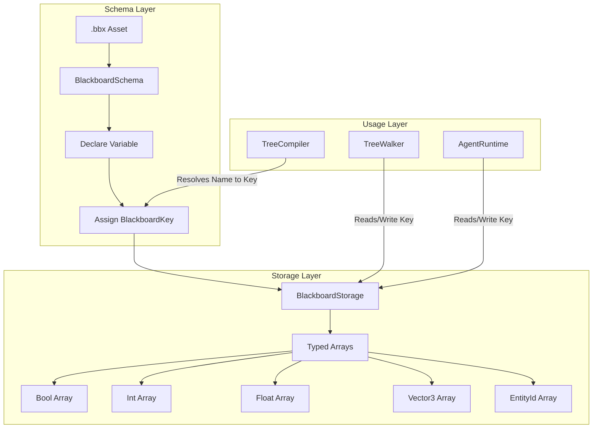
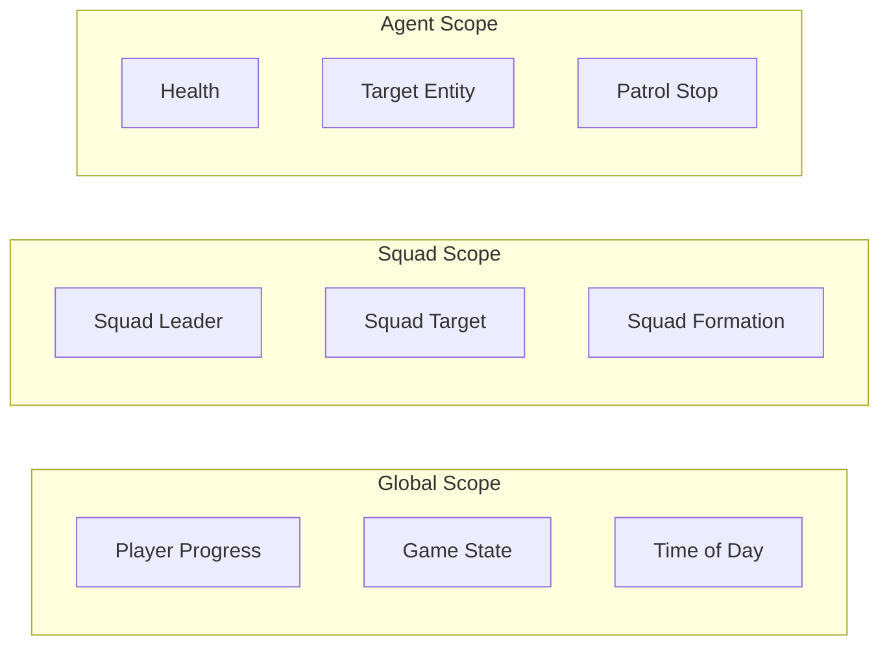

# Blackboard System

> **Category:** Architecture  
> **Status:** Implemented  
> **Core Files:** `Code/Source/Core/Domain/BlackboardSchema.h`, `Code/Source/Core/Domain/BlackboardStorage.cpp`, `Code/Source/Core/Application/BlackboardSystem.cpp`, `Code/Include/GOAT/Domain/BlackboardKey.h`

---

## 💡 Core Concept

The Blackboard is the **shared data layer** that connects behavior trees, backends, and actions. It provides a type-safe, schema-driven interface that eliminates runtime string lookups. Variables are declared in `.bbx` assets, merged into a global `BlackboardSchema`, and resolved into typed indices at compile time.

This architecture ensures:
- **O(1) access** – No string hashing at runtime.
- **Type safety** – Compile-time validation catches mismatches.
- **Cross-scope sharing** – Global, Agent, and Squad scopes allow flexible data ownership.
- **Memory efficiency** – Storage is dynamically provisioned based on declared variables.

---

## 🗺️ Visual Overview



---

## 🧩 Key Components

### 1. BlackboardSchema

**Purpose:** Merges all loaded `.bbx` assets into a single global namespace. It declares variables and assigns them typed indices.

**Interface:**

```cpp
// Code/Source/Core/Domain/BlackboardSchema.h
class BlackboardSchema final
{
public:
    AZ::Outcome<BlackboardKey, AZStd::string> Declare(
	        const AZ::Name& name, BlackboardScope scope, BlackboardType type, AZStd::any defaultValue = {});

    BlackboardKey Find(const AZ::Name& name) const;

    const BlackboardLayout& GetLayout(BlackboardScope scope) const;

    const AZStd::unordered_map<AZ::Name, BlackboardKey>& GetVariables() const { return m_keysByName; }

    void Clear();
};
```

**Key Rules:**
- Names are unique across all `.bbx` assets.
- Duplicate declarations cause a load error.
- Each variable gets a `BlackboardKey` that encodes its `scope`, `type`, and `index`.

---

### 2. BlackboardKey

**Purpose:** A lightweight, typed index used to access values. It encodes the scope and type of a variable.

```cpp
// Code/Include/GOAT/Domain/BlackboardKey.h
class BlackboardKey
{
public:
    BlackboardScope GetScope() const;
    BlackboardType GetType() const;
    AZ::u32 GetIndex() const;
    bool IsValid() const;
};
```

**Why this matters:** Trees and backends never use string names during runtime. They use these pre-resolved keys for O(1) array access.

---

### 3. BlackboardStorage

**Purpose:** Stores the actual values in typed, contiguous arrays. Storage is sized per scope based on the schema layout.

**Interface:**

```cpp
// Code/Include/GOAT/Domain/BlackboardStorage.h
class BlackboardStorage
{
public:
    void EnsureCapacity(const BlackboardLayout& layout);
    void Reset(const BlackboardLayout& layout);

    template<typename T>
    const T& Get(BlackboardKey key) const;

    template<typename T>
    void Set(BlackboardKey key, const T& value);
};
```

**Supported Types:**

| Type | C++ Type | Lua Type |
| :--- | :--- | :--- |
| Bool | `bool` | `boolean` |
| Int | `AZ::s64` | `number` |
| Float | `float` | `number` |
| Vector3 | `AZ::Vector3` | `Vector3` |
| EntityId | `AZ::EntityId` | `EntityId` |
| Name | `AZ::Name` | `string` |
| Quaternion | `AZ::Quaternion` | `Quaternion` |
| Transform | `AZ::Transform` | `Transform` |
| EntityIdList | `AZStd::vector<AZ::EntityId>` | `table` |

---

## 🧩 Scopes

Blackboard variables can belong to one of three scopes. This determines their lifetime and visibility.

| Scope | Description | Lifetime |
| :--- | :--- | :--- |
| **Global** | Shared across all agents | Whole game session |
| **Agent** | Per-agent variables | Agent lifecycle |
| **Squad** | Shared within a squad | Squad lifecycle |



---

## 🧩 Declaration and Merging

### How .bbx Assets are Loaded

```cpp
// Code/Source/Core/Application/GOATSystemComponent.cpp
AZ::Outcome<void, AZStd::string> GOATSystemComponent::LoadBlackboard(const BlackboardAsset& asset)
{
    if (m_blackboardSystem == nullptr)
    {
        return AZ::Failure(AZStd::string("The blackboard system is not running"));
    }

    for (const BlackboardVariable& variable : asset.m_variables)
    {
        auto declared = m_blackboardSystem->Declare(
            AZ::Name(variable.m_name), variable.m_scope, variable.m_type, variable.GetDefault());
        if (!declared.IsSuccess())
        {
            return AZ::Failure(declared.TakeError());
        }
    }
    return AZ::Success();
}
```

### What Happens in Schema

```cpp
// Code/Source/Core/Domain/BlackboardSchema.cpp
AZ::Outcome<BlackboardKey, AZStd::string> BlackboardSchema::Declare(
    const AZ::Name& name, BlackboardScope scope, BlackboardType type, AZStd::any defaultValue)
{
    if (name.IsEmpty())
    {
        return AZ::Failure(AZStd::string("A blackboard variable must have a name"));
    }

    if (auto existing = m_keysByName.find(name); existing != m_keysByName.end())
    {
        return AZ::Failure(AZStd::string::format(
            "Blackboard variable '%s' is already declared as %s %s",
            name.GetCStr(), ToString(existing->second.GetScope()), ToString(existing->second.GetType())));
    }

    BlackboardLayout& layout = m_layouts[static_cast<size_t>(scope)];
    AZ::u32& slotCount = layout.m_slotCounts[static_cast<size_t>(type)];
    if (slotCount > BlackboardKey::MaxIndex)
    {
        return AZ::Failure(AZStd::string::format(
            "Too many %s blackboard variables of type %s", ToString(scope), ToString(type)));
    }

    const BlackboardKey key(scope, type, slotCount);
    ++slotCount;

    if (!defaultValue.empty())
    {
        layout.m_defaults.emplace_back(key, AZStd::move(defaultValue));
    }

    m_keysByName.emplace(name, key);
    return AZ::Success(key);
}
```

---

## 🧩 Access in Lua

From Lua, the `ctx` object provides a type-safe interface for reading and writing blackboard variables.

```lua
-- Example from ExampleAgent.lua
behavior "Patrol" {
    tick = function(me, ctx)
        ctx:SetInt("patrol_stop", me.stop)
        return SUCCESS
    end,
}

behavior "Sense" {
    tick = function(me, ctx)
        ctx:SetBool("target_seen", ctx:GetInt("patrol_stop") % 4 == 0)
    end,
}
```

**Key Methods:**
- `ctx:SetBool(name, value)`
- `ctx:GetBool(name)`
- `ctx:SetInt(name, value)`
- `ctx:GetInt(name)`
- `ctx:SetFloat(name, value)`
- `ctx:GetFloat(name)`
- `ctx:SetVector3(name, value)`
- `ctx:GetVector3(name)`

---

## 🧩 Access in C++

Backends and actions access the blackboard via `IBlackboardSystem`.

```cpp
// Code/Include/GOAT/Interfaces/IBlackboardSystem.h
class IBlackboardSystem
{
public:
    virtual BlackboardKey FindKey(const AZ::Name& name) const = 0;
    virtual void SetValue(BlackboardKey key, const AZStd::any& value) = 0;
    virtual AZStd::any GetValue(BlackboardKey key) const = 0;
};
```

---

## ⚖️ Trade-offs

| ✅ Advantage | ⚠️ Disadvantage |
| :--- | :--- |
| O(1) array access, no string lookups | Requires all variables declared before compile |
| Type-safe access prevents runtime errors | Schema must be maintained separately |
| Scopes allow clean data ownership | Cross-scope access can be confusing |
| Memory is provisioned dynamically | Duplicate declarations fail load |

---

## 🧩 Performance Considerations

- **Compile-time resolution:** Variables are resolved to keys once, not per-tick.
- **Typed arrays:** Contiguous memory for cache locality.
- **Dynamic provisioning:** Arrays grow only when new variables are declared.
- **Replication:** Keys marked as replicated are synced to clients automatically.

---

## 🔗 Related Notes

- [[Design Principles]]
- [[Layered Overview]]
- [[GOATSystemComponent]]
- [[TreeCompiler]]

---

*Last updated: 2026-08-26*