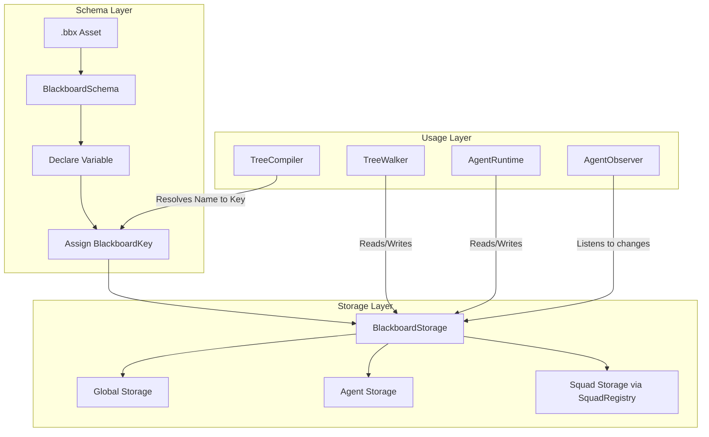

# Blackboard System

> **Category:** Architecture  
> **Status:** Implemented  
> **Core Files:** `Code/Source/Core/Domain/BlackboardSchema.h`, `Code/Source/Core/Domain/BlackboardStorage.cpp`, `Code/Source/Core/Application/BlackboardSystem.cpp`, `Code/Include/GOAT/Domain/BlackboardKey.h`, `Code/Source/Core/Application/SquadRegistry.cpp`

---

## 💡 Core Concept

The Blackboard is the **shared data layer** that connects behavior trees, backends, and actions. It provides a type-safe, schema-driven interface that eliminates runtime string lookups. Variables are declared in `.bbx` assets, merged into a global `BlackboardSchema`, and resolved into typed indices at compile time.

The system supports three scopes:
- **Global** – Shared across all agents.
- **Agent** – Per-agent storage.
- **Squad** – Shared within a named group (managed by `SquadRegistry`).

---

## 🗺️ Visual Overview



---

## 🧩 Key Components

### 1. BlackboardSchema

**Purpose:** Merges all loaded `.bbx` assets into a single global namespace. It declares variables and assigns them typed indices.

**Interface (from `BlackboardSchema.h`):**

```cpp
class BlackboardSchema final
{
public:
    AZ::Outcome<BlackboardKey, AZStd::string> Declare(
        const AZ::Name& name, BlackboardScope scope, BlackboardType type, AZStd::any defaultValue = {});

    BlackboardKey Find(const AZ::Name& name) const;
    const BlackboardLayout& GetLayout(BlackboardScope scope) const;
    const AZStd::unordered_map<AZ::Name, BlackboardKey>& GetVariables() const;
    void Clear();
};
```

**Key Rules:**
- Names are unique across all `.bbx` assets.
- Duplicate declarations cause a load error.
- Each variable gets a `BlackboardKey` that encodes its `scope`, `type`, and `index`.

---

### 2. BlackboardKey

**Purpose:** A lightweight, typed index used to access values. It encodes the scope and type of a variable.

**Interface (from `BlackboardKey.h`):**

```cpp
class BlackboardKey
{
public:
    BlackboardKey(BlackboardScope scope, BlackboardType type, AZ::u32 index);
    bool IsValid() const;
    BlackboardScope GetScope() const;
    BlackboardType GetType() const;
    AZ::u32 GetIndex() const;
    AZ::u32 GetPacked() const;
    bool operator==(const BlackboardKey& rhs) const;
};
```

**Why this matters:** Trees and backends never use string names during runtime. They use these pre-resolved keys for O(1) array access.

---

### 3. BlackboardStorage

**Purpose:** Stores the actual values in typed, contiguous arrays. Storage is sized per scope based on the schema layout.

**Interface (from `BlackboardStorage.h`):**

```cpp
class BlackboardStorage
{
public:
    using ChangedEvent = AZ::Event<BlackboardKey>;

    void EnsureCapacity(const BlackboardLayout& layout);
    void Reset(const BlackboardLayout& layout);

    template<typename T>
    const T* Find(BlackboardKey key) const;

    template<typename T>
    bool Set(BlackboardKey key, const T& value);

    void ConnectChangedHandler(ChangedEvent::Handler& handler);
};
```

**Supported Types (from `BlackboardTypes.h`):**

| Type | C++ Type | Lua Type |
| :--- | :--- | :--- |
| Bool | `bool` | `boolean` |
| Int | `AZ::s64` | `number` |
| Float | `float` | `number` |
| Vector3 | `AZ::Vector3` | `Vector3` |
| EntityId | `AZ::EntityId` | `EntityId` |
| Name | `AZ::Name` | `string` |
| Quaternion | `AZ::Quaternion` | `Quaternion` |
| Transform | `AZ::Transform` | `Transform` |
| EntityIdList | `AZStd::vector<AZ::EntityId>` | `table` |

---

### 4. BlackboardSystem

**Purpose:** Owns the global blackboard, every agent blackboard, and every squad blackboard. One schema is shared by all of them.

**Interface (from `BlackboardSystem.h`):**

```cpp
class BlackboardSystem final : public IBlackboardSystem
{
public:
    AZ::Outcome<BlackboardKey, AZStd::string> Declare(
        const AZ::Name& name, BlackboardScope scope, BlackboardType type, AZStd::any defaultValue = {}) override;
    BlackboardKey FindKey(const AZ::Name& name) const override;
    void CreateAgentBlackboard(AgentId agent) override;
    void DestroyAgentBlackboard(AgentId agent) override;
    void JoinSquad(AgentId agent, const AZ::Name& squad) override;
    void LeaveSquad(AgentId agent) override;
    AZ::Name GetSquad(AgentId agent) const override;
    BlackboardStorage* FindStorage(BlackboardScope scope, AgentId agent) override;
    const BlackboardStorage* FindStorage(BlackboardScope scope, AgentId agent) const override;
    void Clear();
};
```

---

### 5. SquadRegistry

**Purpose:** Manages named agent groups and their squad-scoped blackboard storage. A squad exists only while it has members.

**Interface (from `SquadRegistry.h`):**

```cpp
class SquadRegistry final
{
public:
    void Join(AgentId agent, const AZ::Name& squad, const BlackboardLayout& layout);
    void Leave(AgentId agent);
    AZ::Name Find(AgentId agent) const;
    BlackboardStorage* FindStorage(AgentId agent);
    const BlackboardStorage* FindStorage(AgentId agent) const;
    void EnsureCapacity(const BlackboardLayout& layout);
    void Clear();
};
```

---

## 🧩 Scopes

| Scope | Description | Lifetime |
| :--- | :--- | :--- |
| **Global** | Shared across all agents | Whole game session |
| **Agent** | Per-agent variables | Agent lifecycle |
| **Squad** | Shared within a squad | Squad lifecycle (created on first join, destroyed on last leave) |

---

## 🧩 Access in Lua

From Lua, the `ctx` object provides a type-safe interface for reading and writing blackboard variables.

```lua
-- Example from ExampleAgent.lua
behavior "Patrol" {
    tick = function(me, ctx)
        ctx:SetInt("patrol_stop", me.stop)
        return SUCCESS
    end,
}

behavior "Sense" {
    tick = function(me, ctx)
        ctx:SetBool("target_seen", ctx:GetInt("patrol_stop") % 4 == 0)
    end,
}
```

**Key Methods (from `AgentScriptContext.h`):**
- `ctx:SetBool(name, value)`
- `ctx:GetBool(name)`
- `ctx:SetNumber(name, value)` (works for Int and Float)
- `ctx:GetNumber(name)` (returns a double)
- `ctx:SetVector3(name, value)`
- `ctx:GetVector3(name)`
- `ctx:SetEntity(name, entityId)`
- `ctx:GetEntity(name)`
- `ctx:SetName(name, string)`
- `ctx:GetName(name)`

---

## 🧩 Access in C++

Backends and actions access the blackboard via `IBlackboardSystem`.

```cpp
// Code/Include/GOAT/Interfaces/IBlackboardSystem.h
class IBlackboardSystem
{
public:
    virtual BlackboardKey FindKey(const AZ::Name& name) const = 0;
    virtual BlackboardStorage* FindStorage(BlackboardScope scope, AgentId agent) = 0;
    virtual const BlackboardStorage* FindStorage(BlackboardScope scope, AgentId agent) const = 0;

    template<typename T>
    const T* Find(BlackboardKey key, AgentId agent = {}) const;

    template<typename T>
    bool Set(BlackboardKey key, const T& value, AgentId agent = {});
};
```

---

## 🧩 Event-Driven Changes

`BlackboardStorage` exposes a `ChangedEvent` that fires whenever a slot is modified. `AgentObserver` subscribes to only the storages that hold watched keys, enabling event-driven guard evaluation.

```cpp
// Code/Source/Core/Application/AgentObserver.cpp
void AgentObserver::OnChanged(BlackboardKey key)
{
    if (AZStd::binary_search(m_observed.begin(), m_observed.end(), key))
    {
        m_dirty = true;
    }
}
```

---

## ⚖️ Trade-offs

| ✅ Advantage | ⚠️ Disadvantage |
| :--- | :--- |
| O(1) array access, no string lookups | Requires all variables declared before compile |
| Type-safe access prevents runtime errors | Schema must be maintained separately |
| Scopes allow clean data ownership | Cross-scope access can be confusing |
| Memory is provisioned dynamically | Duplicate declarations fail load |
| Event-driven changes enable efficient guards | Observers must be connected correctly |

---

## 🧩 Performance Considerations

- **Compile-time resolution:** Variables are resolved to keys once, not per-tick.
- **Typed arrays:** Contiguous memory for cache locality.
- **Dynamic provisioning:** Arrays grow only when new variables are declared.
- **Event-driven guards:** `AgentObserver` wakes agents only when watched keys change.
- **Replication:** Keys marked as replicated are synced to clients automatically (via O3DE).

---

## 🔗 Related Notes

- [[Design Principles]]
- [[Layered Overview]]
- [[GOATSystemComponent]]
- [[TreeCompiler]]
- [[AgentObserver]]
- [[SquadRegistry]]

---

*Last updated: 2026-08-26*