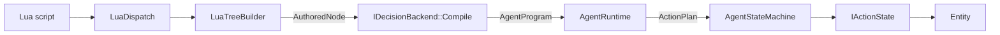
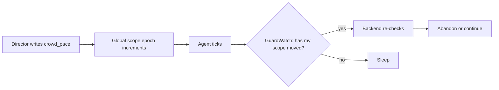

# Data Flow

> **Status:** Implemented
> **Core files:** `Code/Source/Core/Scripting/LuaDispatch.cpp`, `Code/Source/Core/Scripting/LuaTreeBuilder.cpp`, `Code/Source/Core/Application/AgentRuntime.cpp`

---

## The whole pipeline

From a line of Lua to something happening in the world.



The first four steps happen **once**, when the program is compiled. The last four happen every
time the agent's band ticks.

---

## Compiling: Lua to a program

### 1. You write it

```lua
return tree "Patrol" {
    selector {
        sequence {
            condition "enemy_seen",
            script "Chase",
        },
        move_to { key = "patrol_point" },
    },
}
```

`tree` and `selector` are not built into the core. `tree` comes from the behaviour tree gem's
vocabulary file, `move_to` from the navigation gem. `condition` and `script` are the neutral words
in `GOAT.lua`.

### 2. Lua flattens it

`GOAT.Compile` turns the nested tables into a flat pre-order list in Lua, before C++ sees any of
it. That is on purpose — it keeps the fragile C++ side reading a plain array instead of walking a
Lua graph.

### 3. C++ rebuilds the hierarchy

`GOAT_EmitTree` pushes those records at [[LuaTreeBuilder]] through [[LuaDispatch]], and the
builder reassembles them into an [[AuthoredNode]] tree — a name, some properties, some children.
Still paradigm-neutral: nothing has decided what `selector` means yet.

### 4. A backend compiles it

```cpp
CompileOutcome Compile(const AZ::Name& name, const AuthoredNode& root);
```

The `tree` backend flattens it into a [[DecisionProgram]]; the `htn` backend builds an `HtnDomain`.
Either way the result is an [[AgentProgram]], shared by every agent running it. Failure returns a
message, so a bad program is a load-time error with a reason attached.

Properties are checked here against the node type's declared parameters. A misspelled property or
a string where a number belongs fails now, not in the middle of the level.

---

## Running: one tick

`AgentRuntime::Tick` is the whole loop, and it is worth reading in order because the early exits
are where the performance lives.

### Is it even awake?

```cpp
const bool dirty = agent.m_observer.IsDirty();
const bool wantsTick = agent.m_program->m_wantsTick;

if (!dirty && !wantsTick)
{
    agent.m_wakeIn -= deltaTime;
    if (agent.m_wakeIn > 0.0f) { return; }
}
```

Nothing it watches changed, and whatever it was waiting for is not due. **One subtraction and
return.** An agent waiting out a five-second timer costs that, five hundred times, and nothing
else. This is why an idle crowd is nearly free.

### Does what it's doing still hold?

```cpp
if (backend->Advance(...) == TickResult::Abandon)
{
    AbortAgent(agent);
}
```

Only called when a watched scope changed or the program asked for it. The backend re-checks
whatever could interrupt — guards for a tree, remaining preconditions for a task network — and
answers `Continue` or `Abandon`. That is the entire interruption contract.

### Step the plan

```cpp
lastResult = agent.m_machine.Step(m_actions, actionContext, elapsed, wake);
if (lastResult == ActionResult::Running)
{
    agent.m_wakeIn = WakeDelay(wake);
    return;
}
```

Still running, so sleep until it could matter. The action says how long through a `WakeCondition`.

### Decide what's next

```cpp
const Decision decision = backend->Decide(..., lastResult, elapsed, plan);
if (!decision.m_planned || plan.IsEmpty())
{
    agent.m_wakeIn = decision.m_wakeIn;
    return;
}
agent.m_machine.SetPlan(m_planStore, plan);
```

The plan that comes back is a **span into the [[PlanStore]]**, not a copy. That removes both the
length limit and the per-plan copy.

Nothing to do is a normal answer, and the backend says how long before it is worth asking again.

---

## How a write reaches another agent

The interesting flow isn't top-to-bottom, it's sideways — one agent's write reaching another's
decision.



The write is **one integer increment**, not a walk of the level. Each agent notices on its own
next tick by comparing a counter. See [[GuardWatch]].

A `condition` observes the key it reads by default, so this needs nothing authored — no `abort`,
no service polling a variable on an interval.

---

## The pacing bands

[[AgentRegistry]] groups agents into four bands rather than giving each a scheduled event:

| Band | Interval | Typical |
| :--- | :--- | :--- |
| 0 | 33 ms | in combat, on screen |
| 1 | 100 ms | nearby |
| 2 | 250 ms | distant |
| 3 | 1000 ms | directors, ambient crowd |

The scheduler queue stays small while distant agents still run. `order_band` lets a director move
agents between them at runtime.

---

## What each stage costs

| Stage | When | Cost |
| :--- | :--- | :--- |
| Lua → `AuthoredNode` | once, at load | irrelevant |
| `Compile` | once per program | shared by every agent running it |
| sleeping tick | every band tick | one subtract, one branch |
| `Advance` | only when woken | backend's business |
| `Decide` | when a plan ends | backend's business |
| plan storage | after warm-up | no allocation — blocks are recycled |

Measured: about **13 ns per agent** for a full band tick, **192 bytes** per agent record.

---

## Related

- [[Layered Overview]]
- [[Blackboard System]]
- [[AgentRuntime]]
- [[PlanStore]]
- [[GuardWatch]]
- [[IDecisionBackend]]

---

*Last updated: 2026-08-27*
