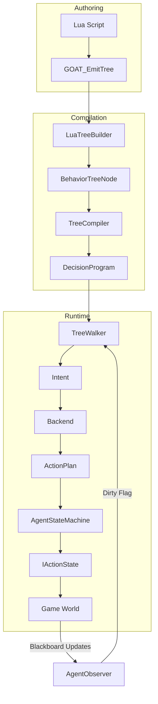
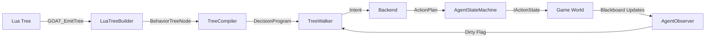

---
type: architecture
status: implemented
tags: [architecture, core, pipeline]
---

# Data Flow

> **Category:** Architecture Pipeline  
> **Status:** Implemented  
> **Core Files:** `Code/Source/Core/Scripting/LuaDispatch.cpp`, `Code/Source/Core/Frontend/LuaTreeBuilder.cpp`, `Code/Source/Core/Frontend/TreeCompiler.cpp`, `Code/Source/Core/Frontend/TreeWalker.cpp`, `Code/Source/Core/Application/AgentRuntime.cpp`, `Code/Source/Core/Application/AgentStateMachine.cpp`

---

## 💡 Core Concept

G.O.A.T. uses a **strict pipeline** to transform authored Lua trees into executable behavior. This pipeline is designed to be **one-way and predictable**: once a tree is compiled into a `DecisionProgram`, it is immutable and shared by all agents running it.

The flow is:

```text
Lua Authoring → LuaTreeBuilder → TreeCompiler → DecisionProgram → TreeWalker → Intent → Backend → ActionPlan → AgentStateMachine → IActionState → Game World
```

---

## 🗺️ Visual Overview



---

## 🧩 Detailed Pipeline

### Stage 1: Lua Authoring

Designers write trees in Lua using the DSL defined in `GOAT.lua`.

```lua
-- Example from ExampleAgent.lua
return tree "ExampleAgent" {
    selector {
        sequence {
            condition "target_seen" { abort = "lower_priority" },
            script "Alert",
            wait(1.0),
        },
        sequence {
            script "Patrol",
            wait(0.5),
        },
    },
}
```

**What happens:**

- `tree "ExampleAgent"` calls `GOAT.Compile(name, root)`.
- `GOAT.Compile` flattens the node graph into a pre-order record list.
- The compiled tree is stored in `GOAT._trees[name]`.

---

### Stage 2: Lua Dispatch to C++

`LuaDispatch::EmitTree` calls the Lua function `GOAT_EmitTree`, passing a `LuaTreeBuilder` object.

```cpp
// Code/Source/Core/Scripting/LuaDispatch.cpp
AZ::Outcome<AZStd::shared_ptr<const BehaviorTreeNode>, AZStd::string> LuaDispatch::EmitTree(const AZ::Name& treeName)
{
    AZ::ScriptDataContext call;
    if (!m_scriptContext->Call("GOAT_EmitTree", call))
    {
        return AZ::Failure(AZStd::string("The GOAT Lua vocabulary is not loaded"));
    }

    call.PushArg(AZStd::string(treeName.GetStringView()));
    call.PushArg(m_builder);

    if (!call.CallExecute())
    {
        return AZ::Failure(AZStd::string::format("Emitting tree '%s' raised a Lua error", treeName.GetCStr()));
    }

    if (!m_builder.IsComplete())
    {
        return AZ::Failure(AZStd::string::format(
            "Tree '%s' could not be assembled: %s", treeName.GetCStr(), m_builder.GetError().c_str()));
    }

    return AZ::Success(AZStd::shared_ptr<const BehaviorTreeNode>(aznew BehaviorTreeNode(m_builder.GetRoot())));
}
```

---

### Stage 3: LuaTreeBuilder Reconstructs the Hierarchy

`LuaTreeBuilder` receives flat node calls and reconstructs the nested `BehaviorTreeNode` structure.

```cpp
// Code/Source/Core/Scripting/LuaTreeBuilder.cpp
void LuaTreeBuilder::AddNode(AZStd::string type, int childCount, int serviceCount)
{
    Record record;
    record.m_type = AZStd::move(type);
    record.m_childCount = childCount;
    record.m_serviceCount = serviceCount;
    m_records.push_back(AZStd::move(record));
}
```

```cpp
size_t LuaTreeBuilder::Build(size_t index, BehaviorTreeNode& out)
{
    const Record& record = m_records[index++];
    out.m_type = record.m_type;
    out.m_properties = record.m_properties;

    for (int i = 0; i < record.m_serviceCount && m_error.empty(); ++i)
    {
        BehaviorTreeNode service;
        index = Build(index, service);
        out.m_services.push_back(AZStd::move(service));
    }

    for (int i = 0; i < record.m_childCount && m_error.empty(); ++i)
    {
        BehaviorTreeNode child;
        index = Build(index, child);
        out.m_children.push_back(AZStd::move(child));
    }

    return index;
}
```

---

### Stage 4: TreeCompiler Flattens the Tree

`TreeCompiler` validates the authored tree and flattens it into a `DecisionProgram`.

```cpp
// Code/Source/Core/Frontend/TreeCompiler.cpp
AZ::Outcome<NodeIndex, AZStd::string> TreeCompiler::Emit(
    const BehaviorTreeNode& authored,
    NodeIndex parent,
    AZ::u32 depth,
    DecisionProgram& program,
    AZStd::vector<AZ::Name>& inlining) const
{
    if (depth >= MaxTreeDepth) { return AZ::Failure(...); }

    const AZ::Name typeName(authored.m_type);
    const NodeTypeDescriptor* descriptor = m_types.Find(typeName);
    if (descriptor == nullptr) { return AZ::Failure(...); }

    const NodeIndex index = aznumeric_cast<NodeIndex>(program.m_nodes.size());
    program.m_nodes.emplace_back();
    {
        DecisionNode& node = program.m_nodes[index];
        node.m_op = descriptor->m_op;
        node.m_parent = parent;
        node.m_childCount = aznumeric_cast<AZ::u16>(authored.m_children.size());
    }

    // Resolve properties, blackboard keys, services, etc.
    // ...

    // Emit children
    const NodeIndex firstChild = aznumeric_cast<NodeIndex>(program.m_nodes.size());
    for (const BehaviorTreeNode& child : authored.m_children)
    {
        auto emitted = Emit(child, index, depth + 1, program, inlining);
        if (!emitted.IsSuccess()) { return emitted; }
    }

    DecisionNode& node = program.m_nodes[index];
    node.m_firstChild = authored.m_children.empty() ? InvalidNodeIndex : firstChild;
    node.m_subtreeEnd = aznumeric_cast<NodeIndex>(program.m_nodes.size());
    return AZ::Success(index);
}
```

---

### Stage 5: TreeWalker Executes the Program

`TreeWalker` iteratively traverses the `DecisionProgram`, producing `Intent`s for leaf nodes.

```cpp
// Code/Source/Core/Frontend/TreeWalker.cpp
WalkStep TreeWalker::Run(
    const DecisionProgram& program,
    DecisionCursor& cursor,
    const PlanContext& context,
    NodeIndex node,
    bool bubbling,
    ActionResult result) const
{
    while (node != InvalidNodeIndex)
    {
        if (!bubbling)
        {
            const DecisionNode& current = program.m_nodes[node];
            switch (current.m_op)
            {
            case NodeOp::Selector:
            case NodeOp::Sequence:
                cursor.ChildIndex(node) = 0;
                node = current.m_firstChild;
                continue;

            case NodeOp::Action:
            case NodeOp::Script:
            case NodeOp::Delegate:
                cursor.SetActiveLeaf(node);
                return Emitted(MakeIntent(current, node));

            // ... other node types ...
            }
        }

        // Bubbling logic
        // ...
    }

    return Finished(result);
}
```

---

### Stage 6: Backend Produces ActionPlan

When a `delegate` node is encountered, `TreeWalker` creates an `Intent` with the backend name and goal. The `BackendRegistry` finds the backend and calls `IBackend::Plan`.

```cpp
// Code/Source/Core/Frontend/DirectBackend.cpp
bool DirectBackend::Plan(
    [[maybe_unused]] const PlanContext& context, const Intent& intent, ActionPlan& outPlan)
{
    if (intent.m_direct.m_action == CoreActions::Invalid)
    {
        return false;
    }

    outPlan.m_steps.clear();
    outPlan.m_steps.push_back(intent.m_direct);
    return true;
}
```

For Lua backends:

```lua
-- Example from ExampleAdvanced.lua
backend "Errand" {
    plan = function(me, ctx, goal)
        if goal == "Rest" then
            return { { action = "wait", seconds = 2.0 } }
        end
        return {
            { action = "script", behavior = "Announce" },
            { action = "wait", seconds = 0.5 },
        }
    end,
}
```

---

### Stage 7: AgentStateMachine Executes Actions

`AgentStateMachine` processes the `ActionPlan`, calling `IActionState::Begin`, `Step`, and `End` for each step.

```cpp
// Code/Source/Core/Domain/AgentStateMachine.cpp
ActionResult AgentStateMachine::Step(const ActionStateRegistry& registry, ActionContext& context, float deltaTime)
{
    if (!HasPlan()) { return ActionResult::Success; }

    FillContext(context);

    IActionState* state = registry.Find(m_plan.m_steps[m_step].m_action);
    if (state == nullptr) { return ActionResult::Failure; }

    if (!m_begun)
    {
        m_scratch.fill(0);
        m_elapsed = 0.0f;
        state->Begin(context);
        m_begun = true;
    }

    m_elapsed += deltaTime;
    const ActionResult result = state->Step(context, deltaTime);
    if (result == ActionResult::Running) { return ActionResult::Running; }

    state->End(context);
    m_begun = false;

    if (result == ActionResult::Failure) { return ActionResult::Failure; }

    ++m_step;
    return HasPlan() ? ActionResult::Running : ActionResult::Success;
}
```

---

### Stage 8: AgentRuntime Orchestrates the Tick

`AgentRuntime` ties everything together each tick:

1. **Advance clock:** `agent.m_cursor.AdvanceClock(deltaTime)`.
2. **Apply guards:** `ApplyGuards()` (only if `AgentObserver` is dirty).
3. **Tick services:** `TickServices()` (collect due services, run them).
4. **Advance action:** If `AgentStateMachine` has a plan, call `Step()`.
5. **Walk tree:** If no plan, call `TreeWalker::Begin()` or `Advance()`.
6. **Start plan:** When an `Intent` is produced, call `StartPlan()` (which routes to a backend).

```cpp
// Code/Source/Core/Application/AgentRuntime.cpp
void AgentRuntime::Tick(AgentRecord& agent, float deltaTime)
{
    if (agent.m_program == nullptr || agent.m_program->IsEmpty()) { return; }

    agent.m_cursor.AdvanceClock(deltaTime);
    const PlanContext planContext = MakePlanContext(agent);

    WalkStep step;
    bool haveStep = false;
    ApplyGuards(agent, planContext, step, haveStep);

    TickServices(agent, deltaTime);

    if (!haveStep)
    {
        if (agent.m_machine.HasPlan())
        {
            ActionContext actionContext = MakeActionContext(agent);
            const ActionResult result = agent.m_machine.Step(m_actions, actionContext, deltaTime);
            if (result == ActionResult::Running) { return; }
            step = m_walker.Advance(*agent.m_program, agent.m_cursor, planContext, result);
        }
        else
        {
            step = m_walker.Begin(*agent.m_program, agent.m_cursor, planContext);
        }
        haveStep = true;
    }

    for (int attempt = 0; attempt < MaxIntentsPerTick; ++attempt)
    {
        if (step.m_outcome == WalkOutcome::Finished)
        {
            step = m_walker.Begin(*agent.m_program, agent.m_cursor, planContext);
            if (step.m_outcome == WalkOutcome::Finished) { return; }
        }

        if (StartPlan(agent, planContext, step.m_intent)) { return; }

        step = m_walker.Advance(*agent.m_program, agent.m_cursor, planContext, ActionResult::Failure);
    }
}
```

---

## 🧩 Visual Flow Summary



---

## ⚖️ Trade-offs

| ✅ Advantage | ⚠️ Disadvantage |
| :--- | :--- |
| One-way data flow is easy to reason about | Requires understanding the full pipeline |
| Compiled program is immutable and shared | Errors can be hard to trace if not logged |
| Type-safe blackboard access | Schema must be declared before compile |
| Modular backends allow paradigm swapping | Backend can fail silently if not handled |
| Event-driven guards reduce polling | Observers must be connected correctly |

---

## 🔗 Related Notes

- [[Layered Overview]]
- [[Blackboard System]]
- [[TreeCompiler]]
- [[TreeWalker]]
- [[AgentRuntime]]
- [[AgentStateMachine]]

---

*Last updated: 2026-08-26*