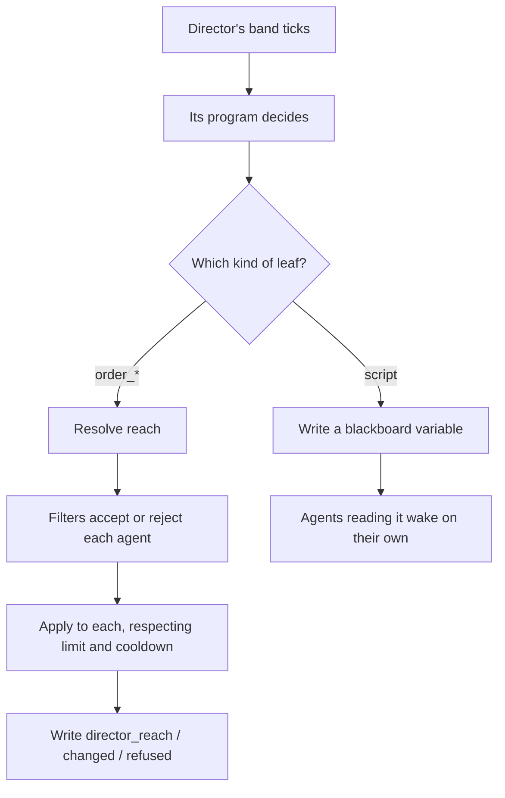

# Director AI

> **Status:** Implemented
> **Core files:** `Code/Source/Clients/GOATDirectorComponent.cpp`, `Code/Source/Core/Director/DirectorRegistry.cpp`, `Code/Source/Core/Director/DirectorActions.cpp`

---

## What a director is

A director is an agent that acts on **other** agents instead of on itself.

That is the only difference. It registers like any agent, runs a program like any agent, and
everything else — guards, services, banding, the console commands — works on it unchanged. Its
leaves just happen to reach other agents.

You make one by putting a **GOAT Director** component on an entity instead of a **GOAT Agent**.
The two are mutually exclusive, because a director already is an agent and the entity would
otherwise be registered twice.

---

## The two ways to direct

There are two, and picking the right one matters more than anything else on this page.

**Publish a variable.** The director writes a blackboard variable and stops. Agents that read it
notice on their own, because a declared condition observes the key it reads. One write, no
matter how many agents there are. Nothing gets interrupted.

**Give an order.** The director puts agents onto another tree with `order_tree` or
`order_interrupt`. That stops whatever they were doing, so it costs more and needs rationing —
hence `limit`, the cooldown, and reach.

Prefer publishing. Reach for orders when you actually need an agent to drop what it is doing.

---

## Reach

Reach is the set of agents a director governs. **By default it is every other agent in the
level** — a director never governs itself, because it could then order itself onto another tree
and never come back.

You narrow it by adding filter components next to the director. Each one is independent, and
several combine with AND:

| Component | Also needs | Governs only |
| :--- | :--- | :--- |
| **GOAT Director Area** | a shape component | agents inside the shape |
| **GOAT Director Squad** | — | agents in the listed squads **or** carrying the listed tags |

The area filter uses an ordinary O3DE shape, so a Sphere Shape is a plain radius and a Box or
Polygon Prism is a zone you draw. The squad filter reads tags from the stock LmbrCentral **Tag**
component, so tagging an agent needs nothing from GOAT.

Both are optional. A director with neither governs the level; that is the intended default.

If you want an OR instead of an AND — "squad Alpha, or anyone in the plaza" — use two directors
and let priority settle the overlap.

Reach is resolved once per director tick and cached until its band comes round again. Every verb
inside one tick sees the same set, so a reach cannot change underneath a Lua loop.

See [[IDirectorFilter]] if you want to write your own filter in C++.

---

## Priority and cooldown

Several directors can govern the same agent. When two command it in the same window, the higher
**priority** wins. An agent switching its own tree carries priority 0, so any director outranks
it — which is the point of a director.

**Cooldown** is how long before that director may command that same agent the same way again.
It is held per director, so one director's order can never silence another's by accident. It is
started only when a command actually changes something, so a no-op costs nothing.

---

## The verbs

These words are available in any director's program.

| Word | Does | Main property |
| :--- | :--- | :--- |
| `order_tree` | puts agents in reach onto another tree | `tree` |
| `order_interrupt` | interrupts agents in reach with another tree | `tree` |
| `order_band` | moves agents in reach between pacing bands | `band` |
| `order_value` | writes a variable, reaching whoever its scope says | `key` |
| `rebind_subtree` | points a subtree slot at another tree | `slot` |

`order_tree`, `order_interrupt` and `order_band` also take `key` — a blackboard variable holding
an EntityId, to act on one agent instead of all of them — and the first two take `limit`, a cap
on how many agents one step may touch.

Four variables are declared from C++, so you never need a `.bbx` for them:

| Variable | Holds |
| :--- | :--- |
| `director_reach` | how many agents the last step reached |
| `director_changed` | how many it actually changed |
| `director_refused` | how many refused, usually on cooldown |
| `director_target` | the agent a single-target step acted on |

From Lua you can also sense the reach directly: `ctx:CountInReach()`,
`ctx:CountRunning("SomeTree")` and `ctx:GetInReach(i)`, which is 1-based.

---

## A worked example

Both directors below are from the Scry test bench, and both are task networks rather than trees —
a director is just an agent, so the paradigm is whatever its Brain says.

The first one publishes and never names an agent:

```lua
domain "CrowdPacer" {
    root = "Pace",
    task "Pace" {
        method { subtask "Adjust", subtask "Drift" },
    },
    primitive "Adjust" { script "PaceTheCrowd" },
    primitive "Drift" { wait(1.0) },
}
```

`PaceTheCrowd` writes one global, `crowd_pace`. A hundred agents read it and each decides for
itself. That is one blackboard write however large the crowd is.

The second one commands, and only when what it sensed says to:

```lua
return domain "CrowdMarshal" {
    root = "Marshal",
    task "Marshal" {
        method {
            condition "crowd_rallying",
            subtask "Order",
            subtask "Report",
            subtask "Sense",
        },
        method {
            subtask "Sense",
            subtask "Rest",
        },
    },
    primitive "Order" { order_interrupt "CrowdRally" { limit = 6 } },
    primitive "Report" { script "ReportMuster" },
    primitive "Sense" { script "CallMuster" },
    primitive "Rest" { wait(1.0) },
}
```

`limit = 6` is what stops it flipping the whole crowd at once — a few agents each plan, so the
gathering happens visibly instead of instantly.

---

## How a tick goes



---

## Checking it in the editor

`ListDirectors` prints every director, what narrows it, and how many agents it governs.
`DumpDirector <entityId>` lists exactly which agents, and names the filters doing the narrowing.

---

## Related

- [[GOATDirectorComponent]]
- [[IDirectorFilter]]
- [[DirectorProfile]]
- [[Blackboard System]]
- [[Orchestration Patterns]]
- [[Creating a Director AI]]

---

*Last updated: 2026-08-27*
