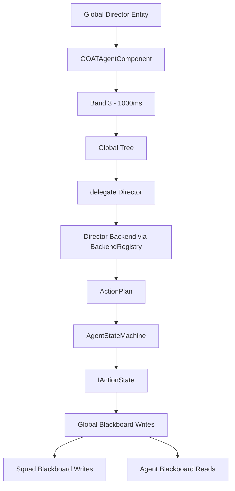

```mermaid
flowchart LR
    A[Director Entity Tick] --> B[AgentRuntime Tick]
    B --> C[TreeWalker]
    C --> D[Intent]
    D --> E[Director Backend]
    E --> F[ActionPlan]
    F --> G[AgentStateMachine]
    G --> H[IActionState]
    H --> I[Write Global Keys]
    I --> J[Write Squad Keys]
    J --> K[Agents Observe Keys]
    K --> L[Agents Preempt / React via AgentObserver]
```

```mermaid
flowchart LR
    A[Director Entity Tick] --> B[AgentRuntime]
    B --> C[TreeWalker]
    C --> D[Intent]
    D --> E[Director Backend]
    E --> F[ActionPlan]
    F --> G[AgentStateMachine]
    G --> H[IActionState]
    H --> I[Write Global/Squad Keys]
    I --> J[AgentObserver wakes agents]
    J --> K[Agents Re-check Guards]
    K --> L[Agents Preempt / React]
```

# Director AI

> **Category:** Architecture Pattern  
> **Status:** Implemented via Backend Abstraction (no specific C++ component)  
> **Core Files:** `Code/Source/Clients/GOATAgentComponent.cpp`, `Code/Source/Core/Application/AgentRegistry.cpp`, `Code/Source/Core/Application/BlackboardSystem.cpp`, `Code/Source/Core/Scripting/LuaBackend.cpp`

---

## 💡 Core Concept

**Director AI** is a global orchestrator that controls high-level game flow—spawning waves, adjusting difficulty, or reacting to player progress. It is **not a separate component** or system. Instead, it is a **specific usage pattern** of G.O.A.T.'s `IBackend` abstraction combined with a "Global Agent" entity.

The Director operates at the **Global** and **Squad** blackboard scopes, making decisions that affect many agents at once. It is simply a regular agent with a `Band` of 3, running a tree that delegates to a Director backend.

---

## 🗺️ Visual Overview



---

## 🧩 How it Fits into the Architecture

### Layered Placement

| Layer | Director's Role |
| :--- | :--- |
| **Lua Authoring** | Define a global tree with `delegate "Director" { goal = "SpawnWave" }`. |
| **C++ Core** | `TreeWalker` executes the global tree; `BackendRegistry` routes to a `DirectorBackend`. |
| **Runtime Component** | A single `GOATAgentComponent` on a "Director" entity, running at the lowest tick frequency (`Band = 3`). |

---

## 🧩 Setting Up a Director Agent

1. **Create an Entity** named "Director" in the level.
2. **Add `GOATAgentComponent`** to it.
3. **Set `Band` to `3`** (runs every 1000ms, saving CPU).
4. **Set `TreeName`** to a global tree (e.g., `"DirectorTree"`).
5. **Load a `.bbx` asset** that declares `Global` scope variables (e.g., `game_state`, `wave_number`).

---

## 🧩 The Director Backend

The Director's logic lives in a backend (C++ or Lua). It receives a goal from a `delegate` node and returns a plan of actions.

### Example (Lua):

```lua
backend "Director" {
    plan = function(me, ctx, goal)
        if goal == "SpawnWave" then
            local wave = ctx:GetInt("wave_number") or 1
            return {
                { action = "script", behavior = "SpawnEnemies", tag = "wave_" .. wave },
                { action = "wait", seconds = 5.0 },
            }
        end
        return nil
    end,
}
```

### How it connects to C++:

```cpp
// Code/Source/Core/Scripting/LuaBackend.cpp
bool LuaBackend::Plan(const PlanContext& context, const Intent& intent, ActionPlan& outPlan)
{
    m_scriptContext.Bind(context.m_agent, context.m_entity, context.m_blackboard);
    const ActionPlan* planned = m_dispatch.CallBackendPlan(m_name, intent.m_goal, context.m_agent, m_scriptContext);
    m_scriptContext.Unbind();

    if (planned == nullptr || planned->IsEmpty())
    {
        return false;
    }

    outPlan = *planned;
    return true;
}
```

---

## 🧩 Data Flow: Director to Agents



---

## 🧩 Example: Director Tree

```lua
return tree "DirectorTree" {
    sequence {
        condition "game_state" { abort = "lower_priority" },
        delegate "Director" { goal = "SpawnWave" },
        wait(2.0),
    },
}
```

---

## 🧩 Scheduling (AgentRegistry)

The Director runs at Band 3 (1000ms interval). This is set via the `m_band` field on `GOATAgentComponent`.

```cpp
// Code/Source/Core/Application/AgentRegistry.cpp
const AZ::TimeMs defaults[BandCount] = {
    AZ::TimeMs{ 33 },   // Band 0
    AZ::TimeMs{ 100 },  // Band 1
    AZ::TimeMs{ 250 },  // Band 2
    AZ::TimeMs{ 1000 }  // Band 3 - Director
};
```

---

## 🧩 Data Flow: Director to Agents



---

## ⚖️ Trade-offs

| ✅ Advantage | ⚠️ Disadvantage |
| :--- | :--- |
| Centralized control over game flow | Single point of failure if not designed carefully |
| Minimal CPU cost (runs at Band 3) | Requires careful management of Global Blackboard state |
| Uses existing Backend abstraction | Need to design a tree that handles multiple goals |
| No new C++ components needed | Debugging can be harder with cross-scope effects |

---

## 🔗 Related Notes

- [[Orchestration Patterns]]
- [[Backend Abstraction Theory]]
- [[Layered Overview]]
- [[Blackboard System]]
- [[Extensibility Model]]
- [[AgentRegistry]]
- [[AgentRuntime]]

---

*Last updated: 2026-08-26*