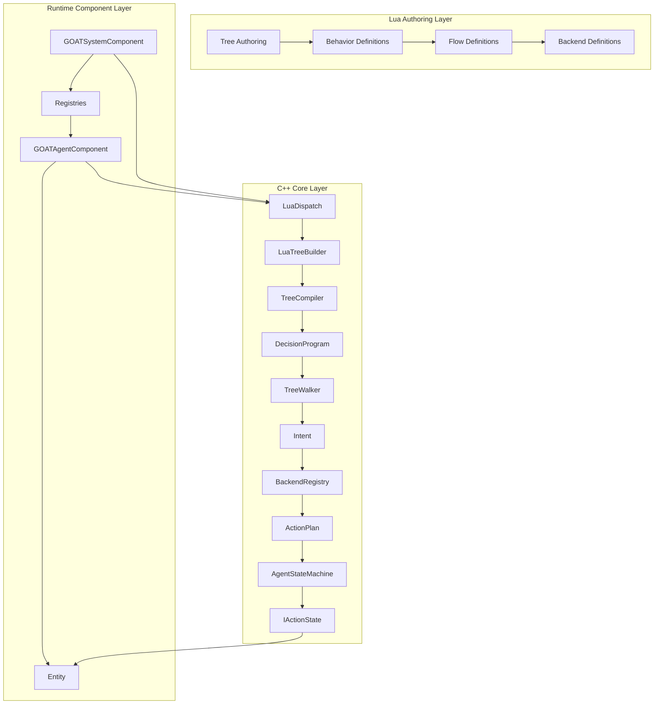
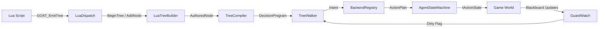
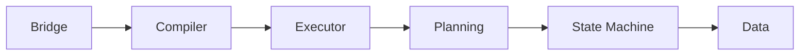
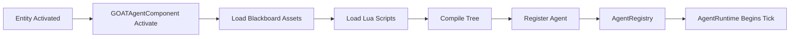
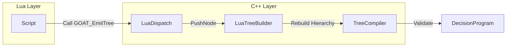

# Layered Overview

> **Category:** Architecture Overview  
> **Status:** Implemented  
> **Core Files:** `Code/Source/Clients/GOATAgentComponent.cpp`, `Code/Source/Core/Application/GOATSystemComponent.cpp`, `Code/Source/Core/Scripting/LuaDispatch.cpp`, `Code/Source/Core/Frontend/TreeCompiler.cpp`, `Code/Source/Core/Application/AgentRuntime.cpp`

---

## 💡 Core Concept

G.O.A.T. is organized into **three distinct layers**, each with a clear and rigid responsibility. This separation ensures that the framework remains modular, testable, and easy to extend.

| Layer | Core Responsibility | Primary Files |
| :--- | :--- | :--- |
| **Lua Authoring Layer** | Define trees, behaviors, flows, and backends | `GOAT.lua`, `ExampleAgent.lua`, `ExampleAdvanced.lua` |
| **C++ Core Layer** | Compile, execute, plan, and manage agents | `LuaDispatch`, `TreeCompiler`, `TreeWalker`, `AgentRuntime`, `BlackboardSystem`, `AgentRegistry` |
| **Runtime Component Layer** | Bridge O3DE entities to the AI system | `GOATAgentComponent`, `GOATSystemComponent` |

---

## 🗺️ Visual Overview (Main Architecture)



---

## 🗺️ Visual Overview (Data Flow Bridge)

This diagram shows the exact communication path between the three layers.



---

## 🧩 Layer 1: Lua Authoring Layer

### Purpose
Provide a designer-friendly DSL for authoring AI behavior without touching C++. This layer is the **source of truth** for what an agent does.

### Key Components
- **`GOAT.lua`**: Defines the global vocabulary (`tree`, `behavior`, `flow`, `backend`) and node constructors (`selector`, `sequence`, `wait`, `script`).
- **User Scripts (e.g., `ExampleAgent.lua`)**: The actual game-specific logic where designers define their custom trees and behaviors.

### What happens here
1. The `tree` function compiles the node graph into a flat, pre-order record list.
2. The compiled record is stored in `GOAT._trees[name]`.
3. `GOAT_Compile` flattens the nested node syntax into a plain array that C++ can consume.

### Detailed Code Flow
```lua
-- Author a tree
behavior "Patrol" {
    tick = function(me, ctx)
        ctx:SetInt("patrol_stop", me.stop)
        return SUCCESS
    end,
}

return tree "ExampleAgent" {
    selector {
        sequence {
            condition "target_seen" { abort = "lower_priority" },
            script "Alert",
            wait(1.0),
        },
        sequence {
            script "Patrol",
            wait(0.5),
        },
    },
}
```

---

## 🧩 Layer 2: C++ Core Layer

### Purpose
Process and execute the authored trees. This layer handles performance-critical operations, validation, and planning.

### Subsystem Breakdown



| Subsystem | Responsibility | Key Files |
| :--- | :--- | :--- |
| **Bridge** | Calls into the Lua VM (`GOAT_EmitTree`, `GOAT_Dispatch`) | `LuaDispatch.cpp`, `LuaTreeBuilder.cpp`, `LuaPlanBuilder.cpp`, `AgentScriptContext.cpp` |
| **Compiler** | Validates nodes, resolves blackboard keys, flattens the tree | `TreeCompiler.cpp`, `NodeTypeRegistry.cpp`, `TreeLibrary.cpp` |
| **Executor** | Iteratively walks the `DecisionProgram`, producing `Intent`s | `TreeWalker.cpp`, `DecisionCursor.h`, `GuardEvaluator.cpp`, `ServiceTracker.cpp` |
| **Planning** | Turns `Intent`s into executable `ActionPlan`s | `BackendRegistry.cpp`, `DirectBackend.cpp`, `LuaBackend.cpp` |
| **State Machine** | Executes `ActionPlan`s, calling `IActionState::Begin/Step/End` | `AgentStateMachine.cpp`, `ActionStateRegistry.cpp` |
| **Data** | Stores typed blackboard variables across scopes | `BlackboardSystem.cpp`, `BlackboardStorage.cpp`, `BlackboardSchema.cpp`, `SquadRegistry.cpp` |

---

## 🧩 Layer 3: Runtime Component Layer

### Purpose
Bridge O3DE entities to the AI system. This layer handles the lifecycle of an agent, loading assets, and exposing the `IAgentSystem` interface to the rest of the engine.

### Key Components
- **`GOATAgentComponent`**: Attached to an NPC entity. Handles `Activate()` and `Deactivate()`.
- **`GOATSystemComponent`**: A singleton "God object" that owns all services. Implements `IAgentSystem`.

### Agent Lifecycle Diagram



### Detailed Lifecycle
1. **`GOATAgentComponent::Activate()`** is called by O3DE.
2. It loads `.bbx` assets to declare blackboard variables.
3. It loads Lua scripts to register behaviors and trees.
4. It calls `CompileTree()` (which triggers `TreeCompiler`).
5. It calls `RegisterAgent()` on `IAgentSystem`.
6. The `AgentRegistry` creates an `AgentId` and registers the `DecisionProgram` for the agent.

```cpp
// Code/Source/Clients/GOATAgentComponent.cpp
void GOATAgentComponent::Activate()
{
    IAgentSystem* agents = AgentSystemInterface::Get();
    if (agents == nullptr)
    {
        AZ_Warning("GOAT", false, "The GOAT agent system is not available");
        return;
    }

    for (auto& blackboard : m_blackboards) { agents->LoadBlackboard(*blackboard.Get()); }
    for (auto& script : m_scripts) { agents->LoadScript(script); }

    if (auto compiled = agents->CompileTree(AZ::Name(m_treeName)); !compiled.IsSuccess())
    {
        AZ_Warning("GOAT", false, "%s", compiled.GetError().c_str());
        return;
    }

    m_agent = agents->RegisterAgent(GetEntityId(), AZ::Name(m_treeName), static_cast<size_t>(m_band));
}
```

---

## 🧩 Agent Scheduling (AgentRegistry)

`AgentRegistry` schedules agents into pacing bands using O3DE's `AZ::ScheduledEvent`.

```cpp
// Code/Source/Core/Application/AgentRegistry.cpp
const AZ::TimeMs defaults[BandCount] = {
    AZ::TimeMs{ 33 },   // Band 0 - Most frequent
    AZ::TimeMs{ 100 },  // Band 1 - Standard
    AZ::TimeMs{ 250 },  // Band 2 - Distant
    AZ::TimeMs{ 1000 }  // Band 3 - Least frequent (Director, Background)
};
```

Each band has its own `AZ::ScheduledEvent` that calls `TickBand()`, which iterates through that band's agents and calls `AgentRuntime::Tick()`.

---

## 🧩 Layer Interaction: The Bridge

The **C++ Core Layer** and **Lua Authoring Layer** communicate through a strict, push-based bridge.



| Step | Caller | Callee | Data Passed |
| :--- | :--- | :--- | :--- |
| 1 | Lua Script | `LuaDispatch` | Function call: `GOAT_EmitTree` |
| 2 | `LuaDispatch` | `LuaTreeBuilder` | `BeginTree`, `AddNode`, `SetProperty` |
| 3 | `LuaDispatch` | `LuaTreeBuilder` | `EndTree` (completes assembly) |
| 4 | `GOATSystemComponent` | `TreeCompiler` | `AuthoredNode` (root) |
| 5 | `TreeCompiler` | `DecisionProgram` | `Compile` (flattened array) |

---

## ⚖️ Trade-offs

| ✅ Advantage | ⚠️ Disadvantage |
| :--- | :--- |
| Clear separation of concerns | Requires understanding all three layers to debug deep issues |
| Lua makes authoring fast and safe (hot-reload) | Lua errors can be harder to trace without proper stack unwinding |
| C++ core is performant (no string lookups, flat arrays) | Compile-time validation adds complexity for new node types |
| Modular and extensible (Backends, Actions) | More files to navigate when starting out |

---

## 🧩 Performance Considerations per Layer

- **Lua Layer**: Lightweight; only runs on script load and `GOAT_Dispatch` calls.
- **C++ Core**: Runs every tick (depending on Band). Uses `DecisionCursor`, `AgentStore`, and `GuardWatch` to avoid heap allocations during runtime and reduce unnecessary polling.
- **Runtime Layer**: Very lightweight; `GOATAgentComponent` is a thin shell that just passes data.

---

## 🔗 Related Notes

- [[Data Flow]]
- [[Blackboard System]]
- [[GOATSystemComponent]]
- [[GOATAgentComponent]]
- [[Extensibility Model]]
- [[AgentRegistry]]
- [[AgentRuntime]]

---

*Last updated: 2026-08-26*