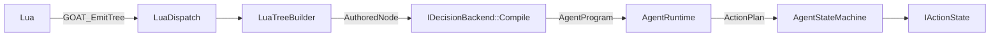

# Layered Overview

> **Status:** Implemented
> **Core files:** `Code/Source/Clients/GOATSystemComponent.cpp`, `Code/Source/Core/Application/AgentRuntime.cpp`, `Code/Source/Core/Scripting/LuaDispatch.cpp`

---

## The shape of it

GOAT is a small paradigm-neutral core with everything opinionated bolted on beside it as gems.

| Layer | Does | Removable |
| :--- | :--- | :--- |
| **Lua authoring** | you write programs, behaviours and vocabulary here | — |
| **Core** (`Gem::GOAT`) | agents, blackboard, plans, actions, directors, the Lua bridge | no |
| **Backend gems** | what a paradigm's words *mean* | yes |
| **Module gems** | verbs for a domain — movement, animation, smart objects | yes |
| **Components** | wire an O3DE entity to all of it | — |

The important line is between the core and the backend gems.

---

## What the core does not know

The core has **no idea what a `selector` is**. It does not know what a `task` is either.

`Code/Source/Core/` contains no tree walker, no compiler, no planner. It holds agents, the
blackboard, plans, action states, directors, and the bridge to Lua — and stops. Grep it for
`BehaviorTree` or `Htn` and you get nothing.

That is not tidiness for its own sake. It is what lets a project delete a paradigm it does not
use, and what lets two paradigms run side by side on the same agents in the same level.

---

## The gems

```
G.O.A.T/
├── Code/                                  Gem::GOAT — the core
├── Code/Source/Backends/BehaviorTree/     Gem::GOAT_BehaviorTree
├── Code/Source/Backends/Htn/              Gem::GOAT_Htn
├── Modules/Navigation/                    Gem::GOAT_Navigation
├── Modules/Animation/                     Gem::GOAT_Animation
└── Modules/SmartObject/                   Gem::GOAT_SmartObject
```

Each is a real O3DE gem with its own `gem.json`, `CMakeLists.txt` and asset scan folder, listed in
the root `gem.json`'s `external_subdirectories`. A project turns one off in `project.json`.

| Gem | Registers | Words it brings |
| :--- | :--- | :--- |
| GOAT_BehaviorTree | the `tree` backend | `selector`, `sequence`, `parallel`, `service`, `subtree`, decorators |
| GOAT_Htn | the `htn` backend | `domain`, `task`, `method`, `primitive`, `subtask`, `effect` |
| GOAT_Navigation | verbs | `move_to`, `is_at_location`, `does_path_exist` |
| GOAT_SmartObject | verbs | claiming and using smart objects |
| GOAT_Animation | verbs | driving animation from an agent |

---

## How a gem plugs in

The same way every time, and none of it is special-cased in the core.

```cpp
// register a paradigm
GOATBackendRequestBus::BroadcastResult(
    ok, &GOATBackendRequests::RegisterDecisionBackend, backend);

// register a verb, and the word that runs it
agents->RegisterAction(AZStd::move(action));
agents->RegisterNodeType(AZStd::move(descriptor));

// register the Lua file that declares your words
agents->RegisterVocabularyScript("goat_htn/scripts/htn");
```

A `VocabularyScope` holds what a gem installed and takes it all back out on shutdown, in reverse
order.

---

## The three things a program passes through



**[[AuthoredNode]]** is the neutral middle. Lua builds one; it is a name, some properties and some
children, and it means nothing on its own. Both backends compile the same struct.

**[[AgentProgram]]** is what a backend produced — a `DecisionProgram` from the tree gem, an
`HtnDomain` from the task network gem. Shared by every agent running it.

**[[ActionPlan]]** is a span of steps in the [[PlanStore]]. The runtime executes it; the backend
only says whether it still stands.

---

## Where each layer lives

**Lua authoring.** `Assets/GOAT/Scripts/GOAT.lua` holds only the words every paradigm shares —
`condition`, `compare`, `wait`, `raw`, `script`, `delegate` — plus the machinery. Each backend gem
ships its own vocabulary file beside it. If `selector` ever appears in `GOAT.lua` again, the
separation has failed.

**Core.** `GOATSystemComponent` owns every registry and implements [[IAgentSystem]], which is the
whole surface a gem gets. [[AgentRuntime]] runs one tick: ask the backend, run the plan, repeat.
[[AgentRegistry]] paces agents through four bands so distant ones run less often.

**Components.** [[GOATAgentComponent]] turns an entity into an agent, [[GOATDirectorComponent]]
into a director. Both are thin: they gather assets and hand off.

---

## Why the seam is where it is

A backend answers exactly two questions — *what next?* and *does it still hold?* — and never
touches the state machine. The runtime owns the plan.

That is what keeps two paradigms compatible. A task network writes a blackboard variable, a
behaviour tree reads it, and neither knows the other exists. The blackboard is the only thing they
share, and it is enough.

---

## Related

- [[Data Flow]]
- [[Blackboard System]]
- [[Backend Abstraction Theory]]
- [[Extensibility Model]]
- [[IDecisionBackend]]
- [[Director AI]]

---

*Last updated: 2026-08-27*
