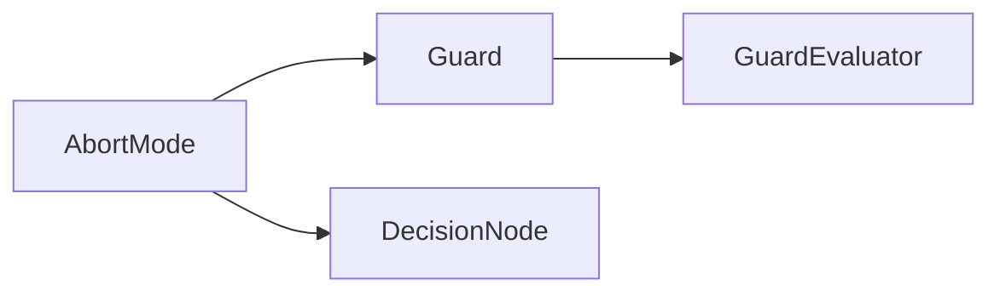

# AbortMode

> **File Location:** `Code/Include/GOAT/Domain/Guard.h`  
> **Inherits:** None (Enum class)

---

## Overview

`AbortMode` is an **enum class** that defines how a condition guard interrupts the execution of a behavior tree. It mirrors Unreal Engine's observer abort modes. It is used by `Guard` and `DecisionNode` to specify what should be aborted when a guard condition changes.

---

## Values

| Value | Description |
| :--- | :--- |
| `None` | Never interrupts. |
| `Self` | Aborts this node and any subtree running under it. |
| `LowerPriority` | Aborts any node to the right of this one (lower priority). |
| `Both` | Aborts both the node itself and any lower-priority nodes. |

---

## Usage

`AbortMode` is set as a property on `condition` and `compare` nodes in Lua:

```lua
condition "target_seen" { abort = "lower_priority" }
```

The string values accepted in Lua are:
- `"self"`
- `"lower_priority"`
- `"both"`
- `"none"` (default)

---

## Dependencies & Interactions



- **Depends on:** None (standalone enum).
- **Required by:** `Guard`, `DecisionNode`, `GuardEvaluator`.

---

## Implementation Notes

### Key Algorithms

`TreeCompiler` reads the authored `abort` property and converts it to the enum:

```cpp
AbortMode ReadAbortMode(const AZ::Name& name)
{
    if (name == AZ_NAME_LITERAL("self")) return AbortMode::Self;
    if (name == AZ_NAME_LITERAL("lower_priority")) return AbortMode::LowerPriority;
    if (name == AZ_NAME_LITERAL("both")) return AbortMode::Both;
    return AbortMode::None;
}
```

### Performance Considerations

- **Allocation:** No allocations.
- **Tick Rate:** Used during guard evaluation only.
- **Concurrency:** Immutable after compilation.

---

## Testing

Unit tests should cover:

- **Enum Reflection:** Correctly reflects all four values.
- **String Conversion:** `"self"`, `"lower_priority"`, `"both"` map correctly.

---

## Related Notes

- [[Guard]]
- [[GuardEvaluator]]
- [[DecisionNode]]
- [[TreeCompiler]]

---

*Last updated: 2026-08-26*