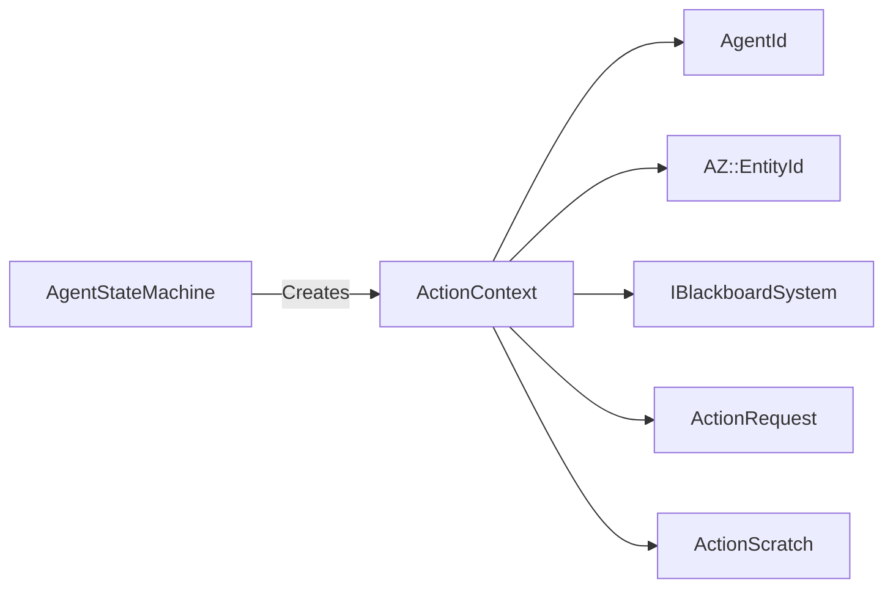

# ActionContext

> **File Location:** `Code/Include/GOAT/Interfaces/IActionState.h`  
> **Inherits:** None (Plain struct)

---

## Overview

`ActionContext` is the **per-agent context** passed to every `IActionState` method (`Begin`, `Step`, `End`). It contains everything an action needs to run for a specific agent: the agent ID, the entity it drives, the blackboard, the current `ActionRequest`, and a scratch buffer for per-agent mutable state.

Because a single `IActionState` instance serves *every* agent, all mutable state must live in the provided `m_scratch` buffer, not in the action's own members.

---

## Key Responsibilities

| # | Responsibility | Description |
| :--- | :--- | :--- |
| 1 | **Agent Identification** | Stores the `AgentId` of the agent running the action. |
| 2 | **Entity Access** | Stores the `AZ::EntityId` of the entity the agent drives. |
| 3 | **Blackboard Access** | Stores a pointer to `IBlackboardSystem` for reading/writing variables. |
| 4 | **Action Parameters** | Stores a pointer to the `ActionRequest` being executed. |
| 5 | **Scratch Storage** | Provides a 32-byte `ActionScratch` buffer for per-agent state. |

---

## Public Interface

### Data Members

| Member | Type | Description |
| :--- | :--- | :--- |
| `m_agent` | `AgentId` | The agent this action is running for. |
| `m_entity` | `AZ::EntityId` | The entity the agent drives. |
| `m_blackboard` | `IBlackboardSystem*` | Shared data, for reading action parameters and writing outcomes. |
| `m_request` | `const ActionRequest*` | Parameters of the action being run. |
| `m_scratch` | `ActionScratch*` | Scratch owned by this agent's state machine, zeroed before `Begin`. |

### Type Alias

```cpp
using ActionScratch = AZStd::array<AZ::u8, 32>;
```

---

## Dependencies & Interactions



- **Depends on:** `AgentId`, `AZ::EntityId`, `IBlackboardSystem`, `ActionRequest`, `ActionScratch`.
- **Required by:** `IActionState`, `AgentStateMachine`.

---

## Implementation Notes

### Key Algorithms

`AgentStateMachine::FillContext()` populates the `ActionContext` for each step:

```cpp
void AgentStateMachine::FillContext(ActionContext& context) const
{
    context.m_request = GetCurrentAction();
    context.m_scratch = &m_scratch;
}
```

`AgentRuntime::MakeActionContext()` fills the agent and entity fields.

### Performance Considerations

- **Allocation:** No allocations; plain struct.
- **Tick Rate:** Created/updated every frame while an action is running.
- **Concurrency:** Per-agent; no shared state.

---

## Lua Exposure

Not directly exposed to Lua. Lua behaviors access the blackboard via `AgentScriptContext` (the `ctx` object), which is a separate mechanism.

---

## Testing

Unit tests should cover:

- **Scratch:** Correctly provides a 32-byte buffer that is zeroed between actions.
- **Request:** Correctly points to the current `ActionRequest`.

---

## Related Notes

- [[IActionState]]
- [[AgentStateMachine]]
- [[ActionRequest]]
- [[AgentId]]

---

*Last updated: 2026-08-26*