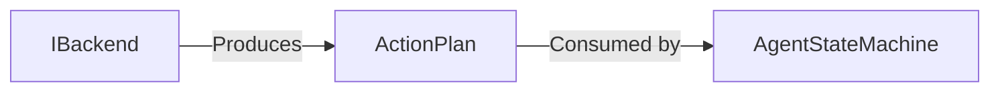

# ActionPlan

> **File Location:** `Code/Include/GOAT/Domain/ActionPlan.h`  
> **Inherits:** None (Plain struct)

---

## Overview

`ActionPlan` is a **sequence of `ActionRequest` steps** that an agent executes. It is produced by a backend (via `IBackend::Plan`) and consumed by `AgentStateMachine`. It represents the complete set of actions an agent must perform to satisfy a goal.

---

## Key Responsibilities

| # | Responsibility | Description |
| :--- | :--- | :--- |
| 1 | **Step Storage** | Holds an ordered list of `ActionRequest`s in a `fixed_vector`. |
| 2 | **Validation** | Exposes `IsEmpty()` to check if a plan has no steps. |
| 3 | **Length Limits** | Enforces a maximum plan length (`MaxPlanLength` = 8). |

---

## Public Interface

### Methods

```cpp
// Returns true if there are no steps.
bool IsEmpty() const { return m_steps.empty(); }

// Clears all steps.
void Clear() { m_steps.clear(); }
```

### Data Members

| Member | Type | Description |
| :--- | :--- | :--- |
| `m_steps` | `AZStd::fixed_vector<ActionRequest, MaxPlanLength>` | The ordered list of actions to execute. |

---

## Dependencies & Interactions



- **Depends on:** `ActionRequest`, `MaxPlanLength`.
- **Required by:** `IBackend`, `AgentStateMachine`.

---

## Implementation Notes

### Key Algorithms

`ActionPlan` is a simple container. Backends clear it, push steps, and return. `AgentStateMachine` iterates through `m_steps` and executes each `ActionRequest`.

### Performance Considerations

- **Allocation:** Uses `fixed_vector` to avoid dynamic allocation.
- **Tick Rate:** Called once per plan, not per frame.
- **Concurrency:** Main thread only.

---

## Lua Exposure

Assembled via `LuaPlanBuilder`:

```lua
backend "Errand" {
    plan = function(me, ctx, goal)
        return {
            { action = "wait", seconds = 2.0 },
        }
    end,
}
```

---

## Testing

Unit tests should cover:

- **IsEmpty:** Correctly returns true when no steps are present.
- **Push:** Correctly appends steps.
- **Clear:** Removes all steps.
- **Max Length:** Fails when exceeding 8 steps.

---

## Related Notes

- [[IBackend]]
- [[ActionRequest]]
- [[AgentStateMachine]]
- [[LuaPlanBuilder]]

---

*Last updated: 2026-08-26*