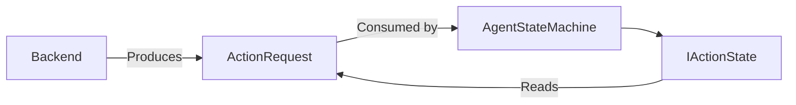

# ActionRequest

> **File Location:** `Code/Include/GOAT/Domain/ActionState.h`  
> **Inherits:** None (Plain struct)

---

## Overview

`ActionRequest` is the **parameter container for one action step**. It is produced by a backend and consumed by `AgentStateMachine`. It contains the verb to run (`m_action`) and optional parameters like target position, target entity, duration, and tolerance.

Fields an action does not use are simply left at their defaults.

---

## Key Responsibilities

| # | Responsibility | Description |
| :--- | :--- | :--- |
| 1 | **Verb Selection** | Stores the `ActionStateId` of the verb to run. |
| 2 | **Target Specification** | Stores a blackboard key, position, or entity for movement/action targets. |
| 3 | **Parameterization** | Stores duration, tolerance, and a tag for time-based or tagged actions. |

---

## Public Interface

### Data Members

| Member | Type | Description |
| :--- | :--- | :--- |
| `m_action` | `ActionStateId` | Which registered verb to run. |
| `m_targetKey` | `BlackboardKey` | Blackboard slot to read the target from; overrides `m_position` when valid. |
| `m_position` | `AZ::Vector3` | Literal target position, used when `m_targetKey` is not set. |
| `m_targetEntity` | `AZ::EntityId` | Target entity, for actions that act on another entity. |
| `m_tag` | `AZ::Name` | Names the thing to run: a script node, an animation clip, a bark line. |
| `m_duration` | `float` | Seconds this action should last, for time-based verbs. |
| `m_tolerance` | `float` | How close counts as arrived, for movement-like verbs. |

### Methods

```cpp
static void Reflect(AZ::ReflectContext* context);
```

---

## Dependencies & Interactions



- **Depends on:** `ActionStateId`, `BlackboardKey`, `AZ::Vector3`, `AZ::EntityId`, `AZ::Name`.
- **Required by:** `ActionPlan`, `IActionState`, `AgentStateMachine`, `LuaPlanBuilder`, `PlanStore`.

---

## Implementation Notes

### Key Algorithms

- `LuaPlanBuilder` assembles `ActionRequest`s from Lua backend steps.
- An inline leaf's own `ActionRequest` is acquired from the [[PlanStore]] as a one-step plan.
- `AgentStateMachine` passes the current `ActionRequest` to `IActionState::Begin`, `Step`, and `End`.

### Performance Considerations

- **Allocation:** No heap allocations; plain struct.
- **Tick Rate:** Used every frame during action execution.
- **Concurrency:** Immutable during execution.

---

## Lua Exposure

Not directly exposed to Lua. Lua backends return steps like `{ action = "wait", seconds = 2.0 }`, which `LuaPlanBuilder` translates into `ActionRequest`s.

---

## Testing

Unit tests should cover:

- **Action ID:** Correctly stores and retrieves the verb ID.
- **Targets:** Correctly stores key, position, or entity.
- **Parameters:** Correctly stores duration, tolerance, and tag.

---

## Related Notes

- [[ActionState]]
- [[ActionPlan]]
- [[IActionState]]
- [[LuaPlanBuilder]]
- [[PlanStore]]

---

*Last updated: 2026-08-26*