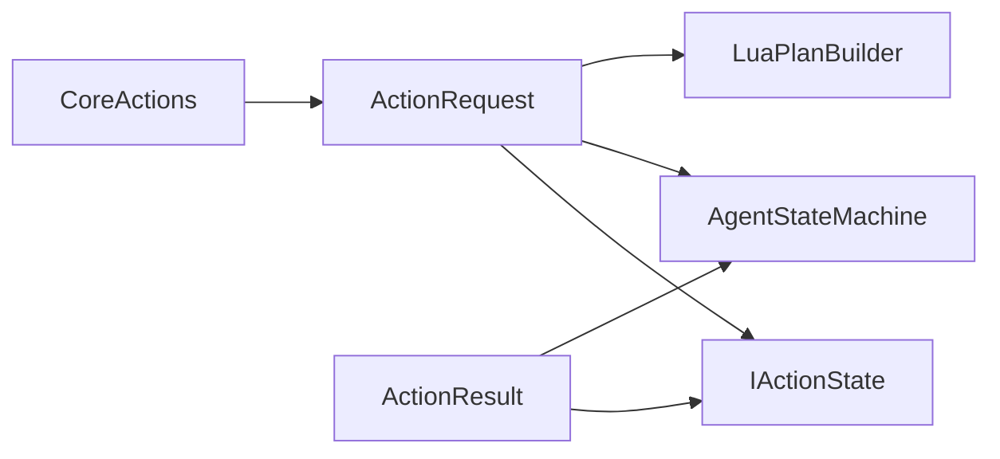

# ActionState

> **File Location:** `Code/Include/GOAT/Domain/ActionState.h`  
> **Inherits:** None (Plain structs and enums)

---

## Overview

`ActionState.h` defines the **core action-related enums and structs** used throughout G.O.A.T. It contains the `ActionResult` enum, the `ActionRequest` struct, and the `CoreActions` namespace that identifies the built-in action IDs. These types are the contract between backends, the `AgentStateMachine`, and `IActionState` implementations.

---

## Key Components

### 1. ActionResult

```cpp
// Outcome of advancing an action state.
enum class ActionResult : AZ::u8
{
    Running,  //!< Still in progress; the FSM stays in this state.
    Success,
    Failure
};
```

Used by `IActionState::Step()` to signal whether the action is still running or has completed (successfully or not).

---

### 2. CoreActions

```cpp
namespace CoreActions
{
    inline constexpr ActionStateId Invalid = 0;
    inline constexpr ActionStateId Wait = 1;
    inline constexpr ActionStateId RunScript = 2;
    inline constexpr ActionStateId FirstRegistered = 3;
}
```

The core always provides `Wait` and `RunScript` actions. `FirstRegistered` is the first ID available for modules to register custom actions.

---

### 3. ActionRequest

```cpp
struct ActionRequest
{
    AZ::Name m_tag;
    AZ::s64 m_duration = 0;
    float m_tolerance = 0.0f;
    BlackboardKey m_targetKey;
    AZ::Vector3 m_position = AZ::Vector3::CreateZero();
    AZ::EntityId m_targetEntity;
    ActionStateId m_action = CoreActions::Invalid;
};
```

Each field is optional and only used by actions that need it. For example:
- `WaitAction` uses `m_duration`.
- `MoveTo` (future) would use `m_targetKey` or `m_position`.
- `RunScriptAction` uses `m_tag` to identify the behavior.

---

## Public Interface

### Methods

```cpp
static void Reflect(AZ::ReflectContext* context);
```

---

## Dependencies & Interactions



- **Depends on:** `BlackboardKey`, `AZ::Vector3`, `AZ::EntityId`.
- **Required by:** `IActionState`, `AgentStateMachine`, `LuaPlanBuilder`, `TreeCompiler`.

---

## Implementation Notes

### Key Algorithms

- `ActionRequest` is a plain data struct. Fields that an action does not use are left at default values.
- `ActionResult` is a simple enum used to control the state machine's flow.

### Performance Considerations

- **Allocation:** No allocations; plain structs.
- **Tick Rate:** Used every frame during action execution.
- **Concurrency:** Main thread only.

---

## Lua Exposure

`ActionRequest` is not directly exposed to Lua. Instead, Lua backends produce steps that are assembled into `ActionPlan`s by `LuaPlanBuilder`. The `action` field in Lua steps maps to an `ActionStateId` via `ActionStateRegistry`.

---

## Testing

Unit tests should cover:

- **ActionResult:** Correctly reflect success/failure/running.
- **CoreActions:** `Wait` and `RunScript` have the correct IDs.
- **ActionRequest:** Fields can be set and read correctly.

---

## Related Notes

- [[IActionState]]
- [[AgentStateMachine]]
- [[ActionPlan]]
- [[ActionStateRegistry]]
- [[LuaPlanBuilder]]

---

*Last updated: 2026-08-26*