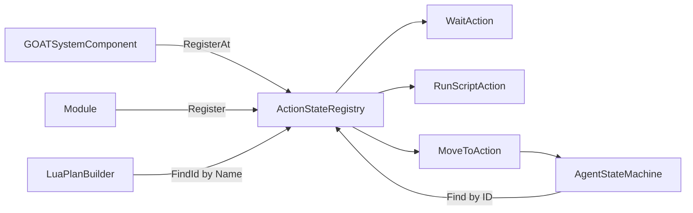

# ActionStateRegistry

> **File Location:** `Code/Source/Core/Application/ActionStateRegistry.cpp`  
> **Header:** `Code/Source/Core/Application/ActionStateRegistry.h`  
> **Inherits:** None (Plain class, owned by `GOATSystemComponent`)

---

## Overview

`ActionStateRegistry` is the **central lookup table** for all action verbs (like `Wait`, `RunScript`, `MoveTo`). It stores `IActionState` implementations by their `ActionStateId` and `AZ::Name`, allowing the `AgentStateMachine` to resolve a verb name to its implementation at runtime.

The registry is initially seeded with core verbs (`Wait`, `RunScript`) at reserved IDs, then modules can register additional verbs at runtime.

---

## Key Responsibilities

| # | Responsibility | Description |
| :--- | :--- | :--- |
| 1 | **Core Verb Registration** | Registers `Wait` and `RunScript` at reserved IDs (`RegisterAt`). |
| 2 | **Module Verb Registration** | Registers custom verbs at the next available ID (`Register`). |
| 3 | **Lookup by ID** | Provides `Find(ActionStateId)` for runtime execution. |
| 4 | **Lookup by Name** | Provides `FindId(AZ::Name)` for Lua/backend verb resolution. |
| 5 | **Enumeration** | Provides `GetNames()` for console output. |

---

## Public Interface

### Methods

```cpp
// Registers a core verb at its reserved id. Fails when the id is taken.
bool RegisterAt(ActionStateId id, AZStd::unique_ptr<IActionState> state);

// Registers a verb and returns the id assigned to it, or Invalid when the name is taken.
ActionStateId Register(AZStd::unique_ptr<IActionState> state);

// Removes a verb. Agents running it will fail their current action.
void Unregister(ActionStateId id);

// Resolves a verb name to its id, or Invalid when it is not registered.
ActionStateId FindId(const AZ::Name& name) const;

// The verb for an id, or nullptr when nothing is registered there.
IActionState* Find(ActionStateId id) const;

// Every registered verb name, for console output and authoring validation.
AZStd::vector<AZ::Name> GetNames() const;
```

### Private Methods

```cpp
// Grows the table so an id is addressable.
void EnsureSlot(ActionStateId id);
```

---

## Dependencies & Interactions



- **Depends on:** `IActionState` (the interface it stores).
- **Required by:** `AgentStateMachine`, `LuaPlanBuilder`, `GOATSystemComponent`, `TreeCompiler`.

---

## Implementation Notes

### Key Algorithms

- **`RegisterAt(id, state)`:** Ensures the slot exists, checks it is empty, then stores the state. Used for core verbs with fixed IDs.
- **`Register(state)`:** Looks for a free slot starting from `CoreActions::FirstRegistered`. If none are free, it appends a new slot (bounded by `ActionStateId::max()`).
- **`FindId(name)`:** Linear scan of all states comparing `GetName()`.

```cpp
// Code/Source/Core/Application/ActionStateRegistry.cpp
ActionStateId ActionStateRegistry::Register(AZStd::unique_ptr<IActionState> state)
{
    if (state == nullptr) { return CoreActions::Invalid; }

    const AZ::Name name = state->GetName();
    if (FindId(name) != CoreActions::Invalid)
    {
        AZ_Warning("GOAT", false, "Action verb '%s' is already registered", name.GetCStr());
        return CoreActions::Invalid;
    }

    EnsureSlot(CoreActions::FirstRegistered);
    for (size_t id = CoreActions::FirstRegistered; id < m_states.size(); ++id)
    {
        if (m_states[id] == nullptr)
        {
            m_states[id] = AZStd::move(state);
            return static_cast<ActionStateId>(id);
        }
    }

    if (m_states.size() > AZStd::numeric_limits<ActionStateId>::max())
    {
        AZ_Warning("GOAT", false, "No action verb ids left for '%s'", name.GetCStr());
        return CoreActions::Invalid;
    }

    m_states.push_back(AZStd::move(state));
    return static_cast<ActionStateId>(m_states.size() - 1);
}
```

### Performance Considerations

- **Allocation:** Owns `unique_ptr`s; no copying.
- **Tick Rate:** Lookup by ID is O(1) array access.
- **Concurrency:** Main thread only.

---

## Lua Exposure

Not directly exposed to Lua. Lua references verbs by name (e.g., `action = "wait"`), which `LuaPlanBuilder` resolves via `FindId()`.

---

## Testing

Unit tests should cover:

- **RegisterAt:** Successfully registering a core verb at a reserved ID.
- **Register:** Successfully adding a new verb and returning the next available ID.
- **FindId:** Correctly resolving a verb name to an ID.
- **Find:** Correctly retrieving an action by ID.
- **Unregister:** Removing an action and ensuring `Find` returns `nullptr`.
- **Duplicate Name:** Failing when a verb with the same name is registered twice.

---

## Related Notes

- [[IActionState]]
- [[AgentStateMachine]]
- [[LuaPlanBuilder]]
- [[TreeCompiler]]
- [[GOATSystemComponent]]

---

*Last updated: 2026-08-26*