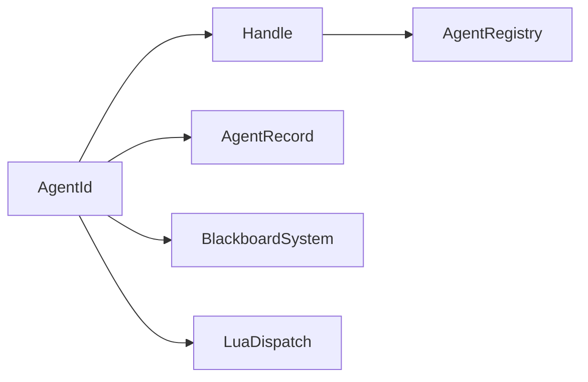

# AgentId

> **File Location:** `Code/Include/GOAT/Domain/AgentId.h`  
> **Inherits:** `Handle<AgentTag>`

---

## Overview

`AgentId` is a **generation-checked handle** that uniquely identifies one registered agent for the lifetime of that agent. It is a specialized version of the generic `Handle<Tag>` template, using an empty `AgentTag` struct to distinguish agent handles from every other kind of handle in the system.

---

## Key Responsibilities

| # | Responsibility | Description |
| :--- | :--- | :--- |
| 1 | **Agent Identification** | Provides a unique, stable identifier for a registered agent. |
| 2 | **Stale Detection** | Uses a generation counter to invalidate stale handles after an agent is unregistered. |
| 3 | **Type Safety** | Uses a tag struct to prevent accidental assignment from other handle types. |

---

## Public Interface

### Type Alias

```cpp
using AgentId = Handle<AgentTag>;
```

### Methods (Inherited from `Handle<Tag>`)

```cpp
// Returns the slot index, or NullIndex when the handle is null.
AZ::u32 GetIndex() const;

// Returns the generation counter for this handle.
AZ::u32 GetGeneration() const;

// True when this handle was never pointed at a slot.
bool IsNull() const;

// Comparison operators for equality and hashing.
bool operator==(const Handle& rhs) const;
bool operator!=(const Handle& rhs) const;
```

---

## Dependencies & Interactions



- **Depends on:** `Handle<AgentTag>` (via `AgentTag`).
- **Required by:** `AgentRegistry`, `AgentRecord`, `BlackboardSystem`, `LuaDispatch`, `AgentScriptContext`.

---

## Implementation Notes

### Key Algorithms

`AgentId` is a simple type alias. It inherits all behavior from `Handle<Tag>`. When an agent is released from `AgentRegistry`, the generation counter for that slot is incremented, invalidating any stale handles that still point to it.

### Performance Considerations

- **Allocation:** No allocations; plain 64-bit value (index + generation).
- **Tick Rate:** Used in all per-agent operations.
- **Concurrency:** Main thread only.

---

## Lua Exposure

Not directly exposed to Lua. Lua receives an agent key as a number (the slot index) when calling `GOAT_Dispatch`.

---

## Testing

Unit tests should cover:

- **IsNull:** Correctly returns true for default-constructed handles.
- **GetIndex:** Correctly returns the slot index.
- **GetGeneration:** Correctly returns the generation counter.
- **Stale Detection:** A handle becomes invalid after the agent is released.

---

## Related Notes

- [[Handle]]
- [[HandleTable]]
- [[AgentRegistry]]
- [[AgentRecord]]

---

*Last updated: 2026-08-26*