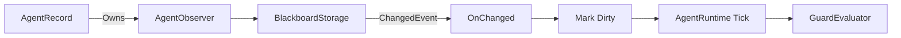

# AgentObserver

> **File Location:** `Code/Source/Core/Application/AgentObserver.cpp`  
> **Header:** `Code/Source/Core/Application/AgentObserver.h`  
> **Inherits:** None (Plain class, owned by `AgentRecord`)

---

## Overview

`AgentObserver` is the **event-driven wake-up mechanism** for agents. It watches only the blackboard slots an agent's tree actually guards on. When a watched slot changes, it marks the agent as "dirty" so the `GuardEvaluator` re-checks conditions only when necessary.

This eliminates per-frame polling of conditions, allowing thousands of agents to have active guards without CPU cost.

---

## Key Responsibilities

| # | Responsibility | Description |
| :--- | :--- | :--- |
| 1 | **Targeted Subscription** | Subscribes to only the blackboard storages that hold observed keys. |
| 2 | **Dirty Flagging** | Marks the agent as dirty when a watched slot changes. |
| 3 | **Cleanup** | Disconnects all handlers when an agent is unregistered. |

---

## Public Interface

### Methods

```cpp
// Subscribes to the storages the program's observed keys live in.
void Connect(const DecisionProgram& program, IBlackboardSystem& blackboard, AgentId agent);

// Drops every subscription, for example when an agent changes squad or tree.
void Disconnect();

// True when a watched slot changed since the last Clear.
bool IsDirty() const { return m_dirty; }

// Marks the agent as needing a guard re-check on its next tick.
void MarkDirty() { m_dirty = true; }

// Called once the guards have been re-checked.
void Clear() { m_dirty = false; }
```

---

## Dependencies & Interactions



- **Depends on:** `DecisionProgram`, `IBlackboardSystem`, `BlackboardStorage`.
- **Required by:** `AgentRecord` (owned per agent).
- **Interacts with:** `GuardEvaluator` (via `AgentRuntime`).

---

## Implementation Notes

### Key Algorithms

`Connect()` performs the following:

1. **Collect Observed Keys:** Copies `program.m_observedKeys` into `m_observed` and sorts them for binary search.
2. **Early Exit:** If no keys are observed, no subscriptions are needed.
3. **Scope Filtering:** For each `BlackboardScope`, it checks if any observed key belongs to that scope.
4. **Subscribe:** For each scope with observed keys, it finds the storage and connects a `ChangedEvent::Handler` that calls `OnChanged()`.

```cpp
// Code/Source/Core/Application/AgentObserver.cpp
void AgentObserver::OnChanged(BlackboardKey key)
{
    if (AZStd::binary_search(m_observed.begin(), m_observed.end(), key))
    {
        m_dirty = true;
    }
}
```

### Performance Considerations

- **Allocation:** `m_observed` is a pre-allocated vector.
- **Tick Rate:** Only called when a watched key changes.
- **Concurrency:** Main thread only.

---

## Lua Exposure

Not directly exposed to Lua. Managed entirely by C++ runtime.

---

## Testing

Unit tests should cover:

- **Connect:** Correctly subscribes to observed keys.
- **Disconnect:** Correctly unsubscribes all handlers.
- **OnChanged:** Only marks dirty for observed keys.
- **Clear:** Resets dirty flag.

---

## Related Notes

- [[BlackboardStorage]]
- [[GuardEvaluator]]
- [[AgentRecord]]
- [[AgentRuntime]]
- [[Blackboard System]]

---

*Last updated: 2026-08-26*