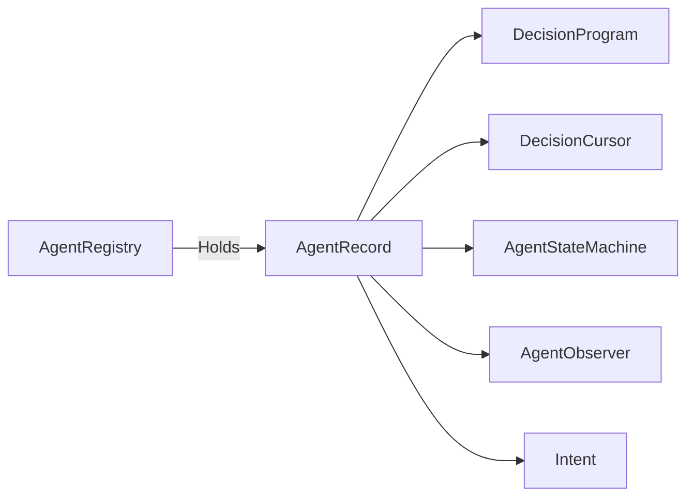

# AgentRecord

> **File Location:** `Code/Source/Core/Application/AgentRecord.h`  
> **Inherits:** None (Plain struct)

---

## Overview

`AgentRecord` is the **per-agent runtime state** held by `AgentRegistry`. It stores everything an agent needs to run its behavior tree: the compiled program, its current position in that tree, the action state machine, and the blackboard observer that wakes it only when relevant keys change.

Records are held behind a `unique_ptr` so their address stays put while the registry's dense storage compacts around them.

---

## Key Responsibilities

| # | Responsibility | Description |
| :--- | :--- | :--- |
| 1 | **Program Storage** | Holds a shared pointer to the immutable `DecisionProgram`. |
| 2 | **Position Tracking** | Holds a `DecisionCursor` tracking the agent's position in the tree. |
| 3 | **Action Execution** | Holds an `AgentStateMachine` for the currently running plan. |
| 4 | **Observer** | Holds an `AgentObserver` that watches only the blackboard slots the tree guards on. |
| 5 | **Intent Tracking** | Stores the intent currently being satisfied, for replanning. |
| 6 | **Service Scratch** | Reused each tick when collecting due services. |

---

## Public Interface

### Data Members

| Member | Type | Description |
| :--- | :--- | :--- |
| `m_id` | `AgentId` | The generation-checked handle for this agent. |
| `m_entity` | `AZ::EntityId` | The entity this agent drives. |
| `m_program` | `AZStd::shared_ptr<const DecisionProgram>` | The compiled tree, shared by all agents using it. |
| `m_cursor` | `DecisionCursor` | Where the agent is inside the tree. |
| `m_machine` | `AgentStateMachine` | The state machine for the current action plan. |
| `m_observer` | `AgentObserver` | Watches only the blackboard slots the tree guards on. |
| `m_intent` | `Intent` | The currently being satisfied intent (for replanning). |
| `m_band` | `size_t` | Which pacing band this agent belongs to. |
| `m_dueServices` | `AZStd::vector<AZ::u32>` | Scratch storage for due services each tick. |

---

## Dependencies & Interactions



- **Depends on:** `DecisionProgram`, `DecisionCursor`, `AgentStateMachine`, `AgentObserver`, `AgentId`, `Intent`.
- **Required by:** `AgentRegistry`.

---

## Implementation Notes

### Key Algorithms

`AgentRecord` is a simple data container. It is allocated via `AZStd::make_unique<AgentRecord>()` in `AgentRegistry::Register()`, and its fields are initialized in a strict order.

```cpp
// Code/Source/Core/Application/AgentRegistry.cpp
auto record = AZStd::make_unique<AgentRecord>();
AgentRecord* raw = record.get();
const AgentId id = m_agents.Acquire(AZStd::move(record));

raw->m_id = id;
raw->m_entity = entity;
raw->m_program = AZStd::move(program);
raw->m_band = band;
raw->m_cursor.Reset(*raw->m_program);
```

### Performance Considerations

- **Allocation:** Held behind a `unique_ptr` so its address stays stable while the registry's dense storage compacts.
- **Tick Rate:** Accessed every tick by `AgentRuntime`.
- **Concurrency:** Per-agent; no shared state.

---

## Lua Exposure

Not directly exposed to Lua. Managed entirely by C++ runtime.

---

## Testing

Unit tests should cover:

- **Initialization:** All fields are correctly set on registration.
- **Cleanup:** `m_dueServices` is cleared when reusing the record.
- **Stable Address:** The record's address remains stable even when the registry compacts.

---

## Related Notes

- [[AgentRegistry]]
- [[AgentRuntime]]
- [[AgentObserver]]
- [[AgentStateMachine]]
- [[DecisionCursor]]
- [[DecisionProgram]]

---

*Last updated: 2026-08-26*