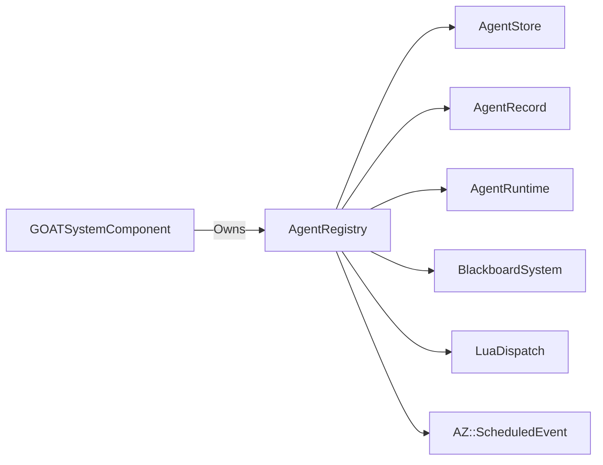

# AgentRegistry

> **File Location:** `Code/Source/Core/Application/AgentRegistry.cpp`  
> **Header:** `Code/Source/Core/Application/AgentRegistry.h`  
> **Inherits:** None (Plain class, owned by `GOATSystemComponent`)

---

## Overview

`AgentRegistry` is the **central registry for all running agents**. It owns every `AgentRecord`, schedules agents into pacing bands, and manages their lifecycle. Agents are grouped into a few bands rather than given one scheduled event each, so the scheduler queue stays small while distant agents still run less often.

It uses a `AgentStore` for dense, generation-checked storage of `AgentRecord`s, allowing O(1) lookup and cache-friendly iteration.

---

## Key Responsibilities

| # | Responsibility | Description |
| :--- | :--- | :--- |
| 1 | **Agent Registration** | Creates `AgentRecord`s and assigns `AgentId`s. |
| 2 | **Agent Unregistration** | Removes agents, cleans up their blackboard and Lua scratch. |
| 3 | **Agent Lookup** | Provides `Find(AgentId)` for runtime access. |
| 4 | **Band Scheduling** | Paces agents into 4 bands using `AZ::ScheduledEvent`. |
| 5 | **Band Management** | Allows moving agents between bands and changing band intervals. |

---

## Public Interface

### Constants

```cpp
// How many pacing bands exist, from most to least frequent.
static constexpr size_t BandCount = 4;
```

### Methods

```cpp
// Registers an entity as an agent running a compiled tree.
AgentId Register(AZ::EntityId entity, AZStd::shared_ptr<const DecisionProgram> program, size_t band);

// Removes an agent, dropping its blackboard and its Lua scratch.
void Unregister(AgentId agent);

// The record for an agent, or nullptr when the handle is stale.
AgentRecord* Find(AgentId agent);

// Moves an agent to a different pacing band.
void SetBand(AgentId agent, size_t band);

// How often each band runs.
void SetBandIntervals(const AZStd::array<AZ::TimeMs, BandCount>& intervals);

size_t Size() const { return m_agents.Size(); }

// Every live agent handle, for console output.
AZStd::vector<AgentId> GetAgents() const;
```

### Private Methods

```cpp
// Runs every agent in one band and records when it last ran.
void TickBand(size_t band);

// Takes an agent out of whichever band currently lists it.
void RemoveFromBand(AgentId agent, size_t band);
```

---

## Dependencies & Interactions



- **Depends on:** `AgentRecord`, `AgentRuntime`, `BlackboardSystem`, `LuaDispatch`, `AgentStore`, `AZ::ScheduledEvent`.
- **Required by:** `GOATSystemComponent`.

---

## Implementation Notes

### Key Algorithms

#### Band Intervals

```cpp
// Code/Source/Core/Application/AgentRegistry.cpp
const AZ::TimeMs defaults[BandCount] = {
    AZ::TimeMs{ 33 },   // Band 0 - Most frequent
    AZ::TimeMs{ 100 },  // Band 1 - Standard
    AZ::TimeMs{ 250 },  // Band 2 - Distant
    AZ::TimeMs{ 1000 }  // Band 3 - Least frequent
};
```

Each band has its own `AZ::ScheduledEvent` that calls `TickBand(band)`. The event is enqueued with `Requeue(interval, true)` so it repeats automatically.

#### Registration

```cpp
AgentId AgentRegistry::Register(AZ::EntityId entity, AZStd::shared_ptr<const DecisionProgram> program, size_t band)
{
    if (program == nullptr || program->IsEmpty()) { return AgentId{}; }

    band = AZStd::min(band, BandCount - 1);

    auto record = AZStd::make_unique<AgentRecord>();
    AgentRecord* raw = record.get();
    const AgentId id = m_agents.Acquire(AZStd::move(record));

    raw->m_id = id;
    raw->m_entity = entity;
    raw->m_program = AZStd::move(program);
    raw->m_band = band;
    raw->m_cursor.Reset(*raw->m_program);

    m_blackboard.CreateAgentBlackboard(id);
    raw->m_observer.Connect(*raw->m_program, m_blackboard, id);

    m_bands[band].m_members.push_back(id);
    return id;
}
```

#### TickBand

```cpp
void AgentRegistry::TickBand(size_t band)
{
    Band& entry = m_bands[band];

    const AZ::TimeMs now = AZ::GetElapsedTimeMs();
    const float deltaTime = AZStd::max(static_cast<float>(now - entry.m_lastTick) / 1000.0f, 0.0f);
    entry.m_lastTick = now;

    // Copy the roster: a behaviour may register or remove agents while it runs.
    AZStd::vector<AgentId> roster = entry.m_members;
    for (const AgentId agent : roster)
    {
        if (AgentRecord* record = Find(agent))
        {
            m_runtime.Tick(*record, deltaTime);
        }
    }
}
```

### Performance Considerations

- **Allocation:** Uses `AgentStore` for dense, generation-checked storage.
- **Tick Rate:** Each band ticks at its own interval (33ms to 1000ms).
- **Concurrency:** Main thread only. `TickBand` copies the roster to avoid iterator invalidation during behavior execution.

---

## Lua Exposure

Not directly exposed to Lua. Agents are registered via `GOATAgentComponent`.

---

## Testing

Unit tests should cover:

- **Register:** Successfully adding a new agent.
- **Unregister:** Removing an agent and freeing its slot.
- **Find:** Correctly retrieving an agent by ID.
- **SetBand:** Moving an agent between bands.
- **TickBand:** Agents in different bands are ticked at the correct frequency.
- **Stale Handles:** A released handle becomes invalid.

---

## Related Notes

- [[AgentRecord]]
- [[AgentRuntime]]
- [[AgentStore]]
- [[AgentId]]
- [[GOATAgentComponent]]
- [[GOATSystemComponent]]

---

*Last updated: 2026-08-26*