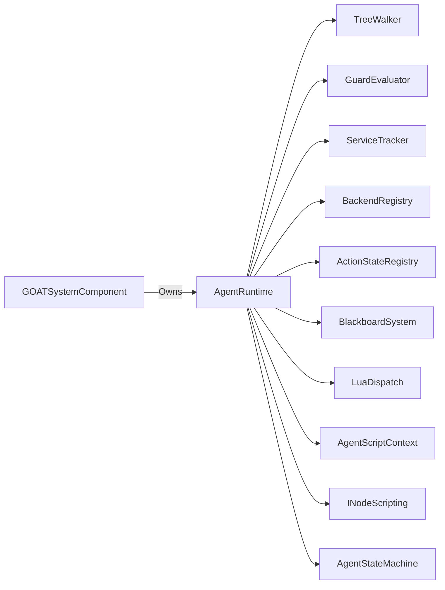

# AgentRuntime

> **File Location:** `Code/Source/Core/Application/AgentRuntime.cpp`  
> **Header:** `Code/Source/Core/Application/AgentRuntime.h`  
> **Inherits:** None (Plain class, owned by `GOATSystemComponent`)

---

## Overview

`AgentRuntime` is the **core execution engine** that runs one tick of the entire AI pipeline for a single agent. It orchestrates guards, services, the action state machine, and the tree walker, ensuring that each agent makes progress within a bounded amount of work per frame (`MaxIntentsPerTick`).

It is constructed once by `GOATSystemComponent` and passed to `AgentRegistry`, which calls `Tick()` on it for every agent in a band.

---

## Key Responsibilities

| # | Responsibility | Description |
| :--- | :--- | :--- |
| 1 | **Guard Evaluation** | Re-checks guards via `GuardEvaluator` when `AgentObserver` is dirty. |
| 2 | **Service Ticking** | Runs due services via `ServiceTracker` on their configured intervals. |
| 3 | **Action Execution** | Advances the `AgentStateMachine` by calling `IActionState::Step()`. |
| 4 | **Tree Walking** | Produces `Intent`s via `TreeWalker` and hands them to backends. |
| 5 | **Plan Start** | Routes an `Intent` to a backend and loads the resulting `ActionPlan` into the state machine. |
| 6 | **Work Bounding** | Limits the number of intents satisfied per tick to prevent frame spikes. |

---

## Public Interface

### Constructor

```cpp
AgentRuntime(
    IBlackboardSystem& blackboard,
    const ActionStateRegistry& actions,
    const BackendRegistry& backends,
    IBackend& directBackend,
    LuaDispatch& dispatch,
    AgentScriptContext& scriptContext,
    INodeScripting& scripting);
```

### Methods

```cpp
// Advances one agent by a delta time.
void Tick(AgentRecord& agent, float deltaTime);
```

---

## Private Helper Methods

```cpp
// Re-checks the guards that a changed blackboard slot could have affected.
// Returns true when the running action was interrupted.
bool ApplyGuards(AgentRecord& agent, const PlanContext& planContext, WalkStep& outStep, bool& outHaveStep);

// Runs the services whose subtree the agent is currently inside.
void TickServices(AgentRecord& agent, float deltaTime);

// Turns an intent into a plan and loads it into the state machine.
// Returns false when no backend could satisfy the intent.
bool StartPlan(AgentRecord& agent, const PlanContext& planContext, const Intent& intent);

// Builds the context an action state receives.
ActionContext MakeActionContext(AgentRecord& agent) const;

// Builds the context a backend receives.
PlanContext MakePlanContext(AgentRecord& agent) const;
```

---

## Dependencies & Interactions



- **Depends on:** `BlackboardSystem`, `ActionStateRegistry`, `BackendRegistry`, `LuaDispatch`, `AgentScriptContext`, `INodeScripting`, `TreeWalker`, `GuardEvaluator`, `ServiceTracker`.
- **Required by:** `AgentRegistry` (to tick agents).
- **Interacts with:** `AgentRecord`, `TreeWalker`, `GuardEvaluator`, `ServiceTracker`, `BackendRegistry`, `AgentStateMachine`.

---

## Implementation Notes

### Key Algorithms

#### `Tick()` – The Main Loop

```cpp
// Code/Source/Core/Application/AgentRuntime.cpp
void AgentRuntime::Tick(AgentRecord& agent, float deltaTime)
{
    if (agent.m_program == nullptr || agent.m_program->IsEmpty()) { return; }

    agent.m_cursor.AdvanceClock(deltaTime);
    const PlanContext planContext = MakePlanContext(agent);

    WalkStep step;
    bool haveStep = false;
    ApplyGuards(agent, planContext, step, haveStep);

    TickServices(agent, deltaTime);

    if (!haveStep)
    {
        if (agent.m_machine.HasPlan())
        {
            ActionContext actionContext = MakeActionContext(agent);
            const ActionResult result = agent.m_machine.Step(m_actions, actionContext, deltaTime);
            if (result == ActionResult::Running) { return; }
            step = m_walker.Advance(*agent.m_program, agent.m_cursor, planContext, result);
        }
        else
        {
            step = m_walker.Begin(*agent.m_program, agent.m_cursor, planContext);
        }
        haveStep = true;
    }

    for (int attempt = 0; attempt < MaxIntentsPerTick; ++attempt)
    {
        if (step.m_outcome == WalkOutcome::Finished)
        {
            step = m_walker.Begin(*agent.m_program, agent.m_cursor, planContext);
            if (step.m_outcome == WalkOutcome::Finished) { return; }
        }

        if (StartPlan(agent, planContext, step.m_intent)) { return; }

        step = m_walker.Advance(*agent.m_program, agent.m_cursor, planContext, ActionResult::Failure);
    }
}
```

#### `StartPlan()` – Backend Routing

```cpp
bool AgentRuntime::StartPlan(AgentRecord& agent, const PlanContext& planContext, const Intent& intent)
{
    IBackend* backend = intent.m_backend.IsEmpty() ? &m_directBackend : m_backends.Find(intent.m_backend);
    if (backend == nullptr)
    {
        AZ_Warning("GOAT", false, "No backend named '%s' is installed", intent.m_backend.GetCStr());
        return false;
    }

    ActionPlan plan;
    if (!backend->Plan(planContext, intent, plan) || plan.IsEmpty())
    {
        return false;
    }

    agent.m_intent = intent;
    agent.m_machine.SetPlan(plan);
    return true;
}
```

### Performance Considerations

- **Allocation:** No per-tick allocations; reuses existing vectors.
- **Tick Rate:** Called every tick for each agent in a band.
- **Concurrency:** Main thread only.
- **Work Bounding:** `MaxIntentsPerTick = 8` prevents a tree of instantly-completing leaves from spinning the frame.

---

## Lua Exposure

Not directly exposed to Lua. Lua behaviors are executed via `RunScriptAction` (which is an `IActionState`). Lua backends are accessed via `LuaBackend` through `BackendRegistry`.

---

## Testing

Unit tests should cover:

- **Tick with No Plan:** Tree begins and produces first intent.
- **Tick with Active Plan:** Action is advanced until it completes.
- **Guard Interrupt:** A guard stops holding and aborts the current action.
- **Service Due:** Services are collected and run at the correct interval.
- **Bounded Work:** Tree of instant leaves stops after `MaxIntentsPerTick`.
- **Backend Failure:** An intent with no backend fails gracefully.

---

## Related Notes

- [[AgentRegistry]]
- [[AgentStateMachine]]
- [[TreeWalker]]
- [[GuardEvaluator]]
- [[ServiceTracker]]
- [[BackendRegistry]]
- [[LuaDispatch]]
- [[AgentScriptContext]]

---

*Last updated: 2026-08-26*