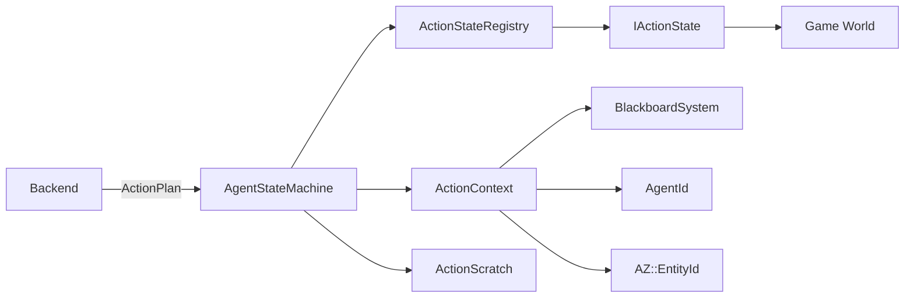

# AgentStateMachine

> **File Location:** `Code/Include/GOAT/Domain/AgentStateMachine.h`  
> **Inherits:** None (Plain class)

---

## Overview

`AgentStateMachine` is the **per-agent plan execution state**. It holds the current `ActionPlan`, tracks which step is being executed, manages the elapsed time for the current action, and handles the lifecycle of `IActionState` implementations (Begin, Step, End).

It is the counterpart to the `TreeWalker` – while the walker produces intents, the state machine executes the resulting plans. It uses a 32-byte `ActionScratch` buffer to store per-agent state without allocating.

---

## Key Responsibilities

| # | Responsibility | Description |
| :--- | :--- | :--- |
| 1 | **Plan Storage** | Holds the current `ActionPlan` being executed. |
| 2 | **Step Tracking** | Tracks which step of the plan is currently running. |
| 3 | **Action Lifecycle** | Calls `IActionState::Begin`, `Step`, and `End` in the correct order. |
| 4 | **Scratch Management** | Provides a 32-byte per-agent scratch buffer for `IActionState` implementations. |
| 5 | **Result Propagation** | Returns `Running`, `Success`, or `Failure` for the whole plan. |

---

## Public Interface

### Methods

```cpp
// Replaces the running plan and arms its first step. Does not end the previous action.
void SetPlan(const ActionPlan& plan);

// Advances the running action, moving to the next step when one finishes.
ActionResult Step(const ActionStateRegistry& registry, ActionContext& context, float deltaTime);

// Ends the running action and drops the plan.
void Abort(const ActionStateRegistry& registry, ActionContext& context);

// True when a plan is loaded and has steps left.
bool HasPlan() const;

// The action currently running, or nullptr when there is none.
const ActionRequest* GetCurrentAction() const;

// Seconds the current action has been running.
float GetElapsed() const { return m_elapsed; }

// Index of the step being run, for console output.
size_t GetStepIndex() const { return m_step; }
```

---

## Dependencies & Interactions



- **Depends on:** `ActionPlan`, `ActionRequest`, `ActionStateRegistry`, `IActionState`, `ActionContext`, `ActionScratch`.
- **Required by:** `AgentRecord` (owned per agent).
- **Interacts with:** `ActionStateRegistry` (to resolve `ActionStateId` to `IActionState`).

---

## Implementation Notes

### Key Algorithms

#### `Step()` – Action Lifecycle

```cpp
// Code/Source/Core/Domain/AgentStateMachine.cpp
ActionResult AgentStateMachine::Step(const ActionStateRegistry& registry, ActionContext& context, float deltaTime)
{
    if (!HasPlan()) { return ActionResult::Success; }

    FillContext(context);

    IActionState* state = registry.Find(m_plan.m_steps[m_step].m_action);
    if (state == nullptr)
    {
        AZ_Warning("GOAT", false, "Agent is running unregistered action verb %u; failing the plan",
            static_cast<AZ::u32>(m_plan.m_steps[m_step].m_action));
        m_begun = false;
        m_step = m_plan.m_steps.size();
        return ActionResult::Failure;
    }

    if (!m_begun)
    {
        m_scratch.fill(0);
        m_elapsed = 0.0f;
        state->Begin(context);
        m_begun = true;
    }

    m_elapsed += deltaTime;
    const ActionResult result = state->Step(context, deltaTime);
    if (result == ActionResult::Running) { return ActionResult::Running; }

    state->End(context);
    m_begun = false;

    if (result == ActionResult::Failure)
    {
        m_step = m_plan.m_steps.size();
        return ActionResult::Failure;
    }

    ++m_step;
    return HasPlan() ? ActionResult::Running : ActionResult::Success;
}
```

#### `Abort()` – Cleanup

```cpp
void AgentStateMachine::Abort(const ActionStateRegistry& registry, ActionContext& context)
{
    EndCurrent(registry, context);
    m_step = m_plan.m_steps.size();
    m_elapsed = 0.0f;
}
```

### Performance Considerations

- **Allocation:** `m_scratch` is a fixed 32-byte array embedded in the state machine.
- **Tick Rate:** Called every tick while a plan is active.
- **Concurrency:** Per-agent; no shared state.

---

## Lua Exposure

Not directly exposed to Lua. The state machine is a C++-internal container. Lua behaviors are executed via `RunScriptAction`.

---

## Testing

Unit tests should cover:

- **SetPlan:** Correctly initializes the plan and resets state.
- **Step Success:** A plan that completes successfully returns `Success`.
- **Step Failure:** A failing action aborts the plan.
- **Running State:** An action returning `Running` keeps the plan active.
- **Abort:** Correctly cleans up the current action.
- **Scratch:** Correctly zeroes the scratch between actions.
- **Unknown Verb:** An unregistered action fails the plan.

---

## Related Notes

- [[ActionPlan]]
- [[ActionRequest]]
- [[IActionState]]
- [[ActionStateRegistry]]
- [[ActionContext]]
- [[AgentRecord]]
- [[AgentRuntime]]

---

*Last updated: 2026-08-26*