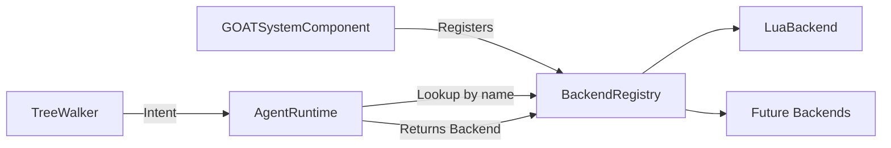

# BackendRegistry

> **File Location:** `Code/Source/Core/Application/BackendRegistry.h`  
> **Header:** `Code/Source/Core/Application/BackendRegistry.h`  
> **Inherits:** None (Plain class, owned by `GOATSystemComponent`)

---

## Overview

`BackendRegistry` is the lookup table for **`delegate` planners** — [[IBackend]] implementations, chiefly [[LuaBackend]], stored by name so an `Intent` naming one reaches it.

It is not where paradigms live. Those are [[IDecisionBackend]] implementations in [[DecisionBackendRegistry]]. A leaf that names no backend never comes here at all: it becomes a one-step plan inline.

Adding a backend is a registration; removing one is deleting its entry. Agents planning through a missing backend fall back to the direct backend.

---

## Key Responsibilities

| # | Responsibility | Description |
| :--- | :--- | :--- |
| 1 | **Registration** | Stores `AZStd::unique_ptr<IBackend>` instances by their `AZ::Name`. |
| 2 | **Lookup** | Provides a `Find()` method to retrieve a backend by name. |
| 3 | **Unregistration** | Removes a backend by name, releasing ownership. |
| 4 | **Enumeration** | Provides `GetNames()` for console output and debugging. |
| 5 | **Clear** | Removes every backend, used during shutdown. |

---

## Public Interface

### Methods

```cpp
// Installs a backend under its own name. Fails when that name is taken.
bool Register(AZStd::unique_ptr<IBackend> backend);

// Removes a backend. Agents planning through it fall back to the direct backend.
void Unregister(const AZ::Name& name);

// The backend registered under a name, or nullptr when there is none.
IBackend* Find(const AZ::Name& name) const;

// Every installed backend name, for console output and authoring validation.
AZStd::vector<AZ::Name> GetNames() const;

// Removes every backend.
void Clear();
```

---

## Dependencies & Interactions



- **Depends on:** `IBackend` (the interface it stores).
- **Required by:** `GOATSystemComponent`, `AgentRuntime`, `TreeWalker`.
- **Interacts with:** `LuaDispatch` (indirectly, via `LuaBackend` for `GOAT_Plan` calls).

---

## Implementation Notes

### Key Algorithms

`Register()` checks for null, empty name, and duplicates before inserting into the map:

```cpp
// Code/Source/Core/Application/BackendRegistry.h
bool BackendRegistry::Register(AZStd::unique_ptr<IBackend> backend)
{
    if (backend == nullptr)
    {
        return false;
    }

    const AZ::Name name = backend->GetName();
    if (name.IsEmpty() || m_backends.contains(name))
    {
        AZ_Warning("GOAT", false, "Backend '%s' is already registered", name.GetCStr());
        return false;
    }

    m_backends.emplace(name, AZStd::move(backend));
    return true;
}
```

### Performance Considerations

- **Allocation:** Owns `unique_ptr`s to backends; no copying.
- **Tick Rate:** Lookup is O(1) via `AZStd::unordered_map` and only happens when a `delegate` node is hit.
- **Concurrency:** Main thread only.

---

## Lua Exposure

Not directly exposed to Lua. Lua backends are wrapped in `LuaBackend` objects and registered here by `GOATSystemComponent` during `RegisterLuaBackends()`.

---

## Testing

Unit tests should cover:

- **Registration:** Successfully adding a new backend.
- **Duplicate Registration:** Attempting to register a backend with an existing name returns `false`.
- **Find:** Correctly retrieving a backend by name.
- **Unregister:** Removing a backend and ensuring `Find` returns `nullptr`.
- **Clear:** Removing all backends.

---

## Related Notes

- [[IBackend]]
- [[LuaBackend]]
- [[IDecisionBackend]]
- [[DecisionBackendRegistry]]
- [[GOATSystemComponent]]
- [[Extensibility Model]]
- [[AgentRuntime]]

---

*Last updated: 2026-08-26*