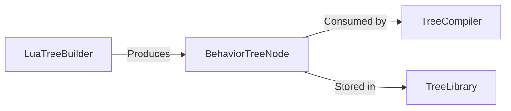

# BehaviorTreeNode

> **File Location:** `Code/Include/GOAT/Assets/BehaviorTreeAsset.h`  
> **Source:** `Code/Source/Core/Assets/BehaviorTreeAsset.cpp`  
> **Inherits:** None (Plain struct)

---

## Overview

`BehaviorTreeNode` is the **authored representation of one node** in a behavior tree. It is produced by `LuaTreeBuilder` (from Lua) or a future graph editor, and consumed by `TreeCompiler` to generate a `DecisionProgram`. It contains the node's type, properties, children, and attached services.

The runtime never sees this type, only the compiled `DecisionProgram` derived from it.

---

## Key Responsibilities

| # | Responsibility | Description |
| :--- | :--- | :--- |
| 1 | **Node Representation** | Stores the node's type (e.g., `"selector"`, `"script"`). |
| 2 | **Property Storage** | Holds authored properties (e.g., `key`, `interval`, `abort`). |
| 3 | **Children Management** | Holds an ordered list of child nodes. |
| 4 | **Service Management** | Holds attached service nodes (for composites). |
| 5 | **Metadata** | Stores editor-only data (position, comment) for a future graph editor. |

---

## Public Interface

### Data Members

| Member | Type | Description |
| :--- | :--- | :--- |
| `m_type` | `AZStd::string` | The node type name. |
| `m_properties` | `AZStd::vector<BehaviorTreeProperty>` | Authored properties. |
| `m_children` | `AZStd::vector<BehaviorTreeNode>` | Child nodes. |
| `m_services` | `AZStd::vector<BehaviorTreeNode>` | Attached services. |
| `m_metadata` | `BehaviorTreeNodeMetadata` | Editor-only data (position, comment). |

---

## Dependencies & Interactions

- **Depends on:** `BehaviorTreeProperty`, `BehaviorTreeNodeMetadata`.
- **Required by:** `LuaTreeBuilder`, `TreeCompiler`, `TreeLibrary`.

---

## Implementation Notes

### Key Algorithms

`BehaviorTreeNode` is a recursive structure. `TreeCompiler::Emit` recursively traverses it, flattening into a `DecisionProgram`.

### Performance Considerations

- **Allocation:** Allocated once during asset loading.
- **Tick Rate:** Not used during runtime; only during compilation.
- **Concurrency:** Main thread only.

---

## Lua Exposure

Indirectly produced from Lua via `GOAT_EmitTree` and `LuaTreeBuilder`.

---

## Testing

Unit tests should cover:

- **Properties:** Correctly storing typed properties.
- **Children:** Correctly handling nested nodes.
- **Services:** Correctly attaching services to composites.

---

## Related Notes

- [[LuaTreeBuilder]]
- [[TreeCompiler]]
- [[TreeLibrary]]
- [[BehaviorTreeProperty]]
- [[BehaviorTreeNodeMetadata]]

---

*Last updated: 2026-08-26*