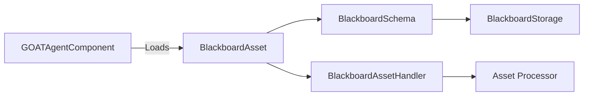

# BlackboardAsset

> **File Location:** `Code/Include/GOAT/Assets/BlackboardAsset.h`  
> **Source:** `Code/Source/Core/Assets/BlackboardAsset.cpp`  
> **Inherits:** `AZ::Data::AssetData`

---

## Overview

`BlackboardAsset` is the **authorable asset type** that declares blackboard variables. It is saved as a `.bbx` file and loaded into the `BlackboardSchema` when an entity activates. It allows designers to define the variables an AI agent needs (health, target, state, etc.) without touching C++.

The asset is composed of a list of `BlackboardVariable` objects, each declaring a name, scope, type, and optional default value.

---

## Key Responsibilities

| # | Responsibility | Description |
| :--- | :--- | :--- |
| 1 | **Variable Declaration** | Holds a list of `BlackboardVariable` definitions. |
| 2 | **Asset Integration** | Integrates with O3DE's Asset System for loading and editing. |
| 3 | **Schema Feeding** | Passes its variables to `BlackboardSchema::Declare` when loaded. |

---

## Public Interface

### Constants

```cpp
// Source extension the Asset Processor watches for.
static constexpr const char* FileExtension = "bbx";

// Group this asset is filed under in the Asset Editor.
static constexpr const char* AssetGroup = "GOAT";

// Name shown in the Asset Editor's new asset list.
static constexpr const char* DisplayName = "Blackboard";
```

### Data Members

| Member | Type | Description |
| :--- | :--- | :--- |
| `m_variables` | `AZStd::vector<BlackboardVariable>` | The list of variables declared by this asset. |

---

## BlackboardVariable

`BlackboardVariable` is a single variable declaration within a `BlackboardAsset`.

### Data Members

| Member | Type | Description |
| :--- | :--- | :--- |
| `m_name` | `AZStd::string` | The name this variable is referenced by. |
| `m_scope` | `BlackboardScope` | Which lifetime the variable belongs to (Global, Agent, Squad). |
| `m_type` | `BlackboardType` | What kind of value the variable holds. |
| `m_boolDefault` | `bool` | Default value for Bool type. |
| `m_intDefault` | `AZ::s64` | Default value for Int type. |
| `m_floatDefault` | `float` | Default value for Float type. |
| `m_vector3Default` | `AZ::Vector3` | Default value for Vector3 type. |
| `m_entityIdDefault` | `AZ::EntityId` | Default value for EntityId type. |
| `m_nameDefault` | `AZStd::string` | Default value for Name type. |

### Methods

```cpp
// Returns the declared default as an any, or empty when no editable default exists.
AZStd::any GetDefault() const;
```

---

## Dependencies & Interactions



- **Depends on:** `BlackboardVariable`, `BlackboardScope`, `BlackboardType`, `AZ::Data::AssetData`.
- **Required by:** `GOATAgentComponent` (to declare variables on activation).
- **Interacts with:** `BlackboardAssetHandler` (for loading), `BlackboardSchema` (for merging declarations).

---

## Implementation Notes

### Key Algorithms

`BlackboardAssetHandler` uses `AzFramework::GenericAssetHandler<BlackboardAsset>` to handle loading. It sets `SetAutoBuildAssetToCache(true)` so the Asset Processor builds the source into the cache without a custom builder.

When `GOATAgentComponent::Activate()` loads the asset, it calls `IAgentSystem::LoadBlackboard()` which iterates through `m_variables` and calls `BlackboardSchema::Declare()` for each one.

### Reflection

`BlackboardAsset::Reflect()` registers the asset with the SerializeContext, enabling it to be saved and loaded. It also uses `EditContext` to show property editors in the Asset Editor.

The `BlackboardVariable::Reflect()` method uses `ChangeNotify` on the type field to refresh the editor when the type changes, showing only the relevant default field.

---

## Lua Exposure

Not directly exposed to Lua. Variables are declared in `.bbx` assets and accessed via `ctx` in Lua behaviors:

```lua
-- Access a variable declared in a .bbx asset
ctx:SetInt("patrol_stop", me.stop)
ctx:GetBool("target_seen")
```

---

## Testing

Unit tests should cover:

- **Asset Reflection:** The asset type is correctly registered with the SerializeContext.
- **Variable Defaults:** `GetDefault()` returns the correct default for each type.
- **Asset Handler:** The handler can load and register the asset with the Asset Manager.
- **Variable Visibility:** Only the matching default field is shown in the editor.

---

## Related Notes

- [[BlackboardSchema]]
- [[BlackboardSystem]]
- [[BlackboardVariable]]
- [[GOATAgentComponent]]
- [[BlackboardAssetHandler]]

---

*Last updated: 2026-08-26*