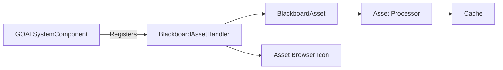

# BlackboardAssetHandler

> **File Location:** `Code/Source/Core/Assets/BlackboardAssetHandler.cpp`  
> **Header:** `Code/Source/Core/Assets/BlackboardAssetHandler.h`  
> **Inherits:** `AzFramework::GenericAssetHandler<BlackboardAsset>`

---

## Overview

`BlackboardAssetHandler` is the **asset handler** for `.bbx` Blackboard assets. It registers the asset type with O3DE's Asset Manager, enabling the Asset Processor to build `.bbx` source files into the cache, and provides a custom icon for the asset in the Asset Browser.

It delegates most behavior to the generic asset handler, but adds the `.bbx` source file icon and ensures the asset is automatically built into the cache without needing a custom builder.

---

## Key Responsibilities

| # | Responsibility | Description |
| :--- | :--- | :--- |
| 1 | **Asset Registration** | Registers `BlackboardAsset` with the Asset Manager via `GenericAssetHandler`. |
| 2 | **Auto-Build** | Enables automatic building of `.bbx` source files into the cache. |
| 3 | **Icon Provision** | Provides a custom browser icon for `.bbx` source files. |

---

## Public Interface

### Constructor

```cpp
BlackboardAssetHandler();
```

### Methods

```cpp
// Path of the icon shown for this asset type, relative to the asset cache.
const char* GetBrowserIcon() const override;
```

---

## Dependencies & Interactions



- **Depends on:** `BlackboardAsset`, `AzFramework::GenericAssetHandler`.
- **Required by:** `GOATSystemComponent`, `GOATBuilderComponent` (in Asset Processor).
- **Interacts with:** `Asset Manager`, `Asset Browser`.

---

## Implementation Notes

### Key Algorithms

The constructor initializes the generic asset handler with the asset's display name, group, and file extension:

```cpp
// Code/Source/Core/Assets/BlackboardAssetHandler.cpp
BlackboardAssetHandler::BlackboardAssetHandler()
    : AzFramework::GenericAssetHandler<BlackboardAsset>(
        BlackboardAsset::DisplayName, BlackboardAsset::AssetGroup, BlackboardAsset::FileExtension)
{
    // Lets the Asset Processor build the source into the cache without a custom builder.
    SetAutoBuildAssetToCache(true);
}

const char* BlackboardAssetHandler::GetBrowserIcon() const
{
    return "Editor/Icons/GOAT/AssetBrowser/Blackboard.svg";
}
```

### Performance Considerations

- **Allocation:** No per-tick allocations.
- **Tick Rate:** Only called during asset loading and registration.
- **Concurrency:** Main thread only.

---

## Lua Exposure

Not directly exposed to Lua. The handler is purely a C++ asset system integration.

---

## Testing

Unit tests should cover:

- **Registration:** The handler registers correctly with the Asset Manager.
- **Auto-Build:** The asset is automatically built into the cache.
- **Icon:** `GetBrowserIcon()` returns the correct path.

---

## Related Notes

- [[BlackboardAsset]]
- [[GOATSystemComponent]]
- [[GOATBuilderComponent]]

---

*Last updated: 2026-08-26*