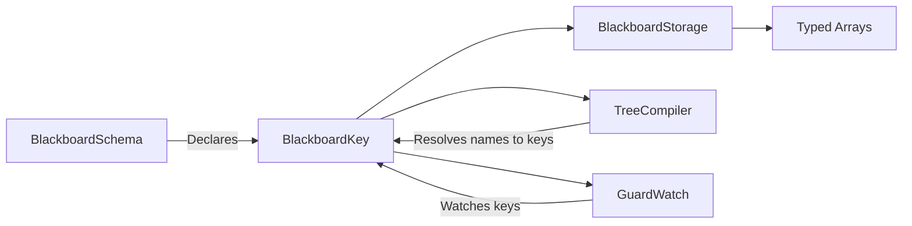

# BlackboardKey

> **File Location:** `Code/Include/GOAT/Domain/BlackboardKey.h`  
> **Source:** `Code/Source/Core/Domain/BlackboardKey.cpp`  
> **Inherits:** None (Plain class)

---

## Overview

`BlackboardKey` is a **lightweight, packed handle** that identifies a single blackboard slot. It encodes the variable's `BlackboardScope`, `BlackboardType`, and a dense `index` into a single 32-bit word. This allows O(1) array access during runtime without any string lookups.

The packing layout is:

- **Index:** Bits 0–25 (26 bits)
- **Type:** Bits 26–29 (4 bits)
- **Scope:** Bits 30–31 (2 bits)

---

## Key Responsibilities

| # | Responsibility | Description |
| :--- | :--- | :--- |
| 1 | **Slot Identification** | Uniquely identifies one blackboard slot. |
| 2 | **Packed Storage** | Stores scope, type, and index in a single 32-bit word. |
| 3 | **Type-Safe Access** | Provides `GetScope()`, `GetType()`, and `GetIndex()` to select the correct array. |
| 4 | **Validation** | Exposes `IsValid()` to check if the key refers to a real slot. |
| 5 | **Hashing** | Supports `AZStd::hash` for use in unordered containers. |

---

## Public Interface

### Constants

```cpp
// Bits reserved for the slot index within its type's array.
static constexpr AZ::u32 IndexBitCount = 26;
// Bits reserved for the BlackboardType tag.
static constexpr AZ::u32 TypeBitCount = 4;
// Bits reserved for the BlackboardScope tag.
static constexpr AZ::u32 ScopeBitCount = 2;
// Largest slot index the packed layout can address.
static constexpr AZ::u32 MaxIndex = (1u << IndexBitCount) - 1;
```

### Constructors

```cpp
// Default-constructed key, which is invalid.
BlackboardKey() = default;

// Constructs a key from scope, type, and index.
BlackboardKey(BlackboardScope scope, BlackboardType type, AZ::u32 index);
```

### Methods

```cpp
// True when this key refers to a real slot.
bool IsValid() const;

// Returns the scope this key belongs to.
BlackboardScope GetScope() const;

// Returns the value type this key points to.
BlackboardType GetType() const;

// Returns the dense index within the scope's typed array.
AZ::u32 GetIndex() const;

// Returns the raw packed value, for hashing and serialization.
AZ::u32 GetPacked() const { return m_packed; }
```

### Operators

```cpp
bool operator==(const BlackboardKey& rhs) const;
bool operator!=(const BlackboardKey& rhs) const;
bool operator<(const BlackboardKey& rhs) const;
```

---

## Dependencies & Interactions



- **Depends on:** `BlackboardScope`, `BlackboardType`.
- **Required by:** `BlackboardStorage`, `BlackboardSchema`, `TreeCompiler`, `GuardWatch`, `LuaPlanBuilder`.

---

## Implementation Notes

### Key Algorithms

The constructor packs the three fields into `m_packed`:

```cpp
// Code/Source/Core/Domain/BlackboardKey.cpp
BlackboardKey::BlackboardKey(BlackboardScope scope, BlackboardType type, AZ::u32 index)
{
    AZ_Assert(index <= MaxIndex, "Blackboard slot index %u exceeds the packed limit of %u", index, MaxIndex);
    AZ_Assert(scope < BlackboardScope::Count, "Invalid blackboard scope");
    AZ_Assert(type < BlackboardType::Count, "Invalid blackboard type");

    m_packed = (static_cast<AZ::u32>(scope) << ScopeShift) | (static_cast<AZ::u32>(type) << TypeShift) |
        (index & IndexMask);
}
```

The getters extract each field by shifting and masking:

```cpp
BlackboardScope BlackboardKey::GetScope() const
{
    return static_cast<BlackboardScope>((m_packed >> ScopeShift) & ScopeMask);
}
```

### Performance Considerations

- **Allocation:** No allocations; plain 32-bit value.
- **Tick Rate:** Used on every blackboard read/write.
- **Concurrency:** Immutable after creation; safe to share across threads.

---

## Lua Exposure

Not directly exposed to Lua. Lua behaviors access variables by name via `AgentScriptContext`, which resolves names to keys internally.

---

## Testing

Unit tests should cover:

- **Packing:** Correctly encodes scope, type, and index.
- **Unpacking:** Correctly extracts scope, type, and index.
- **Invalid Key:** A default-constructed key is invalid.
- **Max Index:** Assertions fire when the index exceeds the packed limit.
- **Hash:** Keys with the same packed value hash identically.

---

## Related Notes

- [[BlackboardSchema]]
- [[BlackboardStorage]]
- [[BlackboardTypes]]
- [[BlackboardScope]]


---

*Last updated: 2026-08-26*