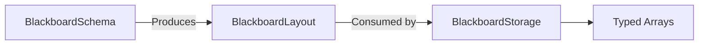

# BlackboardLayout

> **File Location:** `Code/Include/GOAT/Domain/BlackboardLayout.h`  
> **Inherits:** None (Plain struct)

---

## Overview

`BlackboardLayout` describes the **slot counts and defaults** for one blackboard scope (Global, Agent, or Squad). It is produced by `BlackboardSchema` and consumed by `BlackboardStorage` to size and seed its typed arrays.

Each scope has its own layout, and the layout tracks how many slots of each `BlackboardType` exist in that scope, plus any default values that were declared.

---

## Key Responsibilities

| # | Responsibility | Description |
| :--- | :--- | :--- |
| 1 | **Slot Counts** | Stores how many slots of each `BlackboardType` exist in the scope. |
| 2 | **Default Values** | Stores initial values for slots that declared them. |
| 3 | **Schema Feeding** | Produced by `BlackboardSchema` when variables are declared. |
| 4 | **Storage Sizing** | Consumed by `BlackboardStorage` to resize its typed arrays. |

---

## Public Interface

### Data Members

| Member | Type | Description |
| :--- | :--- | :--- |
| `m_slotCounts` | `AZStd::array<AZ::u32, static_cast<size_t>(BlackboardType::Count)>` | Number of slots for each type. |
| `m_defaults` | `AZStd::vector<AZStd::pair<BlackboardKey, AZStd::any>>` | Default values for declared slots. |

---

## Dependencies & Interactions



- **Depends on:** `BlackboardKey`, `BlackboardType`.
- **Required by:** `BlackboardSchema` (to store layouts), `BlackboardStorage` (to size arrays).

---

## Implementation Notes

### Key Algorithms

`BlackboardSchema::Declare()` updates the layout's slot counts and appends defaults. `BlackboardStorage::EnsureCapacity()` uses the layout to resize its arrays.

```cpp
// Code/Source/Core/Domain/BlackboardSchema.cpp
BlackboardLayout& layout = m_layouts[static_cast<size_t>(scope)];
AZ::u32& slotCount = layout.m_slotCounts[static_cast<size_t>(type)];
if (slotCount > BlackboardKey::MaxIndex) { ... }

const BlackboardKey key(scope, type, slotCount);
++slotCount;

if (!defaultValue.empty())
{
    layout.m_defaults.emplace_back(key, AZStd::move(defaultValue));
}
```

### Performance Considerations

- **Allocation:** `m_defaults` is a vector, but it is built once at declaration time.
- **Tick Rate:** Not used during runtime.
- **Concurrency:** Immutable after schema is fully loaded.

---

## Lua Exposure

Not directly exposed to Lua. Variables are declared in `.bbx` assets and accessed via `ctx` in Lua behaviors.

---

## Testing

Unit tests should cover:

- **Slot Counts:** Correctly increments when declaring a new variable.
- **Defaults:** Correctly stores default values.
- **Multiple Types:** Correctly tracks slot counts for each `BlackboardType`.

---

## Related Notes

- [[BlackboardSchema]]
- [[BlackboardStorage]]
- [[BlackboardKey]]
- [[BlackboardTypes]]

---

*Last updated: 2026-08-26*