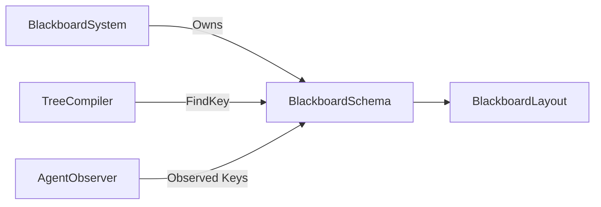

# BlackboardSchema

> **File Location:** `Code/Source/Core/Domain/BlackboardSchema.cpp`  
> **Header:** `Code/Include/GOAT/Domain/BlackboardSchema.h`  
> **Inherits:** None (Plain class, owned by `BlackboardSystem`)

---

## Overview

`BlackboardSchema` is the **global namespace for all blackboard variables**. It merges declarations from every `.bbx` asset into a single, unified schema. It assigns typed `BlackboardKey`s to variable names, ensuring that any tree or backend can access any variable via a pre-resolved index.

Names share one namespace across all assets, so any stage can reach any variable. A duplicate name is an error caught at load time, preventing silent overwrites or type mismatches.

---

## Key Responsibilities

| # | Responsibility | Description |
| :--- | :--- | :--- |
| 1 | **Variable Declaration** | Registers new variables with name, scope, type, and optional default. |
| 2 | **Key Resolution** | Maps a variable name to its `BlackboardKey`. |
| 3 | **Layout Management** | Maintains `BlackboardLayout`s per scope, tracking slot counts and defaults. |
| 4 | **Duplicate Detection** | Fails on duplicate variable names to catch authoring errors. |
| 5 | **Global Merging** | Merges declarations from all loaded `.bbx` assets into one namespace. |

---

## Public Interface

### Methods

```cpp
// Declares one variable and assigns it a slot.
// Fails when the name is already declared, so a collision is caught at load.
AZ::Outcome<BlackboardKey, AZStd::string> Declare(
    const AZ::Name& name, BlackboardScope scope, BlackboardType type, AZStd::any defaultValue = {});

// Resolves a name to its key, or an invalid key when the name is undeclared.
BlackboardKey Find(const AZ::Name& name) const;

// Slot counts and defaults for one scope, used to size a storage instance.
const BlackboardLayout& GetLayout(BlackboardScope scope) const;

// Every declared variable, for validation messages and console output.
const AZStd::unordered_map<AZ::Name, BlackboardKey>& GetVariables() const;

// Forgets every declaration.
void Clear();
```

---

## Dependencies & Interactions



- **Depends on:** `BlackboardKey`, `BlackboardLayout`, `BlackboardType`, `BlackboardScope`.
- **Required by:** `BlackboardSystem`, `TreeCompiler`.

---

## Implementation Notes

### Key Algorithms

`Declare()` checks for name collisions, then assigns the next sequential index for the given `scope` and `type`. It stores the key in `m_keysByName` and updates the layout's slot count. If a default value is provided, it appends to `m_defaults`.

```cpp
// Code/Source/Core/Domain/BlackboardSchema.cpp
AZ::Outcome<BlackboardKey, AZStd::string> BlackboardSchema::Declare(
    const AZ::Name& name, BlackboardScope scope, BlackboardType type, AZStd::any defaultValue)
{
    if (name.IsEmpty()) { return AZ::Failure(...); }
    if (scope >= BlackboardScope::Count || type >= BlackboardType::Count) { return AZ::Failure(...); }

    if (auto existing = m_keysByName.find(name); existing != m_keysByName.end()) { return AZ::Failure(...); }

    BlackboardLayout& layout = m_layouts[static_cast<size_t>(scope)];
    AZ::u32& slotCount = layout.m_slotCounts[static_cast<size_t>(type)];
    if (slotCount > BlackboardKey::MaxIndex) { return AZ::Failure(...); }

    const BlackboardKey key(scope, type, slotCount);
    ++slotCount;

    if (!defaultValue.empty()) { layout.m_defaults.emplace_back(key, AZStd::move(defaultValue)); }

    m_keysByName.emplace(name, key);
    return AZ::Success(key);
}
```

### Performance Considerations

- **Allocation:** `m_keysByName` is a hash map for O(1) lookup.
- **Tick Rate:** Only called during asset loading, not runtime.
- **Concurrency:** Main thread only.

---

## Lua Exposure

Not directly exposed to Lua. Variables are declared via `.bbx` assets and accessed via `ctx` in Lua behaviors.

---

## Testing

Unit tests should cover:

- **Declare:** Successfully adding a new variable.
- **Duplicate:** Failing when a variable with the same name exists.
- **Find:** Correctly resolving a name to a key.
- **Layout:** Correctly updating slot counts and defaults.
- **Invalid Scope/Type:** Failing on out-of-range enums.

---

## Related Notes

- [[BlackboardSystem]]
- [[BlackboardStorage]]
- [[BlackboardKey]]
- [[BlackboardLayout]]
- [[BlackboardTypes]]

---

*Last updated: 2026-08-26*