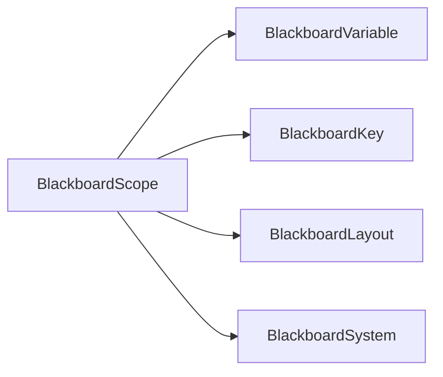

# BlackboardScope

> **File Location:** `Code/Include/GOAT/Domain/BlackboardTypes.h`  
> **Inherits:** None (Enum class)

---

## Overview

`BlackboardScope` is an **enum class** that defines which lifetime a blackboard variable belongs to. It determines where the variable's storage lives: globally (shared by all agents), per-agent, or per-squad.

The concrete storage is managed by `BlackboardSystem` and `SquadRegistry`.

---

## Values

| Value | Description |
| :--- | :--- |
| `Global` | One shared instance for the whole world. |
| `Agent` | One instance per agent. |
| `Squad` | One instance per named squad. |
| `Count` | Sentinel value for validation. |

---

## Usage

The scope is set on a `BlackboardVariable` when authoring a `.bbx` asset, and is used by `BlackboardSchema::Declare()` to select the correct `BlackboardLayout`.

```cpp
serializeContext->Enum<BlackboardScope>()
    ->Value("Global", BlackboardScope::Global)
    ->Value("Agent", BlackboardScope::Agent)
    ->Value("Squad", BlackboardScope::Squad);
```

---

## Dependencies & Interactions



- **Depends on:** None (standalone enum).
- **Required by:** `BlackboardVariable`, `BlackboardKey`, `BlackboardLayout`, `BlackboardSystem`.

---

## Implementation Notes

### Key Algorithms

`BlackboardSystem::FindStorage()` uses the scope to select the correct storage:

```cpp
const BlackboardStorage* BlackboardSystem::FindStorage(BlackboardScope scope, AgentId agent) const
{
    switch (scope)
    {
    case BlackboardScope::Global: return &m_global;
    case BlackboardScope::Agent: ...
    case BlackboardScope::Squad: return m_squads.FindStorage(agent);
    default: return nullptr;
    }
}
```

### Performance Considerations

- **Allocation:** No runtime cost.
- **Tick Rate:** Used during storage access (O(1) switch).
- **Concurrency:** Immutable enum.

---

## Lua Exposure

Not directly exposed to Lua.

---

## Testing

Unit tests should cover:

- **Reflection:** Correctly reflects all four values.
- **ToString:** Returns readable names for errors.

---

## Related Notes


- [[BlackboardVariable]]
- [[BlackboardKey]]
- [[BlackboardSystem]]

---

*Last updated: 2026-08-26*