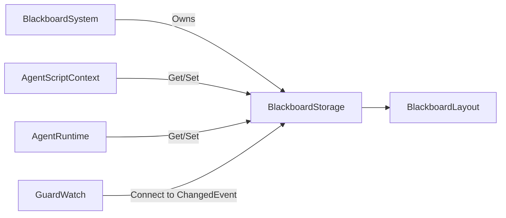

# BlackboardStorage

> **File Location:** `Code/Source/Core/Domain/BlackboardStorage.cpp`  
> **Header:** `Code/Include/GOAT/Domain/BlackboardStorage.h`  
> **Inherits:** None (Plain class, owned by `BlackboardSystem`)

---

## Overview

`BlackboardStorage` is the **container that holds blackboard values** for a specific scope (Global, Agent, or Squad). It uses typed, contiguous arrays (e.g., `m_bools`, `m_ints`, `m_floats`) indexed by `BlackboardKey`, providing O(1) access without runtime string lookups.

It also exposes a `ChangedEvent` that fires when a slot is modified, allowing `GuardWatch` to subscribe to only the storages that hold watched keys.

---

## Key Responsibilities

| # | Responsibility | Description |
| :--- | :--- | :--- |
| 1 | **Memory Management** | Owns typed arrays for all supported blackboard types. |
| 2 | **Capacity Provisioning** | Resizes arrays based on the `BlackboardLayout` when new variables are declared. |
| 3 | **Default Initialization** | Seeds new slots with default values. |
| 4 | **Type-Safe Access** | Provides template-based `Find<T>` and `Set<T>` methods for each type. |
| 5 | **Change Notification** | Fires `ChangedEvent` when a value is modified (only if the value actually changed). |

---

## Public Interface

### Methods

```cpp
// Grows every array to the layout's slot counts, seeding only the newly added slots.
// Existing values are kept, so declaring a variable later does not disturb live agents.
void EnsureCapacity(const BlackboardLayout& layout);

// Discards every value and re-seeds from the layout.
void Reset(const BlackboardLayout& layout);

// Returns the value at a key, or nullptr when the key is the wrong type or out of range.
template<typename T>
const T* Find(BlackboardKey key) const;

// Writes a value. Returns false when the key is the wrong type or out of range.
// Writing the value a slot already holds does not signal observers.
template<typename T>
bool Set(BlackboardKey key, const T& value);

// Subscribes a handler to every change in this storage.
void ConnectChangedHandler(ChangedEvent::Handler& handler);
```

### Data Members (Private)

| Member | Type | Description |
| :--- | :--- | :--- |
| `m_bools` | `AZStd::vector<bool>` | Bool values. |
| `m_ints` | `AZStd::vector<AZ::s64>` | Integer values. |
| `m_floats` | `AZStd::vector<float>` | Float values. |
| `m_vectors` | `AZStd::vector<AZ::Vector3>` | Vector3 values. |
| `m_entities` | `AZStd::vector<AZ::EntityId>` | EntityId values. |
| `m_names` | `AZStd::vector<AZ::Name>` | Name values. |
| `m_quaternions` | `AZStd::vector<AZ::Quaternion>` | Quaternion values. |
| `m_transforms` | `AZStd::vector<AZ::Transform>` | Transform values. |
| `m_entityLists` | `AZStd::vector<EntityIdList>` | EntityIdList values. |
| `m_changed` | `ChangedEvent` | Fires when a slot is modified. |

---

## Dependencies & Interactions



- **Depends on:** `BlackboardKey`, `BlackboardLayout`, `BlackboardType`, `BlackboardTraits`.
- **Required by:** `BlackboardSystem`, `AgentScriptContext`, `AgentRuntime`, `GuardWatch`.

---

## Implementation Notes

### Key Algorithms

`EnsureCapacity()` resizes each typed array to match the layout's slot counts. It tracks previous sizes to only seed newly-added slots with defaults.

```cpp
// Code/Source/Core/Domain/BlackboardStorage.cpp
void BlackboardStorage::EnsureCapacity(const BlackboardLayout& layout)
{
    const auto count = [&layout](BlackboardType type) {
        return layout.m_slotCounts[static_cast<size_t>(type)];
    };

    // Remember what was already there so only the new slots get seeded.
    AZStd::array<size_t, static_cast<size_t>(BlackboardType::Count)> previous{};
    previous[static_cast<size_t>(BlackboardType::Bool)] = m_bools.size();
    // ... other types ...

    m_bools.resize(count(BlackboardType::Bool), false);
    m_ints.resize(count(BlackboardType::Int), 0);
    m_floats.resize(count(BlackboardType::Float), 0.0f);
    // ... other types ...

    for (const auto& [key, value] : layout.m_defaults)
    {
        if (key.GetIndex() >= previous[static_cast<size_t>(key.GetType())])
        {
            ApplyDefault(key, value);
        }
    }
}
```

`Set<T>()` writes to the array and fires `m_changed.Signal(key)` only if the value actually changed.

```cpp
template<typename T>
bool BlackboardStorage::Set(BlackboardKey key, const T& value)
{
    if (!key.IsValid() || key.GetType() != BlackboardTypeOf<T>::Value) { return false; }

    AZStd::vector<T>& values = Array<T>();
    if (key.GetIndex() >= values.size()) { return false; }

    T& slot = values[key.GetIndex()];
    if (slot == value) { return true; }

    slot = value;
    m_changed.Signal(key);
    return true;
}
```

### Performance Considerations

- **Allocation:** Arrays are resized only when new variables are declared.
- **Tick Rate:** O(1) array access for reads/writes.
- **Concurrency:** Main thread only.

---

## Lua Exposure

Accessed via `ctx` in Lua behaviors:

```lua
ctx:SetBool("target_seen", true)
ctx:GetInt("health")
```

---

## Testing

Unit tests should cover:

- **EnsureCapacity:** Correctly resizing arrays.
- **Set/Get:** Correctly reading and writing typed values.
- **Default Initialization:** New slots receive correct defaults.
- **Reset:** Clearing and re-initializing all values.
- **ChangedEvent:** Fires only when the value actually changes.
- **Type Mismatch:** `Set`/`Find` return false/nullptr for wrong types.

---

## Related Notes

- [[BlackboardSystem]]
- [[BlackboardSchema]]
- [[BlackboardKey]]
- [[BlackboardLayout]]
- [[BlackboardTraits]]
- [[GuardWatch]]

---

*Last updated: 2026-08-26*