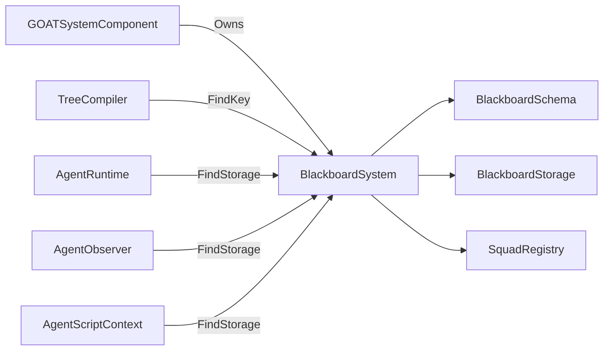

# BlackboardSystem

> **File Location:** `Code/Source/Core/Application/BlackboardSystem.cpp`  
> **Header:** `Code/Source/Core/Application/BlackboardSystem.h`  
> **Inherits:** `IBlackboardSystem`

---

## Overview

`BlackboardSystem` is the **concrete implementation** of the `IBlackboardSystem` interface. It owns the global blackboard, every agent blackboard, and every squad blackboard. One `BlackboardSchema` is shared by all of them, so a name resolves to the same slot everywhere.

It registers itself with `BlackboardSystemInterface` (an `AZ::Interface<BlackboardSystem>`) on construction, making it accessible to the rest of the G.O.A.T. pipeline and to external modules.

---

## Key Responsibilities

| # | Responsibility | Description |
| :--- | :--- | :--- |
| 1 | **Schema Management** | Owns the global `BlackboardSchema` and declares variables from `.bbx` assets. |
| 2 | **Storage Ownership** | Holds the `BlackboardStorage` instances for Global, Agent, and Squad scopes. |
| 3 | **Agent Lifecycle** | Creates and destroys agent blackboards as agents are registered/unregistered. |
| 4 | **Squad Management** | Manages squad membership and per-squad storage via `SquadRegistry`. |
| 5 | **Key Resolution** | Provides `FindKey()` to resolve variable names to typed indices. |
| 6 | **Storage Access** | Provides `FindStorage()` for access to a specific scope's storage. |
| 7 | **Late Declaration** | Grows existing storage when a new variable is declared late, so live agents are not disturbed. |
| 8 | **Cleanup** | Drops every declaration and storage instance during `Clear()`. |

---

## Public Interface

### Constructors & Destructor

```cpp
BlackboardSystem();
~BlackboardSystem() override;
```

### Methods (IBlackboardSystem Implementation)

```cpp
AZ::Outcome<BlackboardKey, AZStd::string> Declare(
    const AZ::Name& name, BlackboardScope scope, BlackboardType type, AZStd::any defaultValue = {}) override;
BlackboardKey FindKey(const AZ::Name& name) const override;
void CreateAgentBlackboard(AgentId agent) override;
void DestroyAgentBlackboard(AgentId agent) override;
void JoinSquad(AgentId agent, const AZ::Name& squad) override;
void LeaveSquad(AgentId agent) override;
AZ::Name GetSquad(AgentId agent) const override;
BlackboardStorage* FindStorage(BlackboardScope scope, AgentId agent) override;
const BlackboardStorage* FindStorage(BlackboardScope scope, AgentId agent) const override;
```

### Other Methods

```cpp
// Drops every declaration and every storage instance.
void Clear();

// The declared variables, for validation messages and console output.
const BlackboardSchema& GetSchema() const;
```

---

## Dependencies & Interactions



- **Depends on:** `BlackboardSchema`, `BlackboardStorage`, `SquadRegistry`, `IBlackboardSystem`.
- **Required by:** `GOATSystemComponent`, `TreeCompiler`, `AgentRuntime`, `AgentObserver`, `AgentScriptContext`.
- **Interacts with:** `SquadRegistry` (for squad storage), `AgentRegistry` (to create/destroy agent blackboards).

---

## Implementation Notes

### Key Algorithms

#### `Declare()`

`Declare()` delegates to `BlackboardSchema::Declare()`. If successful, it grows whatever storage already exists so a late declaration does not disturb live agents.

```cpp
// Code/Source/Core/Application/BlackboardSystem.cpp
AZ::Outcome<BlackboardKey, AZStd::string> BlackboardSystem::Declare(
    const AZ::Name& name, BlackboardScope scope, BlackboardType type, AZStd::any defaultValue)
{
    auto declared = m_schema.Declare(name, scope, type, AZStd::move(defaultValue));
    if (!declared.IsSuccess())
    {
        return declared;
    }

    // Grow whatever already exists so a late declaration does not disturb live agents.
    switch (scope)
    {
    case BlackboardScope::Global:
        m_global.EnsureCapacity(m_schema.GetLayout(BlackboardScope::Global));
        break;
    case BlackboardScope::Agent:
        for (auto& [agent, storage] : m_agents)
        {
            storage.EnsureCapacity(m_schema.GetLayout(BlackboardScope::Agent));
        }
        break;
    case BlackboardScope::Squad:
        m_squads.EnsureCapacity(m_schema.GetLayout(BlackboardScope::Squad));
        break;
    default:
        break;
    }

    return declared;
}
```

#### `CreateAgentBlackboard()`

```cpp
void BlackboardSystem::CreateAgentBlackboard(AgentId agent)
{
    if (agent.IsNull()) { return; }

    m_agents[agent].Reset(m_schema.GetLayout(BlackboardScope::Agent));
}
```

#### `DestroyAgentBlackboard()`

```cpp
void BlackboardSystem::DestroyAgentBlackboard(AgentId agent)
{
    m_squads.Leave(agent);
    m_agents.erase(agent);
}
```

#### `FindStorage()`

```cpp
const BlackboardStorage* BlackboardSystem::FindStorage(BlackboardScope scope, AgentId agent) const
{
    switch (scope)
    {
    case BlackboardScope::Global:
        return &m_global;
    case BlackboardScope::Agent:
    {
        const auto found = m_agents.find(agent);
        return found != m_agents.end() ? &found->second : nullptr;
    }
    case BlackboardScope::Squad:
        return m_squads.FindStorage(agent);
    default:
        return nullptr;
    }
}
```

### Performance Considerations

- **Allocation:** `m_agents` is an `unordered_map` of `AgentId` to `BlackboardStorage`. Storage is dynamically provisioned but reused across agents.
- **Tick Rate:** Key resolution is O(1) after compile time.
- **Concurrency:** Main thread only.

---

## Lua Exposure

Exposed to Lua via the `ctx` object in behaviors.

```lua
ctx:SetBool("target_seen", true)
ctx:GetInt("health")
```

The `ctx` object is an `AgentScriptContext` that holds a pointer to the `BlackboardSystem` and resolves names to keys on each call.

---

## Testing

Unit tests should cover:

- **Declare:** Successfully adding a new variable.
- **Duplicate Declare:** Failing when a variable with the same name exists.
- **FindKey:** Correctly resolving a name to a key.
- **CreateAgentBlackboard:** Correctly resetting agent storage.
- **DestroyAgentBlackboard:** Removing agent storage and leaving squads.
- **JoinSquad/LeaveSquad:** Correctly managing squad membership.
- **FindStorage:** Correctly retrieving storage for a scope.
- **Late Declare:** Existing storage is grown without disturbing live agents.
- **Clear:** Removing all declarations and storage.

---

## Related Notes

- [[IBlackboardSystem]]
- [[BlackboardSchema]]
- [[BlackboardStorage]]
- [[SquadRegistry]]
- [[BlackboardAsset]]
- [[AgentRegistry]]

---

*Last updated: 2026-08-26*