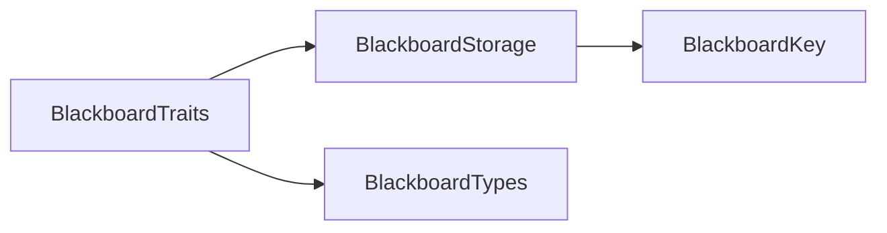

# BlackboardTraits

> **File Location:** `Code/Include/GOAT/Domain/BlackboardTraits.h`  
> **Inherits:** None (Template struct)

---

## Overview

`BlackboardTraits` provides a **compile-time mapping** between C++ types and `BlackboardType` tags. It defines which types can be stored on a blackboard and allows `BlackboardStorage` to select the correct typed array via template specialization.

This is what makes `BlackboardStorage::Find<T>()` and `Set<T>()` type-safe – the compiler ensures the template parameter `T` matches the `BlackboardType` stored in the `BlackboardKey`.

---

## Key Responsibilities

| # | Responsibility | Description |
| :--- | :--- | :--- |
| 1 | **Type Mapping** | Maps C++ types (`bool`, `AZ::s64`, `float`, `AZ::Vector3`, etc.) to `BlackboardType`. |
| 2 | **Entity List** | Defines `EntityIdList` as the type for `BlackboardType::EntityIdList`. |
| 3 | **Compile-Time Safety** | Ensures that only supported types can be used with `BlackboardStorage`. |

---

## Public Interface

### Template Struct

```cpp
template<typename T>
struct BlackboardTypeOf
{
    static constexpr BlackboardType Value = BlackboardType::Count; // Unsupported by default
};
```

### Supported Types

| C++ Type | `BlackboardType::Value` |
| :--- | :--- |
| `bool` | `BlackboardType::Bool` |
| `AZ::s64` | `BlackboardType::Int` |
| `float` | `BlackboardType::Float` |
| `AZ::Vector3` | `BlackboardType::Vector3` |
| `AZ::EntityId` | `BlackboardType::EntityId` |
| `AZ::Name` | `BlackboardType::Name` |
| `AZ::Quaternion` | `BlackboardType::Quaternion` |
| `AZ::Transform` | `BlackboardType::Transform` |
| `EntityIdList` | `BlackboardType::EntityIdList` |

### Type Alias

```cpp
using EntityIdList = AZStd::vector<AZ::EntityId>;
```

---

## Dependencies & Interactions



- **Depends on:** `BlackboardType`, `AZ::Vector3`, `AZ::EntityId`, `AZ::Name`, `AZ::Quaternion`, `AZ::Transform`, `AZStd::vector`.
- **Required by:** `BlackboardStorage` (to select typed arrays).

---

## Implementation Notes

### Key Algorithms

`BlackboardTraits` is purely compile-time. It uses template specialization to map each supported C++ type to its `BlackboardType` tag. This allows `BlackboardStorage` to write generic `Find<T>` and `Set<T>` methods that work only with supported types.

### Performance Considerations

- **Allocation:** No runtime allocation.
- **Tick Rate:** Used only during template instantiation; no runtime cost.
- **Concurrency:** Compile-time only.

---

## Lua Exposure

Not directly exposed to Lua. It is a C++-only compile-time construct.

---

## Testing

Unit tests should cover:

- **Type Mapping:** `BlackboardTypeOf<T>::Value` returns the correct `BlackboardType` for each supported type.
- **Unsupported Types:** `BlackboardTypeOf<Unsupported>::Value` returns `BlackboardType::Count`.

---

## Related Notes

- [[BlackboardStorage]]
- [[BlackboardTypes]]
- [[BlackboardKey]]
- [[BlackboardLayout]]

---

*Last updated: 2026-08-26*