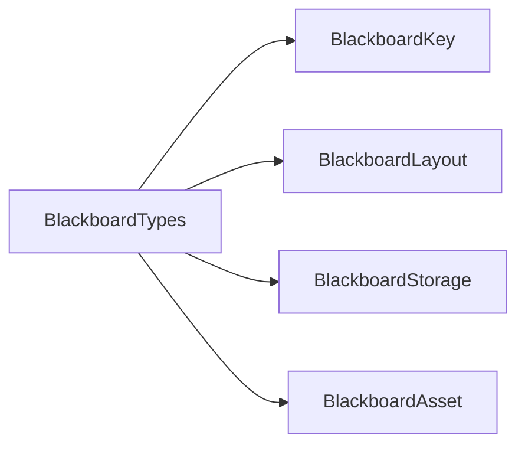

# BlackboardTypes

> **File Location:** `Code/Include/GOAT/Domain/BlackboardTypes.h`  
> **Source:** `Code/Source/Core/Domain/BlackboardTypes.cpp`  
> **Inherits:** None (Plain enums and helper functions)

---

## Overview

`BlackboardTypes` defines the **core enums and helper functions** for the blackboard system. It contains `BlackboardScope` (which lifetime a variable belongs to) and `BlackboardType` (what kind of value a variable holds). It also provides utility functions for reflecting these enums to O3DE's serialization system and converting between `BlackboardType` and `AZ::TypeId`.

---

## Key Components

### 1. BlackboardScope

```cpp
enum class BlackboardScope : AZ::u8
{
    Global,  //!< One shared instance for the whole world.
    Agent,   //!< One instance per agent.
    Squad,   //!< One instance per named squad.
    Count
};
```

Determines where the variable's storage lives.

---

### 2. BlackboardType

```cpp
enum class BlackboardType : AZ::u8
{
    Bool,
    Int,
    Float,
    Vector3,
    EntityId,
    Name,
    Quaternion,
    Transform,
    EntityIdList,
    Count
};
```

Determines which typed array in `BlackboardStorage` holds the value.

---

## Public Interface

### Functions

```cpp
// Reflects the blackboard enums for serialization and scripting.
void ReflectBlackboardTypes(AZ::ReflectContext* context);

// Returns the C++ type a blackboard type stores, or a null id when unsupported.
AZ::TypeId ToTypeId(BlackboardType type);

// Returns the blackboard type for a C++ type, or Count when unsupported.
BlackboardType FromTypeId(const AZ::TypeId& typeId);

// Returns a readable name for errors and console output.
const char* ToString(BlackboardType type);

// Returns a readable name for errors and console output.
const char* ToString(BlackboardScope scope);
```

---

## Dependencies & Interactions



- **Depends on:** `AZ::TypeId`, `AZ::ReflectContext`.
- **Required by:** `BlackboardKey`, `BlackboardLayout`, `BlackboardStorage`, `BlackboardAsset`, `GOATSystemComponent`.

---

## Implementation Notes

### Key Algorithms

`ReflectBlackboardTypes()` registers both enums with the `SerializeContext` (for saving/loading) and the `EditContext` (for property editor dropdowns). The `EditContext` registration is essential for the Asset Editor to show a populated combo box for the type and scope fields on a `BlackboardVariable`.

`ToTypeId()` and `FromTypeId()` map between the blackboard enum and O3DE's `AZ::TypeId` for each supported type.

```cpp
// Code/Source/Core/Domain/BlackboardTypes.cpp
AZ::TypeId ToTypeId(BlackboardType type)
{
    switch (type)
    {
    case BlackboardType::Bool: return azrtti_typeid<bool>();
    case BlackboardType::Int: return azrtti_typeid<AZ::s64>();
    case BlackboardType::Float: return azrtti_typeid<float>();
    case BlackboardType::Vector3: return azrtti_typeid<AZ::Vector3>();
    case BlackboardType::EntityId: return azrtti_typeid<AZ::EntityId>();
    case BlackboardType::Name: return azrtti_typeid<AZ::Name>();
    case BlackboardType::Quaternion: return azrtti_typeid<AZ::Quaternion>();
    case BlackboardType::Transform: return azrtti_typeid<AZ::Transform>();
    case BlackboardType::EntityIdList: return azrtti_typeid<AZStd::vector<AZ::EntityId>>();
    default: return AZ::TypeId::CreateNull();
    }
}
```

### Performance Considerations

- **Allocation:** No runtime allocations.
- **Tick Rate:** Used only during reflection and asset loading.
- **Concurrency:** Main thread only.

---

## Lua Exposure

Not directly exposed to Lua. The enums are used internally to validate and store blackboard variables.

---

## Testing

Unit tests should cover:

- **ReflectBlackboardTypes:** Correctly registers both enums with `SerializeContext`.
- **ToTypeId:** Correctly maps each `BlackboardType` to its `AZ::TypeId`.
- **FromTypeId:** Correctly maps each `AZ::TypeId` to its `BlackboardType`.
- **ToString:** Returns readable names for both enums.

---

## Related Notes

- [[BlackboardScope]]
- [[BlackboardTypes]]
- [[BlackboardKey]]
- [[BlackboardStorage]]
- [[BlackboardAsset]]

---

*Last updated: 2026-08-26*