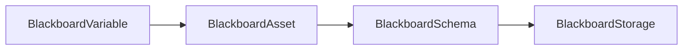

# BlackboardVariable

> **File Location:** `Code/Include/GOAT/Assets/BlackboardAsset.h`  
> **Source:** `Code/Source/Core/Assets/BlackboardAsset.cpp`  
> **Inherits:** None (Plain class)

---

## Overview

`BlackboardVariable` is a **single variable declaration** within a `BlackboardAsset`. It defines the variable's name, scope, type, and an optional default value. It is used in the Asset Editor to author blackboard variables.

The class provides a `GetDefault()` method that returns the default value as an `AZStd::any`, based on the selected type.

---

## Key Responsibilities

| # | Responsibility | Description |
| :--- | :--- | :--- |
| 1 | **Variable Definition** | Stores the name, scope, and type of a blackboard variable. |
| 2 | **Default Provision** | Provides the default value as an `AZStd::any` for the schema. |
| 3 | **Editor Visibility** | Shows only the matching default field in the editor based on the type. |

---

## Public Interface

### Data Members

| Member | Type | Description |
| :--- | :--- | :--- |
| `m_name` | `AZStd::string` | Name this variable is referenced by. Shared across every loaded `.bbx` asset. |
| `m_scope` | `BlackboardScope` | Which lifetime the variable belongs to. |
| `m_type` | `BlackboardType` | What kind of value the variable holds. |
| `m_boolDefault` | `bool` | Default value for Bool type. |
| `m_intDefault` | `AZ::s64` | Default value for Int type. |
| `m_floatDefault` | `float` | Default value for Float type. |
| `m_vector3Default` | `AZ::Vector3` | Default value for Vector3 type. |
| `m_entityIdDefault` | `AZ::EntityId` | Default value for EntityId type. |
| `m_nameDefault` | `AZStd::string` | Default value for Name type. |

### Methods

```cpp
// Returns the declared default as an any, or empty when no editable default exists.
AZStd::any GetDefault() const;
```

---

## Dependencies & Interactions



- **Depends on:** `BlackboardScope`, `BlackboardType`, `AZStd::any`.
- **Required by:** `BlackboardAsset`.

---

## Implementation Notes

### Key Algorithms

`GetDefault()` switches on `m_type` and returns the appropriate default:

```cpp
AZStd::any BlackboardVariable::GetDefault() const
{
    switch (m_type)
    {
    case BlackboardType::Bool: return AZStd::any(m_boolDefault);
    case BlackboardType::Int: return AZStd::any(m_intDefault);
    case BlackboardType::Float: return AZStd::any(m_floatDefault);
    case BlackboardType::Vector3: return AZStd::any(m_vector3Default);
    case BlackboardType::EntityId: return AZStd::any(m_entityIdDefault);
    case BlackboardType::Name: return AZStd::any(AZ::Name(m_nameDefault));
    default: return {};
    }
}
```

### Performance Considerations

- **Allocation:** No runtime allocations.
- **Tick Rate:** Used only during asset loading.
- **Concurrency:** Main thread only.

---

## Editor Integration

`Reflect()` registers the class with the `SerializeContext` and uses `EditContext` to show the variable in the Asset Editor. It uses `ChangeNotify` on the type field to refresh the editor and show only the relevant default field.

---

## Lua Exposure

Not directly exposed to Lua. Variables declared in `.bbx` assets are accessed via `ctx` in Lua behaviors.

---

## Testing

Unit tests should cover:

- **GetDefault:** Correctly returns the default for each type.
- **Visibility:** Only the matching default field is shown in the editor.

---

## Related Notes

- [[BlackboardAsset]]
- [[BlackboardSchema]]
- [[BlackboardScope]]

---

*Last updated: 2026-08-26*