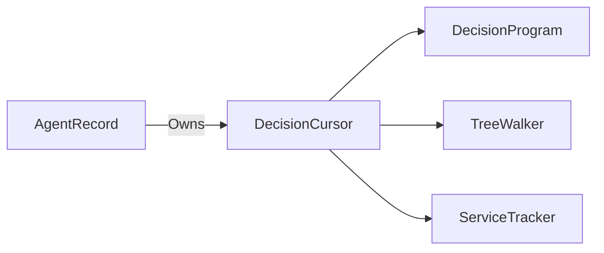

# DecisionCursor

> **File Location:** `Code/Source/Backends/BehaviorTree/Code/Source/DecisionCursor.cpp`  
> **Header:** `Code/Source/Backends/BehaviorTree/Code/Source/DecisionCursor.h`  
> **Inherits:** None (Plain class)

---

## Overview

`DecisionCursor` is the **per-agent execution state** for a behavior tree. It tracks the current position within a `DecisionProgram`, including active leaf, child indices, cooldown deadlines, loop counters, and service due times. It is created per agent and reset when the agent is unregistered.

State is indexed by node rather than kept on a stack, so bubbling a result only follows parent links and never needs a depth bounded path.

---

## Key Responsibilities

| # | Responsibility | Description |
| :--- | :--- | :--- |
| 1 | **Position Tracking** | Stores the active leaf node index. |
| 2 | **Child Index Management** | Tracks which child is running for each composite. |
| 3 | **Timing Management** | Stores deadlines for cooldowns and time limits. |
| 4 | **Loop Counters** | Tracks iteration counts for loops. |
| 5 | **Service Scheduling** | Stores the next due time for each service. |
| 6 | **Clock Management** | Maintains an agent-local clock for time-based nodes. |

---

## Public Interface

### Methods

```cpp
// Points the cursor at a program and rewinds it to the root.
void Reset(const DecisionProgram& program);

// True when a leaf has an intent in flight.
bool IsRunning() const { return m_activeLeaf != InvalidNodeIndex; }

// The leaf whose intent is in flight, or InvalidNodeIndex when idle.
NodeIndex GetActiveLeaf() const { return m_activeLeaf; }
void SetActiveLeaf(NodeIndex node) { m_activeLeaf = node; }

// Which child a composite is currently running.
AZ::u16& ChildIndex(NodeIndex node) { return m_childIndex[node]; }

// Absolute time a cooldown expires or a time limit runs out.
float& Deadline(NodeIndex node) { return m_deadlines[node]; }

// How many times a loop has repeated.
AZ::u16& Counter(NodeIndex node) { return m_counters[node]; }

// Absolute time a service is next due to run.
float& ServiceDue(AZ::u32 service) { return m_serviceDue[service]; }

// The agent's own clock, used for cooldowns without sweeping every node each tick.
float GetNow() const { return m_now; }
void AdvanceClock(float deltaTime) { m_now += deltaTime; }
```

---

## Dependencies & Interactions



- **Depends on:** `DecisionProgram`, `NodeIndex`, `InvalidNodeIndex`.
- **Required by:** `TreeWalker`, `ServiceTracker`, `AgentRecord`.

---

## Implementation Notes

### Key Algorithms

`Reset()` clears all vectors and sets `m_activeLeaf` to `InvalidNodeIndex`. Vectors are pre-sized to match the program's node count, avoiding dynamic allocation during execution.

```cpp
// Code/Source/Backends/BehaviorTree/Code/Source/DecisionCursor.cpp
void DecisionCursor::Reset(const DecisionProgram& program)
{
    const size_t nodeCount = program.m_nodes.size();
    m_childIndex.assign(nodeCount, 0);
    m_deadlines.assign(nodeCount, 0.0f);
    m_counters.assign(nodeCount, 0);
    m_serviceDue.assign(program.m_services.size(), 0.0f);
    m_activeLeaf = InvalidNodeIndex;
    m_now = 0.0f;
}
```

### Performance Considerations

- **Allocation:** Vectors are pre-allocated in `Reset()`.
- **Tick Rate:** Accessed every frame by `TreeWalker`.
- **Concurrency:** Per-agent; no shared state.

---

## Lua Exposure

Not directly exposed to Lua. Managed entirely by C++ runtime.

---

## Testing

Unit tests should cover:

- **Reset:** Correctly initializes state.
- **Active Leaf:** Correctly tracks the running leaf.
- **Child Index:** Correctly updates composite child indices.
- **Timing:** Correctly stores and retrieves deadlines.
- **Service Due:** Correctly tracks service schedules.
- **Clock:** Correctly advances the agent-local time.

---

## Related Notes

- [[TreeWalker]]
- [[DecisionProgram]]
- [[AgentRecord]]
- [[ServiceTracker]]

---

*Last updated: 2026-08-26*