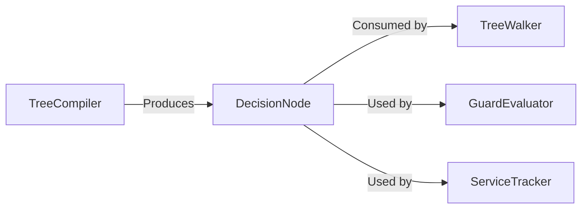

# DecisionNode

> **File Location:** `Code/Source/Backends/BehaviorTree/Code/Include/GOAT_BehaviorTree/DecisionProgram.h`  
> **Inherits:** None (Plain struct)

---

## Overview

`DecisionNode` is the **compiled representation of one node** in a `DecisionProgram`. It is produced by `TreeCompiler` and consumed by `TreeWalker`. It contains the operation to perform, parent/child indices, blackboard keys, and any action data.

Nodes are stored in pre-order, so a node's whole subtree is the range `[index, m_subtreeEnd)`. Direct children are not adjacent to each other: the next sibling begins at the previous sibling's `m_subtreeEnd`, which is how the walker steps between them in constant time.

---

## Key Responsibilities

| # | Responsibility | Description |
| :--- | :--- | :--- |
| 1 | **Operation Storage** | Stores the `NodeOp` enum that tells the walker what to do. |
| 2 | **Subtree Navigation** | Stores `m_parent`, `m_firstChild`, and `m_subtreeEnd` for O(1) traversal. |
| 3 | **Blackboard Keys** | Stores `m_key` and `m_otherKey` for conditions and comparisons. |
| 4 | **Action Data** | Stores `m_action` for direct actions and `m_tag`/`m_goal` for scripts and delegates. |
| 5 | **Service References** | Stores `m_firstService` and `m_serviceCount` for attached services. |
| 6 | **Abort Mode** | Stores `m_abort` to define what a guard interrupts. |

---

## Public Interface

### Data Members

| Member | Type | Description |
| :--- | :--- | :--- |
| `m_op` | `NodeOp` | What the walker does with this node. |
| `m_abort` | `AbortMode` | What a tripped guard on this node interrupts. |
| `m_parent` | `NodeIndex` | Parent node, or `InvalidNodeIndex` at the root. |
| `m_firstChild` | `NodeIndex` | First child, which always sits immediately after this node. |
| `m_subtreeEnd` | `NodeIndex` | One past the last node in this node's subtree. |
| `m_childCount` | `AZ::u16` | How many children this node has. |
| `m_key` | `BlackboardKey` | Blackboard slot this node reads, for conditions and comparisons. |
| `m_otherKey` | `BlackboardKey` | Second slot, for comparisons. |
| `m_tag` | `AZ::Name` | Name this node references: a Lua behavior, a backend, another tree. |
| `m_goal` | `AZ::Name` | Secondary name, such as the goal handed to a backend. |
| `m_action` | `ActionRequest` | Inline action emitted by an Action leaf. |
| `m_amount` | `float` | Primary numeric property: cooldown seconds, loop count, time limit, or duration. |
| `m_tolerance` | `float` | How close counts as arrived, kept apart from `m_amount` so a node may carry both. |
| `m_firstService` | `AZ::u32` | First service attached to this node, indexing the program's service table. |
| `m_serviceCount` | `AZ::u16` | How many services are attached to this node. |

---

## Dependencies & Interactions

- **Depends on:** `NodeOp`, `AbortMode`, `BlackboardKey`, `ActionRequest`, `AZ::Name`, `NodeIndex`.
- **Required by:** `DecisionProgram`, `TreeWalker`, `GuardEvaluator`, `ServiceTracker`.

---

## Implementation Notes

### Key Algorithms

`TreeCompiler::Emit()` creates each `DecisionNode` and fills its fields based on the authored `AuthoredNode` and its resolved `NodeTypeDescriptor`.

### Performance Considerations

- **Allocation:** Stored in a contiguous `AZStd::vector` within `DecisionProgram`.
- **Tick Rate:** Accessed every frame by `TreeWalker`.
- **Concurrency:** Immutable after compilation; safe for concurrent read.

---

## Lua Exposure

Not directly exposed to Lua. Authored via Lua node constructors and compiled to `DecisionNode`s.

---

## Testing

Unit tests should cover:

- **Pre-order Layout:** `m_firstChild` and `m_subtreeEnd` are correctly computed.
- **Abort Mode:** `m_abort` is correctly set from authored `abort` property.
- **Blackboard Keys:** `m_key` and `m_otherKey` are correctly resolved.
- **Action Data:** `m_action` is correctly populated for action nodes.

---

## Related Notes

- [[DecisionProgram]]
- [[DecisionService]]
- [[TreeCompiler]]
- [[TreeWalker]]
- [[NodeOp]]

---

*Last updated: 2026-08-26*