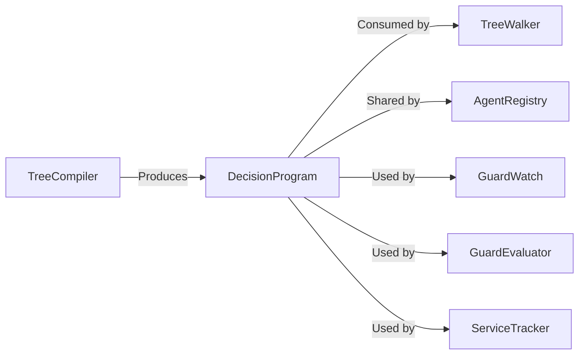

# DecisionProgram

> **File Location:** `Code/Source/Backends/BehaviorTree/Code/Include/GOAT_BehaviorTree/DecisionProgram.h`  
> **Inherits:** None (Plain class)

---

## Overview

`DecisionProgram` is the **compiled, flat representation of a behavior tree**. It is produced by `TreeCompiler` and consumed by `TreeWalker`. It contains a contiguous array of `DecisionNode`s, services, and guard metadata, enabling cache-friendly, iterative execution.

The program is immutable after compilation and shared by every agent running the same tree. This eliminates per-agent tree duplication and ensures cache locality.

---

## Key Responsibilities

| # | Responsibility | Description |
| :--- | :--- | :--- |
| 1 | **Node Storage** | Holds a flat `AZStd::vector<DecisionNode>` in pre-order. |
| 2 | **Service Storage** | Holds an array of `DecisionService`s referenced by node service ranges. |
| 3 | **Guard Metadata** | Stores `observedKeys` and `guardNodes` for reactive aborts. |
| 4 | **Service Metadata** | Stores `serviceNodes` for efficient service due checks. |
| 5 | **Tree Metadata** | Stores the tree's name and maximum depth. |

---

## Public Interface

### Constants

```cpp
// Deepest tree the walker will run, which bounds an agent's cursor.
inline constexpr size_t MaxTreeDepth = 32;
```

### Methods

```cpp
// True when the program has no nodes to run.
bool IsEmpty() const { return m_nodes.empty(); }
```

### Data Members

| Member | Type | Description |
| :--- | :--- | :--- |
| `m_name` | `AZ::Name` | Name agents refer to this tree by. |
| `m_nodes` | `AZStd::vector<DecisionNode>` | Nodes in pre-order, root first. |
| `m_services` | `AZStd::vector<DecisionService>` | Services referenced by node service ranges. |
| `m_observedKeys` | `AZStd::vector<BlackboardKey>` | Every blackboard slot a guard observes, deduplicated. |
| `m_guardNodes` | `AZStd::vector<NodeIndex>` | Nodes that declared an abort mode. |
| `m_serviceNodes` | `AZStd::vector<NodeIndex>` | Nodes that carry services. |
| `m_depth` | `AZ::u32` | Deepest path in this tree, checked against `MaxTreeDepth`. |

---

## Supporting Structures

### DecisionService

```cpp
struct DecisionService
{
    AZ::Name m_behavior;  // Lua behavior this service runs.
    float m_interval = 0.5f;  // Seconds between ticks.
};
```

### DecisionNode

```cpp
struct DecisionNode
{
    NodeOp m_op = NodeOp::Selector;
    AbortMode m_abort = AbortMode::None;
    NodeIndex m_parent = InvalidNodeIndex;
    NodeIndex m_firstChild = InvalidNodeIndex;
    NodeIndex m_subtreeEnd = InvalidNodeIndex;
    AZ::u16 m_childCount = 0;
    BlackboardKey m_key;
    BlackboardKey m_otherKey;
    AZ::Name m_tag;
    AZ::Name m_goal;
    ActionRequest m_action;
    float m_amount = 0.0f;
    float m_tolerance = 0.0f;
    AZ::u32 m_firstService = 0;
    AZ::u16 m_serviceCount = 0;
};
```

---

## Dependencies & Interactions



- **Depends on:** `DecisionNode`, `DecisionService`, `BlackboardKey`, `NodeIndex`, `NodeOp`, `AbortMode`, `ActionRequest`.
- **Required by:** `TreeWalker`, `AgentRegistry`, `GuardWatch`, `GuardEvaluator`, `ServiceTracker`.

---

## Implementation Notes

### Key Algorithms

`TreeCompiler` fills `m_nodes` via pre-order traversal. `TreeWalker` indexes directly into `m_nodes` using `NodeIndex`.

```cpp
// Code/Source/Backends/BehaviorTree/Code/Source/TreeCompiler.cpp
const NodeIndex index = aznumeric_cast<NodeIndex>(program.m_nodes.size());
program.m_nodes.emplace_back();
{
    DecisionNode& node = program.m_nodes[index];
    node.m_op = descriptor->m_op;
    node.m_parent = parent;
    node.m_childCount = aznumeric_cast<AZ::u16>(authored.m_children.size());
}
```

### Performance Considerations

- **Allocation:** Contiguous vector for cache locality.
- **Tick Rate:** Immutable after compilation; shared by many agents.
- **Concurrency:** Read-only after compilation; safe for concurrent read.

---

## Lua Exposure

Not directly exposed to Lua. Produced via `GOAT_EmitTree` → `LuaTreeBuilder` → `TreeCompiler`.

---

## Testing

Unit tests should cover:

- **Contiguity:** Nodes are stored in a flat array.
- **Guard Metadata:** `observedKeys` are correctly collected and deduplicated.
- **Depth:** Maximum depth is correctly computed.
- **Empty Program:** `IsEmpty()` returns true when no nodes are present.
- **Service Ranges:** `firstService` and `serviceCount` are correctly set.

---

## Related Notes

- [[TreeCompiler]]
- [[TreeWalker]]
- [[DecisionNode]]
- [[DecisionService]]
- [[GuardWatch]]
- [[GuardEvaluator]]
- [[ServiceTracker]]

---

*Last updated: 2026-08-26*