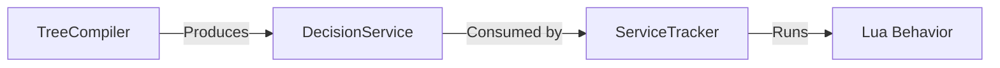

# DecisionService

> **File Location:** `Code/Include/GOAT/Domain/DecisionProgram.h`  
> **Inherits:** None (Plain struct)

---

## Overview

`DecisionService` is the **compiled representation of a service** attached to a composite node in a `DecisionProgram`. It is produced by `TreeCompiler` and consumed by `ServiceTracker`.

A service is a Lua behavior that runs on a fixed interval while its parent composite is active. It is the sanctioned place to do periodic sensing, allowing the tree to react to changes without checking conditions every frame.

---

## Key Responsibilities

| # | Responsibility | Description |
| :--- | :--- | :--- |
| 1 | **Behavior Name** | Stores the name of the Lua behavior to run. |
| 2 | **Interval** | Stores how often the service should run (in seconds). |
| 3 | **Scheduling** | Consumed by `ServiceTracker` to determine when the service is due. |

---

## Public Interface

### Data Members

| Member | Type | Description |
| :--- | :--- | :--- |
| `m_behavior` | `AZ::Name` | Lua behavior this service runs. |
| `m_interval` | `float` | Seconds between ticks. |

---

## Dependencies & Interactions



- **Depends on:** `AZ::Name`.
- **Required by:** `DecisionProgram`, `ServiceTracker`.

---

## Implementation Notes

### Key Algorithms

`TreeCompiler` reads the `behavior` and `interval` properties from an authored service node and stores them in a `DecisionService`:

```cpp
// Code/Source/Core/Frontend/TreeCompiler.cpp
DecisionService service;
if (const AZStd::any* behavior = FindProperty(authoredService, AZ_NAME_LITERAL("behavior")))
{
    ReadName(*behavior, service.m_behavior);
}
if (const AZStd::any* interval = FindProperty(authoredService, AZ_NAME_LITERAL("interval")))
{
    double seconds = 0.0;
    if (ReadNumber(*interval, seconds))
    {
        service.m_interval = static_cast<float>(seconds);
    }
}
program.m_services.push_back(AZStd::move(service));
```

### Performance Considerations

- **Allocation:** Stored in a contiguous `AZStd::vector` within `DecisionProgram`.
- **Tick Rate:** Accessed by `ServiceTracker` to determine due services.
- **Concurrency:** Immutable after compilation; safe for concurrent read.

---

## Lua Exposure

Not directly exposed to Lua. Services are authored in Lua using `service "Sense" { interval = 0.25 }`.

---

## Testing

Unit tests should cover:

- **Behavior Name:** Correctly stores the Lua behavior name.
- **Interval:** Correctly stores the interval value.
- **Default Interval:** Correctly defaults to 0.5 seconds when not specified.

---

## Related Notes

- [[DecisionProgram]]
- [[DecisionNode]]
- [[ServiceTracker]]
- [[TreeCompiler]]

---

*Last updated: 2026-08-26*