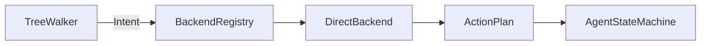

# DirectBackend

> **File Location:** `Code/Source/Core/Frontend/DirectBackend.cpp`  
> **Header:** `Code/Source/Core/Frontend/DirectBackend.h`  
> **Inherits:** `IBackend`

---

## Overview

`DirectBackend` is the **simplest and most fundamental backend** in G.O.A.T. It handles `raw` and `script` leaves by converting a single inline action into a one-step `ActionPlan`.

It is what keeps the pipeline uniform when no real planning backend (like GOAP or HTN) is installed. Every tree leaf that does not explicitly delegate to a named backend uses this backend. It is always present, regardless of what modules are installed.

---

## Key Responsibilities

| # | Responsibility | Description |
| :--- | :--- | :--- |
| 1 | **Direct Action Execution** | Converts an `Intent` containing a direct `ActionRequest` (from `raw` or `script`) into a one-step `ActionPlan`. |
| 2 | **Backend Registration** | Registered with `BackendRegistry` by `GOATSystemComponent` at startup under the name `"direct"`. |
| 3 | **Backend Name** | Provides the constant `GetBackendName()` which returns the literal `"direct"`. |
| 4 | **Uniform Pipeline** | Ensures a plainly authored leaf reaches the state machine by the same route as a delegated plan. |

---

## Public Interface

### Static Methods

```cpp
// Name a tree leaf gets when it does not delegate to a backend.
static AZ::Name GetBackendName();
```

### Instance Methods

```cpp
// Returns the registered backend name ("direct").
AZ::Name GetName() const override;

// Produces a plan of exactly one step from the intent's direct action.
bool Plan(const PlanContext& context, const Intent& intent, ActionPlan& outPlan) override;
```

---

## Dependencies & Interactions



- **Depends on:** `Intent` (specifically `m_direct` field), `ActionPlan`.
- **Required by:** `GOATSystemComponent` (created and registered during `StartServices`).
- **Interacts with:** `BackendRegistry` (registered at startup).

---

## Implementation Notes

### Key Algorithms

`Plan()` checks if the `Intent` has a valid direct action. If not, it returns `false`. If yes, it clears the plan and pushes that single action:

```cpp
// Code/Source/Core/Frontend/DirectBackend.cpp
bool DirectBackend::Plan(
    [[maybe_unused]] const PlanContext& context, const Intent& intent, ActionPlan& outPlan)
{
    if (intent.m_direct.m_action == CoreActions::Invalid)
    {
        return false;
    }

    outPlan.m_steps.clear();
    outPlan.m_steps.push_back(intent.m_direct);
    return true;
}
```

### Performance Considerations

- **Allocation:** Reuses the `ActionPlan` vector, no heap allocation.
- **Tick Rate:** Called only when a `raw` or `script` leaf is activated, not every frame.
- **Concurrency:** Runs on main thread.

---

## Lua Exposure

`DirectBackend` is not exposed to Lua directly, but it is the target for `raw` nodes and `script` nodes.

Example Lua usage:

```lua
-- Using raw
raw "wait" { seconds = 0.25 }

-- Using script
script "Patrol"
```

Both cases produce an `Intent` with `m_direct` set, which this backend converts into a plan.

---

## Testing

Unit tests should cover:

- **Valid Direct Action:** A `raw` node with a registered verb produces a one-step plan.
- **Invalid Action:** An `Intent` with `m_action == Invalid` returns `false`.
- **Plan Cleanliness:** The output plan has exactly one step.
- **Name:** `GetName()` returns `"direct"`.

---

## Related Notes

- [[IBackend]]
- [[BackendRegistry]]
- [[TreeWalker]]
- [[GOATSystemComponent]]

---

*Last updated: 2026-08-26*