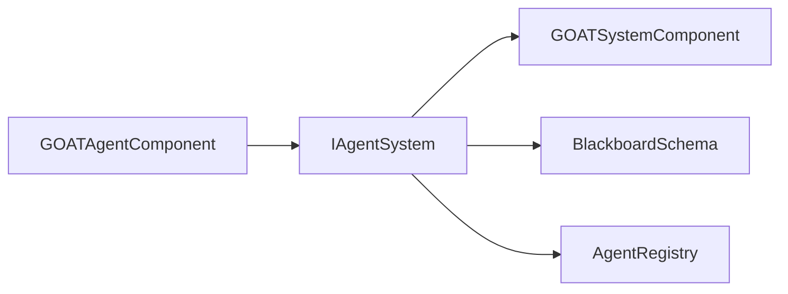

# GOATAgentComponent

> **File Location:** `Code/Source/Clients/GOATAgentComponent.cpp`  
> **Header:** `Code/Source/Clients/GOATAgentComponent.h`  
> **Inherits:** `AZ::Component`

---

## Overview

`GOATAgentComponent` is the **only component** a game developer needs to place on an entity to turn it into an AI agent. It is a thin, data-driven shell that handles the entire lifecycle of an agent: loading assets, compiling trees, and registering with the `AgentRegistry`. It contains no AI logic itself—it simply gathers the required data and hands it off to `GOATSystemComponent` (via `IAgentSystem`).

---

## Key Responsibilities

| # | Responsibility | Description |
| :--- | :--- | :--- |
| 1 | **Asset Loading** | Loads `.bbx` Blackboard assets and Lua Script assets on `Activate()`. |
| 2 | **Tree Compilation** | Calls `IAgentSystem::CompileTree()` for the specified tree name. |
| 3 | **Agent Registration** | Calls `IAgentSystem::RegisterAgent()` to get an `AgentId`. |
| 4 | **Squad Joining** | Optionally joins a named squad via `IAgentSystem::JoinSquad()`. |
| 5 | **Lifecycle Management** | Registers and unregisters the agent on `Activate()` and `Deactivate()`. |

---

## Public Interface

### Methods

```cpp
// Returns the AgentId assigned to this entity.
AgentId GetAgentId() const { return m_agent; }
```

### Data Members (Serialized Fields)

| Member | Type | Description |
| :--- | :--- | :--- |
| `m_blackboards` | `AZStd::vector<AZ::Data::Asset<BlackboardAsset>>` | Assets declaring the variables this agent's tree uses. |
| `m_scripts` | `AZStd::vector<AZ::Data::Asset<AZ::ScriptAsset>>` | Lua scripts declaring behaviors, backends, and trees. |
| `m_treeName` | `AZStd::string` | Name of the declared tree this agent runs. |
| `m_squad` | `AZStd::string` | Squad this agent joins (empty for none). |
| `m_band` | `int` | Tick frequency (0 = most frequent, 3 = least). |
| `m_agent` | `AgentId` | The assigned agent ID (runtime only). |

---

## Dependencies & Interactions



- **Depends on:** `IAgentSystem` (obtained via `AgentSystemInterface::Get()`).
- **Provides:** A bridge between an O3DE `Entity` and the G.O.A.T. runtime.
- **Interacts with:** `GOATSystemComponent` (to compile trees and load blackboards).

---

## Implementation Notes

### Key Algorithms

`Activate()` follows a strict order of operations to ensure valid state:

1. **Load Blackboards:** Calls `LoadBlackboard()` for every asset.
2. **Load Scripts:** Calls `LoadScript()` for every script.
3. **Compile Tree:** Calls `CompileTree()` for the `m_treeName`.
4. **Register Agent:** Calls `RegisterAgent()` to create the runtime handle.
5. **Join Squad:** If `m_squad` is not empty, calls `JoinSquad()`.

```cpp
// Code/Source/Clients/GOATAgentComponent.cpp
void GOATAgentComponent::Activate()
{
    IAgentSystem* agents = AgentSystemInterface::Get();
    if (agents == nullptr)
    {
        AZ_Warning("GOAT", false, "The GOAT agent system is not available");
        return;
    }

    // Variables must be declared before the tree compiles.
    for (auto& blackboard : m_blackboards)
    {
        if (EnsureLoaded(blackboard))
        {
            if (auto declared = agents->LoadBlackboard(*blackboard.Get()); !declared.IsSuccess())
            {
                AZ_Warning("GOAT", false, "%s", declared.GetError().c_str());
            }
        }
    }

    for (auto& script : m_scripts)
    {
        if (EnsureLoaded(script))
        {
            agents->LoadScript(script);
        }
    }

    if (m_treeName.empty())
    {
        AZ_Warning("GOAT", false, "Entity %s has no tree name set", GetEntityId().ToString().c_str());
        return;
    }

    const AZ::Name treeName(m_treeName);
    if (auto compiled = agents->CompileTree(treeName); !compiled.IsSuccess())
    {
        AZ_Warning("GOAT", false, "%s", compiled.GetError().c_str());
        return;
    }

    m_agent = agents->RegisterAgent(GetEntityId(), treeName, static_cast<size_t>(m_band));

    if (!m_squad.empty() && !m_agent.IsNull())
    {
        agents->JoinSquad(m_agent, AZ::Name(m_squad));
    }
}
```

### Performance Considerations

- **Allocation:** `m_agent` is a lightweight handle; no heavy allocation in `Activate()`.
- **Tick Rate:** The `m_band` field determines how often `AgentRuntime` ticks this agent.
- **Concurrency:** Runs on main thread during entity activation.

---

## Editor Integration

`GOATAgentComponent` uses `EditContext` to expose its fields to the Editor:

- **Category:** "AI"
- **Appears In:** Add Component Menu (Game)
- **Icon:** `Editor/Icons/GOAT/Components/GOATAgent.svg`
- **Viewport Icon:** `Editor/Icons/GOAT/Components/Viewport/GOATAgent.svg`

---

## Lua Exposure

`GOATAgentComponent` is **not** directly exposed to Lua. Designers interact with it through the Editor's component properties (serialized fields). The Lua API interacts with the *runtime*, not this component itself.

---

## Testing

Unit tests should cover:

- Correct loading of blackboard and script assets.
- Correct compile failure when `m_treeName` is invalid.
- Proper registration and unregistration on `Activate`/`Deactivate`.
- Squads are joined only when `m_squad` is non-empty.

---

## Related Notes

- [[GOATSystemComponent]]
- [[Layered Overview]]
- [[Blackboard System]]
- [[IAgentSystem]]

---

*Last updated: 2026-08-26*