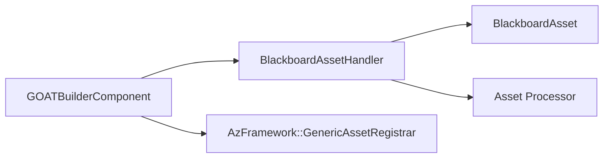

# GOATBuilderComponent

> **File Location:** `Code/Source/Tools/GOATBuilderComponent.cpp`  
> **Header:** `Code/Source/Tools/GOATBuilderComponent.h`  
> **Inherits:** `AZ::Component`

---

## Overview

`GOATBuilderComponent` is a **specialized system component** that only activates inside the Asset Processor's builder processes. It registers the gem's asset handlers (like `BlackboardAssetHandler`) so that `.bbx` source files are recognized and processed into the cache.

It is tagged with `AssetBuilderSDK::ComponentTags::AssetBuilder`, which tells O3DE to activate this component in builder processes. It deliberately registers handlers and nothing else—a builder process has no use for agents, scheduling, or Lua.

---

## Key Responsibilities

| # | Responsibility | Description |
| :--- | :--- | :--- |
| 1 | **Asset Handler Registration** | Registers `BlackboardAssetHandler` in builder processes. |
| 2 | **Builder Process Activation** | Uses the `AssetBuilder` tag to ensure it activates only in builder processes. |
| 3 | **Resource Cleanup** | Unregisters handlers on deactivation. |

---

## Public Interface

### Methods

```cpp
static void Reflect(AZ::ReflectContext* context);
static void GetProvidedServices(AZ::ComponentDescriptor::DependencyArrayType& provided);
```

### Private Methods

```cpp
// AZ::Component
void Activate() override;
void Deactivate() override;
```

---

## Dependencies & Interactions



- **Depends on:** `BlackboardAssetHandler`, `BlackboardAsset`, `AzFramework::GenericAssetRegistrar`.
- **Required by:** Asset Processor (via the `AssetBuilder` tag).

---

## Implementation Notes

### Key Algorithms

`Activate()` checks if the Asset Manager is ready and if a handler for `BlackboardAsset` is already registered (to avoid duplicates). If not, it creates and registers a `BlackboardAssetHandler`.

```cpp
// Code/Source/Tools/GOATBuilderComponent.cpp
void GOATBuilderComponent::Activate()
{
    if (!AZ::Data::AssetManager::IsReady() ||
        AZ::Data::AssetManager::Instance().GetHandler(azrtti_typeid<BlackboardAsset>()) != nullptr)
    {
        return;
    }

    auto handler = AZStd::make_unique<BlackboardAssetHandler>();
    handler->Register();
    m_assetHandlers.emplace_back(AZStd::move(handler));
}
```

### Performance Considerations

- **Allocation:** `m_assetHandlers` is a vector of `unique_ptr`s.
- **Tick Rate:** Only called during Asset Processor startup.
- **Concurrency:** Main thread only.

---

## Editor Integration

`Reflect()` adds the `AssetBuilder` tag to the component, ensuring the Asset Processor sees it:

```cpp
// Code/Source/Tools/GOATBuilderComponent.cpp
serializeContext->Class<GOATBuilderComponent, AZ::Component>()
    ->Version(0)
    ->Attribute(
        AZ::Edit::Attributes::SystemComponentTags,
        AZStd::vector<AZ::Crc32>({ AssetBuilderSDK::ComponentTags::AssetBuilder }));
```

---

## Lua Exposure

Not directly exposed to Lua.

---

## Testing

Unit tests should cover:

- **Activation:** Registers the handler only when no handler exists.
- **Deactivation:** Unregisters the handler cleanly.
- **Builder Tag:** The component is correctly tagged for builder processes.

---

## Related Notes

- [[BlackboardAssetHandler]]
- [[BlackboardAsset]]
- [[GOATEditorSystemComponent]]
- [[GOATSystemComponent]]

---

*Last updated: 2026-08-26*