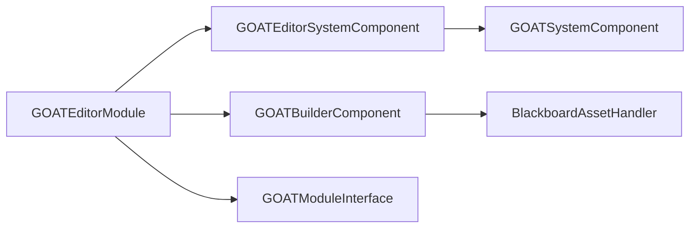

# GOATEditorModule

> **File Location:** `Code/Source/Tools/GOATEditorModule.cpp`  
> **Inherits:** `GOATModuleInterface`

---

## Overview

`GOATEditorModule` is the **editor module** for the G.O.A.T. gem. It is the entry point that O3DE loads when the Editor is running. It registers the Editor-specific system components and the builder component that handles asset processing.

It derives from `GOATModuleInterface`, which itself derives from `AZ::Module`. It registers `GOATEditorSystemComponent` and `GOATBuilderComponent` in its descriptor list.

---

## Key Responsibilities

| # | Responsibility | Description |
| :--- | :--- | :--- |
| 1 | **Editor Module Registration** | Registers `GOATEditorSystemComponent` and `GOATBuilderComponent` descriptors. |
| 2 | **Required System Components** | Specifies `GOATEditorSystemComponent` as a required system component. |
| 3 | **Gem Bootstrapping** | Uses `AZ_DECLARE_MODULE_CLASS` to integrate with O3DE's gem loading system. |

---

## Public Interface

### Constructor

```cpp
GOATEditorModule();
```

### Methods

```cpp
// Returns the list of system components required by this module.
AZ::ComponentTypeList GetRequiredSystemComponents() const override;
```

---

## Dependencies & Interactions



- **Depends on:** `GOATModuleInterface`, `GOATEditorSystemComponent`, `GOATBuilderComponent`.
- **Required by:** O3DE's Editor (via `AZ_DECLARE_MODULE_CLASS`).

---

## Implementation Notes

### Key Algorithms

The constructor inserts the editor-specific component descriptors into `m_descriptors`.

```cpp
// Code/Source/Tools/GOATEditorModule.cpp
GOATEditorModule::GOATEditorModule()
{
    m_descriptors.insert(m_descriptors.end(), {
        GOATEditorSystemComponent::CreateDescriptor(),
        GOATBuilderComponent::CreateDescriptor(),
    });
}
```

`GetRequiredSystemComponents()` returns the `GOATEditorSystemComponent` so it is automatically added to the system entity.

```cpp
AZ::ComponentTypeList GOATEditorModule::GetRequiredSystemComponents() const
{
    return AZ::ComponentTypeList {
        azrtti_typeid<GOATEditorSystemComponent>(),
    };
}
```

### Performance Considerations

- **Allocation:** No runtime allocation.
- **Tick Rate:** Only called during module initialization.
- **Concurrency:** Main thread only.

---

## Editor Integration

The module is loaded by O3DE only when the Editor is running. It is mutually exclusive with the client module (`GOATModule`) – they share the same `GOATModuleTypeId`.

---

## Lua Exposure

Not directly exposed to Lua.

---

## Testing

Unit tests should cover:

- **Module Registration:** Descriptors are correctly added.
- **Required Components:** `GOATEditorSystemComponent` is returned.

---

## Related Notes

- [[GOATModuleInterface]]
- [[GOATEditorSystemComponent]]
- [[GOATBuilderComponent]]
- [[GOATModule]]

---

*Last updated: 2026-08-26*