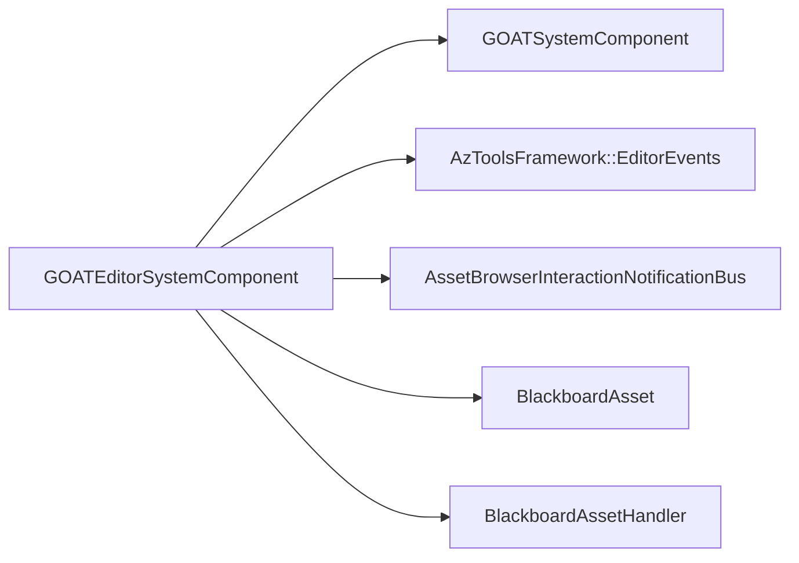

# GOATEditorSystemComponent

> **File Location:** `Code/Source/Tools/GOATEditorSystemComponent.cpp`  
> **Header:** `Code/Source/Tools/GOATEditorSystemComponent.h`  
> **Inherits:** `GOATSystemComponent`, `AzToolsFramework::EditorEvents::Bus::Handler`, `AzToolsFramework::AssetBrowser::AssetBrowserInteractionNotificationBus::Handler`

---

## Overview

`GOATEditorSystemComponent` is the **editor-specific system component** for the G.O.A.T. gem. It derives from `GOATSystemComponent` to inherit all the runtime services, but adds editor-specific functionality like handling Asset Browser interactions and providing icons for `.bbx` source files.

It is only active in the Editor, not in the launcher. It is registered as a required system component by `GOATEditorModule`.

---

## Key Responsibilities

| # | Responsibility | Description |
| :--- | :--- | :--- |
| 1 | **Runtime Inheritance** | Inherits all services from `GOATSystemComponent`. |
| 2 | **Asset Browser Icon** | Provides a custom thumbnail for `.bbx` source files in the Asset Browser. |
| 3 | **Editor Event Handling** | Connects to `AzToolsFramework::EditorEvents::Bus` for editor lifecycle events. |
| 4 | **Asset Browser Interaction** | Connects to `AssetBrowserInteractionNotificationBus` for file type detection. |

---

## Public Interface

### Methods

```cpp
static void Reflect(AZ::ReflectContext* context);
static void GetProvidedServices(AZ::ComponentDescriptor::DependencyArrayType& provided);
static void GetIncompatibleServices(AZ::ComponentDescriptor::DependencyArrayType& incompatible);
static void GetRequiredServices(AZ::ComponentDescriptor::DependencyArrayType& required);
static void GetDependentServices(AZ::ComponentDescriptor::DependencyArrayType& dependent);
```

### Private Methods

```cpp
// AZ::Component
void Activate() override;
void Deactivate() override;

// AzToolsFramework::AssetBrowser::AssetBrowserInteractionNotificationBus
AzToolsFramework::AssetBrowser::SourceFileDetails GetSourceFileDetails(const char* fullSourceFileName) override;
```

---

## Dependencies & Interactions



- **Depends on:** `GOATSystemComponent`, `AzToolsFramework::EditorEvents`, `AssetBrowserInteractionNotificationBus`, `BlackboardAsset`.
- **Required by:** `GOATEditorModule`.
- **Interacts with:** `BlackboardAssetHandler` (indirectly via `GOATSystemComponent`).

---

## Implementation Notes

### Key Algorithms

#### `Activate()`

```cpp
void GOATEditorSystemComponent::Activate()
{
    GOATSystemComponent::Activate();
    AzToolsFramework::EditorEvents::Bus::Handler::BusConnect();
    AzToolsFramework::AssetBrowser::AssetBrowserInteractionNotificationBus::Handler::BusConnect();
}
```

#### `Deactivate()`

```cpp
void GOATEditorSystemComponent::Deactivate()
{
    AzToolsFramework::AssetBrowser::AssetBrowserInteractionNotificationBus::Handler::BusDisconnect();
    AzToolsFramework::EditorEvents::Bus::Handler::BusDisconnect();
    GOATSystemComponent::Deactivate();
}
```

#### `GetSourceFileDetails()`

```cpp
AzToolsFramework::AssetBrowser::SourceFileDetails GOATEditorSystemComponent::GetSourceFileDetails(
    const char* fullSourceFileName)
{
    if (AZStd::wildcard_match("*.bbx", fullSourceFileName))
    {
        return AzToolsFramework::AssetBrowser::SourceFileDetails(
            "Editor/Icons/GOAT/AssetBrowser/Blackboard.svg");
    }
    return {};
}
```

### Performance Considerations

- **Allocation:** No heavy allocations.
- **Tick Rate:** Only called during Asset Browser queries.
- **Concurrency:** Main thread only.

---

## Editor Integration

The component provides a custom icon for `.bbx` source files in the Asset Browser. This is important because the handler's browser icon only covers the processed product, not the source file.

It also inherits the `GOATEditorService` service tag, ensuring it is only active in the Editor.

---

## Lua Exposure

Not directly exposed to Lua.

---

## Testing

Unit tests should cover:

- **Activate:** Correctly connects to editor event buses.
- **Deactivate:** Correctly disconnects from editor event buses.
- **GetSourceFileDetails:** Correctly returns the `.bbx` icon path.
- **Service Registration:** Provides `GOATEditorService`.

---

## Related Notes

- [[GOATSystemComponent]]
- [[GOATEditorModule]]
- [[GOATBuilderComponent]]
- [[BlackboardAsset]]

---

*Last updated: 2026-08-26*