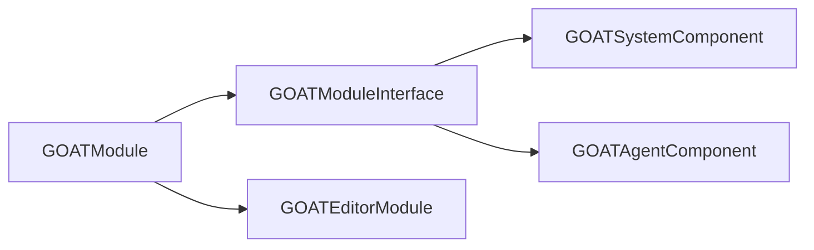

# GOATModule

> **File Location:** `Code/Source/Clients/GOATModule.cpp`  
> **Inherits:** `GOATModuleInterface`

---

## Overview

`GOATModule` is the **client (runtime) module** for the G.O.A.T. gem. It is the entry point that O3DE loads when the game is running (launcher). It derives from `GOATModuleInterface`, which itself derives from `AZ::Module`, and registers the runtime system components.

It is mutually exclusive with the editor module (`GOATEditorModule`) – they share the same `GOATModuleTypeId` so only one is loaded at a time.

---

## Key Responsibilities

| # | Responsibility | Description |
| :--- | :--- | :--- |
| 1 | **Client Module Registration** | Registers `GOATSystemComponent` and `GOATAgentComponent` descriptors via `GOATModuleInterface`. |
| 2 | **Required System Components** | Specifies `GOATSystemComponent` as a required system component. |
| 3 | **Gem Bootstrapping** | Uses `AZ_DECLARE_MODULE_CLASS` to integrate with O3DE's gem loading system. |

---

## Public Interface

### Constructor

```cpp
GOATModule();
```

### Methods

```cpp
// Returns the list of system components required by this module.
AZ::ComponentTypeList GetRequiredSystemComponents() const override;
```

---

## Dependencies & Interactions



- **Depends on:** `GOATModuleInterface`, `GOATSystemComponent`, `GOATAgentComponent`.
- **Required by:** O3DE's Launcher (via `AZ_DECLARE_MODULE_CLASS`).
- **Mutually Exclusive with:** `GOATEditorModule` (same `GOATModuleTypeId`).

---

## Implementation Notes

### Key Algorithms

The module class is defined using the `AZ_RTTI` macro:

```cpp
// Code/Source/Clients/GOATModule.cpp
class GOATModule : public GOATModuleInterface
{
public:
    AZ_RTTI(GOATModule, GOATModuleTypeId, GOATModuleInterface);
    AZ_CLASS_ALLOCATOR(GOATModule, AZ::SystemAllocator);
};
```

The `AZ_DECLARE_MODULE_CLASS` macro handles the bootstrap:

```cpp
#if defined(O3DE_GEM_NAME)
AZ_DECLARE_MODULE_CLASS(AZ_JOIN(Gem_, O3DE_GEM_NAME), GOAT::GOATModule)
#else
AZ_DECLARE_MODULE_CLASS(Gem_GOAT, GOAT::GOATModule)
#endif
```

### Performance Considerations

- **Allocation:** No runtime allocation.
- **Tick Rate:** Only called during module initialization.
- **Concurrency:** Main thread only.

---

## Client vs Editor Integration

| Module | Loaded When | Registers |
| :--- | :--- | :--- |
| `GOATModule` | Launcher (client) | `GOATSystemComponent`, `GOATAgentComponent` |
| `GOATEditorModule` | Editor | `GOATEditorSystemComponent`, `GOATBuilderComponent` |

---

## Lua Exposure

Not directly exposed to Lua.

---

## Testing

Unit tests should cover:

- **Module Registration:** Descriptors are correctly added.
- **Required Components:** `GOATSystemComponent` is returned.

---

## Related Notes

- [[GOATModuleInterface]]
- [[GOATEditorModule]]
- [[GOATSystemComponent]]
- [[GOATAgentComponent]]

---

*Last updated: 2026-08-26*