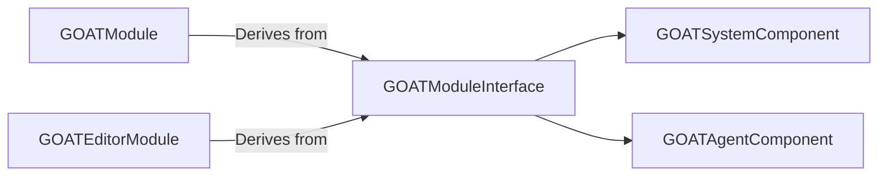

# GOATModuleInterface

> **File Location:** `Code/Source/Clients/GOATModuleInterface.cpp`  
> **Header:** `Code/Source/Clients/GOATModuleInterface.h`  
> **Inherits:** `AZ::Module`

---

## Overview

`GOATModuleInterface` is the **base module class** for the G.O.A.T. gem. It centralizes the registration of the core runtime component descriptors (`GOATSystemComponent`, `GOATAgentComponent`). Both the client module (`GOATModule`) and the editor module (`GOATEditorModule`) derive from this class, ensuring that the runtime components are always registered regardless of whether the game is running in the Launcher or the Editor.

It also defines the required system components list, ensuring `GOATSystemComponent` is automatically added to the system entity when the gem is loaded.

---

## Key Responsibilities

| # | Responsibility | Description |
| :--- | :--- | :--- |
| 1 | **Component Descriptor Registration** | Adds `GOATSystemComponent` and `GOATAgentComponent` descriptors to `m_descriptors`. |
| 2 | **System Component Requirement** | Specifies `GOATSystemComponent` as a required system component via `GetRequiredSystemComponents()`. |
| 3 | **Common Base** | Provides a shared base for the client and editor modules, preventing code duplication. |

---

## Public Interface

### Constructor

```cpp
GOATModuleInterface();
```

### Methods

```cpp
// Returns the list of system components required by this module.
AZ::ComponentTypeList GetRequiredSystemComponents() const override;
```

---

## Dependencies & Interactions



- **Depends on:** `GOATSystemComponent`, `GOATAgentComponent`, `AZ::Module`.
- **Required by:** `GOATModule` (client), `GOATEditorModule` (editor).

---

## Implementation Notes

### Key Algorithms

The constructor inserts the component descriptors:

```cpp
// Code/Source/Clients/GOATModuleInterface.cpp
GOATModuleInterface::GOATModuleInterface()
{
    m_descriptors.insert(m_descriptors.end(), {
        GOATSystemComponent::CreateDescriptor(),
        GOATAgentComponent::CreateDescriptor(),
    });
}
```

The `GetRequiredSystemComponents()` method returns the system component:

```cpp
AZ::ComponentTypeList GOATModuleInterface::GetRequiredSystemComponents() const
{
    return AZ::ComponentTypeList{
        azrtti_typeid<GOATSystemComponent>(),
    };
}
```

### Performance Considerations

- **Allocation:** No runtime allocation.
- **Tick Rate:** Only called during module initialization.
- **Concurrency:** Main thread only.

---

## Client vs Editor Inheritance

| Module | Derived From | Registers |
| :--- | :--- | :--- |
| `GOATModule` | `GOATModuleInterface` | `GOATSystemComponent`, `GOATAgentComponent` |
| `GOATEditorModule` | `GOATModuleInterface` | `GOATEditorSystemComponent`, `GOATBuilderComponent` |

The `GOATModuleInterface` ensures the core runtime components are always registered, while the derived modules add their specific (client or editor) components.

---

## Lua Exposure

Not directly exposed to Lua.

---

## Testing

Unit tests should cover:

- **Descriptor Registration:** `GOATSystemComponent` and `GOATAgentComponent` descriptors are added.
- **Required Components:** `GOATSystemComponent` is returned.

---

## Related Notes

- [[GOATModule]]
- [[GOATEditorModule]]
- [[GOATSystemComponent]]
- [[GOATAgentComponent]]

---

*Last updated: 2026-08-26*